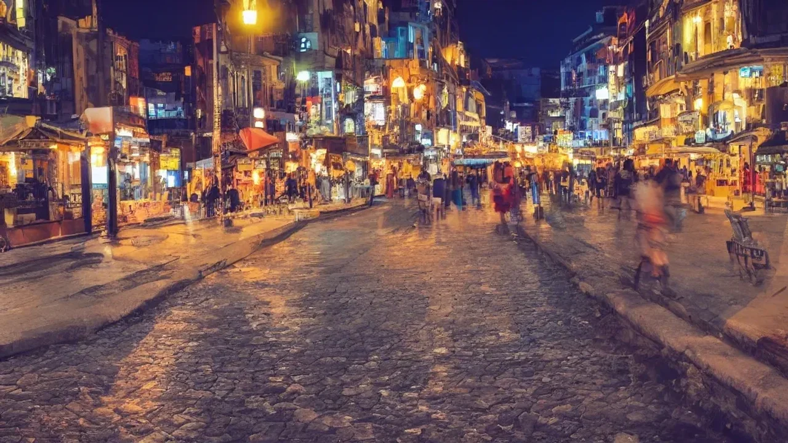
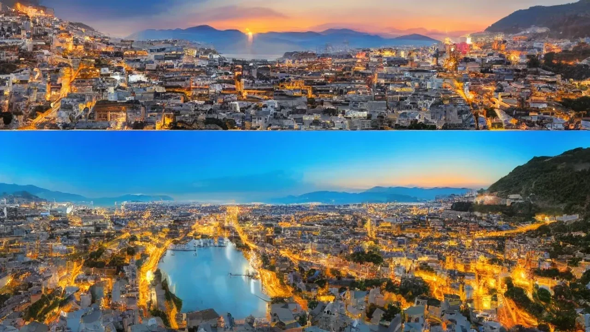

2026년 여름 휴가 시즌을 앞두고 역대급 폭염 예보가 이어지면서, 낮 시간의 무더위를 피해 시원한 밤을 즐기는 야간 여행 코스 설계가 새로운 대안으로 떠올랐습니다. 뜨거운 태양 아래서 지치는 대신 일몰 이후의 쾌적한 공기를 마시며 도시의 진면목을 발견하는 이른바 **'더스킹(Dusking)'** 트렌드가 전 세계 주요 관광지를 중심으로 빠르게 확산 중입니다. 지금부터 가성비와 체력을 모두 잡을 수 있는 국내외 야간 여행의 매력과 구체적인 코스 구성 팁을 하나씩 풀어가겠습니다.

## 왜 지금 낮보다 밤인가? 2026 여름 '더스킹'의 대세론

글로벌 기후 변화로 인해 여름철 대낮의 야외 활동은 단순히 무덥다는 느낌을 넘어 여행자의 건강을 직접적으로 위협합니다. 세계기상기구(WMO)의 2026년 상반기 기후 분석 보고서에 따르면, 올해 지구 평균 기온은 역대 최고치를 갱신할 확률이 85%를 상회합니다. 이러한 환경적 변화는 여행자들의 행동 패턴을 완전히 바꾸어 놓았습니다. 낮에는 에어컨이 완비된 호텔이나 대형 쇼핑몰에서 휴식을 취하고, 오후 5시 이후에 본격적인 일정을 시작하는 야간 여행 코스 수요가 급증한 배경입니다.

낮 여행과 밤 여행을 직관적으로 비교하면 체력적·경제적 차이가 명확하게 드러납니다.

| 비교 항목 | 낮 여행 (오전 10시 \~ 오후 4시) | 밤 여행 (오후 5시 \~ 오후 11시) |
| :--- | :--- | :--- |
| **평균 기온 (여름철)** | 33°C \~ 38°C (체감 온도 상승) | 24°C \~ 28°C (선선한 바람 유입) |
| **주요 리스크** | 일사병, 자외선 노출, 급격한 체력 저하 | 야간 대중교통 차편 제한, 일부 치안 사각지대 |
| **인파 밀집도** | 유명 랜드마크 기준 대기 시간 최장 | 예약제 운영으로 쾌적한 관람 환경 제공 |
| **소비 비용** | 음료 및 휴식 목적의 카페 비용 과다 | 야간 투어 입장료 중심의 계획적 지출 |

강렬한 자외선은 피부 노화를 촉진할 뿐만 아니라 한 시간만 걸어도 성인 기준 평소보다 2배 빠른 탈수 증상을 유발합니다. 반면 일몰 전후의 야간 활동은 신체 대사율을 안정적으로 유지시켜 주어, 같은 거리를 이동하더라도 피로도가 확연히 낮습니다. 한여름 휴가철에 겪는 고질적인 '귀국 후 만성 피로'를 방지하는 데 탁월한 효과가 있습니다.

이러한 트렌드에 발맞추어 전 세계 관광 도시들도 빠르게 밤 시장을 확장하는 추세입니다. 프랑스 파리 루브르 박물관과 이탈리아 로마 콜로세움은 주 2\~3회 시행하던 야간 개장 프로그램을 올여름부터 주 5회로 확대 운영하기로 결정했습니다. 싱가포르와 홍콩 등 아시아권 허브 도시들 역시 '나이트 이코노미(Night Economy)' 활성화 정책을 도입하여, 주요 국립공원과 문화재의 야간 조명 시설을 대대적으로 확충하고 여행객을 맞이하고 있습니다.

## 취향별로 골라 가는 글로벌 야간 여행 코스 추천 스팟

### 야간 미술관과 미디어아트: 로마·파리의 시원한 밤 문화

유럽의 여름은 해가 늦게 지는 특성이 있어 야간 여행 코스를 짜기에 최적의 조건을 자랑합니다. 이탈리아 로마의 바티칸 박물관은 한낮의 타는 듯한 더위를 피해 저녁 6시 이후에 입장하는 야간 투어 프로그램을 운영 중입니다. 낮 시간에는 최소 2시간 이상 줄을 서야 하지만, 야간 예약제를 이용하면 대기 시간 없이 쾌적하게 시스티나 성당의 천장화를 감상할 수 있습니다. 은은한 황금빛 조명이 켜진 고대 로마 포로 로마노 거리를 걸으며 가이드의 역사 설명을 듣는 야간 산책 코스는 고즈넉한 로맨틱함을 선사합니다.

프랑스 파리 역시 빛의 채도가 낮아지는 저녁 시간을 활용한 미디어아트 전시가 강세입니다. 아틀리에 데 루미에르(Atelier des Lumières) 같은 디지털 미술관은 사방이 차단된 시원한 실내 공간에서 밤 10시까지 몰입감 넘치는 시각 경험을 제공합니다. 센강을 따라 운행하는 바토무슈 유람선 또한 밤 9시 정각에 에펠탑이 반짝이는 '화이트 에펠' 타이밍에 맞춰 탑승하는 코스가 필수 관문으로 꼽힙니다.

### 선셋 카약부터 야간 하이킹까지: 동남아·일본의 액티브 나이트

정적인 관람보다 몸을 움직이는 액티비티를 선호한다면 동남아시아와 일본의 야간 아웃도어 프로그램이 훌륭한 선택지입니다. 태국 끄라비나 베트남 하롱베이에서는 오후 5시 30분에 출발하는 '선셋 카약 투어'가 폭발적인 인기를 끌고 있습니다. 붉게 물드는 석양을 바라보며 노를 젓다가, 밤이 깊어지면 물속에서 스스로 빛을 내는 플랑크톤을 관찰하는 신비로운 경험이 가능합니다. 

> "낮에 사원을 돌 때는 땀이 비 오듯 흘러서 아무것도 눈에 들어오지 않았는데, 저녁에 선셋 카약을 타니 시원한 강바람 덕분에 비로소 휴양지에 온 느낌이 들었습니다. 밤하늘의 별과 물속의 야광 플랑크톤이 동시에 반짝이는 순간은 평생 잊지 못할 기억입니다." (2026년 5월 베트남 푸꾸옥 야간 투어 참여자 김모 씨의 여행기)

일본의 경우, 전통적인 등산 코스를 야간 하이킹 형태로 재해석한 상품이 주목받고 있습니다. 도쿄 근교의 다카오산은 여름철 야간 산행객을 위해 케이블카 운행 시간을 대폭 연장했습니다. 산 정상에 위치한 비어 가든에서 시원한 생맥주를 마시며 도쿄 시내의 화려한 야경을 내려다보는 코스는 현지 2030 세대의 퇴근 후 힐링 코스로 자리 잡았습니다.

### 화려한 도시 불빛 속으로: 홍콩·싱가포르의 숨은 야경 명소

현대적인 건축물과 스카이라인이 자아내는 야경은 도시 여행의 꽃입니다. 싱가포르의 마리나 베이 샌즈 인근 가든스 바이 더 베이에서는 매일 밤 '슈퍼트리 쇼(스카이 쇼)'가 무료로 펼쳐집니다. 거대한 인공 나무들이 음악에 맞춰 형형색색의 조명을 뿜어내는 모습은 지상에서 봐도 아름답지만, 최근에는 인근 마리나 스퀘어 옥상 정원이나 에스플러네이드 루프탑 같은 숨은 조망 스팟이 인파를 피할 수 있는 명소로 소문나기 시작했습니다.

홍콩 역시 전통적인 빅토리아 피크 전망대의 극심한 혼잡을 피해, 구룡반도 서쪽에 위치한 '서구룡 문화지구(West Kowloon Cultural District)' 수변 공원이 새로운 야간 여행 코스로 급부상했습니다. 넓게 펼쳐진 잔디밭에 돗자리를 깔고 앉아 홍콩섬의 마천루를 정면으로 바라볼 수 있으며, 밤 8시에 진행되는 '심포니 오브 라이트' 레이저 쇼를 방해물 없이 온전히 감상할 수 있는 최적의 장소입니다.

[관련 글 보기](/posts/world-travel/)

## 밤을 두 배로 알차게: 야간 여행 코기획 및 예약 꿀팁

### 오후 5시 이후 오픈하는 현지 패스 및 투어 상품 예매법

효율적인 더스킹 일정을 완성하려면 사전에 '야간 전용 패스(Night Pass)'를 확보해야 합니다. 글로벌 액티비티 플랫폼들은 2026년 여름 시즌을 겨냥해 낮 입장권보다 15\~20% 저렴한 가격의 야간 전용 티켓을 대거 출시했습니다. 이러한 패스들은 대개 오후 4시나 5시 이후부터 입장이 가능한 대신, 주간의 긴 대기 줄을 우회할 수 있는 '패스트 트랙' 기능을 포함하는 경우가 많아 시간 절약에 매우 유리합니다. 

현지 가이드가 동행하는 야간 워킹 투어는 반드시 출발 일주일 전에 예약을 마쳐야 합니다. 야간 안전 관리를 위해 투어당 참여 인원을 10\~15명 내외로 엄격하게 제한하는 업체가 많기 때문입니다. 예약 시에는 가이드의 공인 자격증 보유 여부와 야간 안전장비(야광 밴드, 무선 수신기 등) 제공 항목을 꼼꼼히 확인하는 과정이 필요합니다.

### 야간 대중교통(심야버스, 안전 택시 앱) 이용 및 동선 짜기

야간 여행 코스를 설계할 때 가장 흔히 하는 실수는 귀가 교통편을 고려하지 않는 일입니다. 밤 10시가 넘어가면 도심 외곽 지역의 지하철과 버스 배차 간격이 급격히 늘어나거나 운행이 종료될 수 있습니다. 이를 방지하기 위해 여행지 국가의 대표적인 차량 호출 서비스(우버, 그랩, 볼트 등) 앱을 한국에서 미리 설치하고 결제 카드까지 연동해 두는 편이 안전합니다.

구체적인 동선을 짤 때는 다음과 같은 역방향 설계 방식을 권장합니다.

1. **최종 목적지 선정:** 밤 10시 전후에 도달할 야경 명소나 바(Bar), 야시장을 먼저 결정합니다.
2. **귀가 경로 검증:** 해당 장소에서 숙소까지 운행하는 심야 버스 노선이나 택시 승차 스팟이 명확한지 구글 맵으로 교차 검증합니다.
3. **이전 동선 배치:** 최종 목적지와 도보 15분 이내로 연결되는 미술관이나 식당을 오후 6\~8시 타임라인에 역순으로 배치합니다.

### 밤 비행기(레이오버) 시간과 연계하여 하루 더 버는 코스 설계

귀국편 비행기가 늦은 밤이나 새벽에 출발하는 스케줄이라면, 여행의 마지막 날을 완벽한 더스킹 데이로 활용할 수 있습니다. 체크아웃 이후 캐리어가 짐이 되지 않도록 호텔의 짐 보관 서비스를 이용하거나, 도심 공항 터미널에서 레이트 체크인 및 수하물 위탁을 미리 처리해 두는 행동이 첫걸음입니다. 현지 시간으로 오후 2시부터 5시까지는 공항 근처의 대형 스파 시설이나 라운지를 예약해 샤워와 휴식을 취하며 체력을 보충합니다.

체력이 충전된 오후 6시부터 공항 인근 소도시의 야시장이나 전망대를 방문하는 코스를 실행합니다. 예를 들어 일본 도쿄 나리타 공항을 이용한다면 나리타산 신쇼지 주변의 은은한 조명이 켜진 전통 거리를 산책하고 장어구이로 저녁을 해결하는 동선이 가능합니다. 이 방식을 적용하면 비행기 탑승 전까지 버려지는 시간 없이 여행의 만족도를 극대화할 수 있습니다.

## 안전하고 완벽한 밤을 위한 체크리스트 및 장단점

### 야간 여행의 장점: 인파 최소화와 독점적인 포토스팟

더스킹 투어의 가장 커다란 매력은 낮 시간대 특유의 시장통 같은 혼잡함에서 해방된다는 점입니다. 낮에는 단체 관광객과 현지 체험학습 인파로 인산인해를 이루는 유명 유적지도 밤이 되면 한적하고 차분한 공간으로 탈바꿈합니다. 소음이 잦아든 밤의 궁전이나 사원을 거닐며 온전히 풍경에 몰입하는 심리적 안정감은 밤 여행자만의 특권입니다.

사진 촬영 측면에서도 야간 조명이 주는 드라마틱한 효과 덕분에 타인과 차별화된 결과물을 얻을 수 있습니다. 삼각대와 장노출을 활용하면 도심의 차량 불빛이 궤적을 그리며 지나가는 화려한 도시 야경을 앵글에 담을 수 있습니다. 낮에는 역광 때문에 인물 사진을 찍기 어려웠던 스팟들도 야간 건축물 조명을 정면으로 받으면 스튜디오에서 촬영한 듯한 선명하고 깊이 있는 인물 스냅 사진이 연출됩니다.

### 치안과 안전: 밤거리를 걸을 때 반드시 피해야 할 행동

주간에 비해 시야가 제한되는 야간 여행은 치안 문제에 각별히 유의해야 합니다. 가로등 조명이 어둡거나 구글 맵상에서 이면도로(골목길)로 표시되는 구역은 절대 도보로 진입하지 않는 원칙을 고수해야 안전합니다. 특히 소매치기나 부당한 호객 행위는 인적이 드문 밤길에서 빈번하게 발생하므로, 화려한 유흥가 주변을 통과할 때는 소지품을 가방 앞쪽으로 매고 빠르게 이동하는 태도가 요구됩니다.

해외 일부 국가에서는 야간에 외국인 여행자를 대상으로 한 간이 검문이 수시로 이루어지기도 합니다. 따라서 여권 원본이나 선명한 여권 사본(스마트폰 저장본 포함)을 늘 지니고 다녀야 불필요한 마찰을 피할 수 있습니다. 비상 상황 발생 시 즉시 연락할 수 있는 현지 대사관 영사콜센터 번호와 숙소 주소가 영문 및 현지어로 적힌 명함을 지갑에 상시 소지하는 습관도 필수적입니다.

### 야간 촬영 성능을 극대화하는 스마트폰·카메라 세팅 가이드

어두운 환경에서 만족스러운 사진을 건지기 위해서는 기기 설정값에 대한 사전 이해가 뒷받침되어야 합니다. 최신 스마트폰을 사용하는 경우 기본 카메라 앱의 '야간 모드(Night Mode)' 기능을 반드시 활성화해야 합니다. 야간 모드는 셔터를 누르는 동안 여러 장의 사진을 연속 촬영해 합성하는 방식이므로, 촬영 신호가 완전히 끝날 때까지 최소 2\~3초 동안 기기를 흔들림 없이 고정하는 조작이 핵심입니다. 주변의 벽이나 가로등 기둥에 몸을 기대어 지지대를 만드는 것도 좋은 방법입니다.

미러리스나 DSLR 카메라를 지참했다면 아래의 세팅 가이드를 참고하여 수동 모드(M모드)를 제어하면 좋습니다.

* **조리개(F값):** 렌즈가 허용하는 최댓값(예: F1.4 \~ F2.8)으로 최대한 개방하여 빛의 유입량을 확보합니다.
* **셔터 스피드:** 흔들림 없는 핸드헬드 촬영을 위해 최소 1/60초 이상을 유지하되, 움직임이 없는 정물은 1/30초까지 낮춰봅니다.
* **ISO 감도:** 노이즈가 과도하게 발생하지 않는 선인 ISO 1600\~3200 범위 내에서 조절하며, 셔터 스피드 확보가 어려울 때만 유동적으로 올립니다.

낮의 무더위를 지혜롭게 피해 밤의 낭만을 온전히 누리는 야간 여행 코스 설계는 2026년 여름을 가장 시원하고 똑똑하게 보내는 이정표가 될 것입니다. 철저한 사전 준비와 안전 수칙 준수를 바탕으로, 올여름 나만의 특별한 나이트 라이프 투어를 완성해 보시기 바랍니다.

**함께 읽으면 좋은 글**
- [2026 유럽 항공 지연, 진짜 보상받는 3가지](/posts/world-travel/2026-europe-flight-delay-atc-compensation-guide/)
- [2026 조지아 여행: 왜 뜰까? 항공/비자 완전 정리](/posts/world-travel/georgia-travel-2026-guide/)

#야간여행코스 #더스킹 #2026여름트레블 #야경명소추천 #해외야간투어 #여름휴가계획 #밤에가볼만한곳 #글로벌여행트렌드 #야간촬영팁