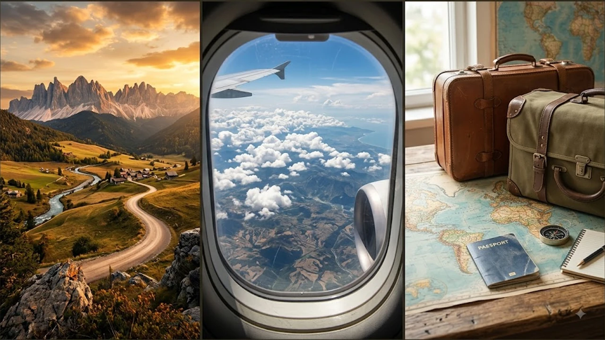

유럽 주요 거점 공항에서 최신 검색 장비 도입으로 풀렸던 **유럽 공항 액체류 규정**이 2026년 8월 중순을 기점으로 긴급 재조정되고 있습니다. 차세대 3D CT 스캐너를 설치했던 터미널에서도 다시 **기내 액체류 100ml 반입 제한** 지침을 엄격하게 집행하면서 성수기 귀국길과 환승 통로 곳곳에서 혼선이 빚어지는 상황입니다. 특히 유럽 연계 일정을 소화 중이라면 바뀐 현장 검사 기준과 짐 패킹 방식을 미리 숙지해야 아끼는 소지품을 쓰레기통에 버리거나 비행기를 놓치는 낭패를 막을 수 있습니다.

## 유럽 공항 액체류 규정 긴급 재적용 배경

### 왜 최신 3D 스캐너 도입 후 100ml 제한이 다시 돌아왔을까
런던 히드로, 암스테르담 스키폴 등 주요 허브 공항은 가방을 열지 않고 최대 2L까지 액체를 통과시키는 차세대 EDS-CB C3(폭발물 탐지 시스템) 스캐너를 발 빠르게 도입했습니다. 하지만 특정 3D 스캐너 소프트웨어가 고밀도 액체 수하물을 정밀 판독할 때 기준 오차율을 완벽히 맞추지 못한다는 기술적 결함이 포착되었습니다. 보안 공백을 원천 차단하기 위해 규제 당국이 전격적으로 예전문턱 복귀를 결정했습니다.

### 유럽항공안전기구(EASA) 권고와 적용 대상 주요 공항
유럽항공안전기구(EASA)와 각국 민간항공국은 스캐너 제조사의 펌웨어 패치와 재인증이 끝날 때까지 전면적인 안전 통제를 권고했습니다. 이에 따라 영국 런던 시티·개트윅, 네덜란드 스키폴, 독일 프랑크푸르트 등 최신 검색대를 선제 운용하던 터미널에서도 기존의 엄격한 액체류 통제 지침이 즉각 되살아났습니다.

### 공항별 장비 점검 일정과 이번 조치의 한시적 성격
이번 번복은 영구 회귀가 아닌 스캐너 시스템 결함을 보완하기 위한 임시 브레이크 조치입니다. 현장 혼란을 줄이고자 각 공항은 안내 인력을 보강하고 재검사 레인을 늘렸습니다. 정밀 알고리즘 안정화 작업이 끝나는 2026년 하반기 이후에나 순차적인 규제 완화가 다시 논의될 계획입니다.

## 출국과 환승 전 체크해야 할 변경된 기내 반입 기준

### 기내 수하물 100ml 개별 용기 및 1L 투명 지퍼백 규격
들고 타는 가방에 넣는 모든 액체·겔·에어로졸류는 **개별 용기 용량 100ml(3.4온스) 이하**여야 합니다.

- 용기 용량이 150ml라면 속에 내용물이 30ml만 남아 있어도 무조건 압수 대상
- 가로·세로 약 20cm 규격의 **1L 투명 지퍼백 1개** 안에 용기가 남김없이 들어가야 통과
- 지퍼백 입구가 덜 닫히거나 터질 듯 담긴 경우 현장에서 폐기 처분

> **실전 체크:** 스마트 레인 표시가 붙어 있어도 현장 보안 요원의 판단에 따라 지퍼백 분리 제출을 요구받으므로, 짐을 쌀 때 지퍼백을 가방 맨 위 주머니에 넣어두는 편이 빠릅니다.

### 전자제품과 액체류 분리 배출 절차의 실시간 변경 사항
노트북, 태블릿, 보조배터리와 액체류 지퍼백을 가방에서 꺼내 바구니에 따로 올리는 클래식 검색 방식이 다시 필수가 되었습니다. 이전 완화 소식만 믿고 짐을 가방 깊숙이 쑤셔 넣었다가 바구니 앞에서 온 짐을 다 풀어헤치는 여행객들 때문에 대기열이 급속도로 늘어나는 추세입니다.

### 환승 공항별 현장 검사 편차
출발지 공항을 무사히 통과했더라도 유럽 역내 공항에서 갈아탈 때(Transfer) 다시 보안 검색대를 거치게 됩니다. 터미널마다 단속 강도 편차가 크므로 [2026년 여름 해외여행 추천 도시 5곳](/posts/world-travel/summer-travel-cities-2026/)을 포함한 유럽 경유 일정을 짤 때는 환승 여유 시간을 최소 2시간 30분 이상 잡아야 안전합니다.

## 기내 반입 시 자주 적발되는 품목과 면세품 주의사항

### 화장품과 식품 등 오인하기 쉬운 액체·겔류 기준
점성이 있거나 흘러내릴 수 있는 반고체 형태의 물품은 거의 전부 액체류로 분류됩니다.

- **스킨케어·뷰티:** 수분크림, 립글로스, 선크림, 마스카라, 헤어 왁스, 향수
- **식품·스프레드:** 잼류, 누텔라, 땅콩버터, 소프트 치즈(브리·카망베르), 올리브유, 페스토
- **에어로졸:** 미스트, 데오도란트 스프레이 (가연성 표기 화염 마크 제품은 기내·위탁 모두 금지)

유럽 마트나 재래시장에서 산 소스류나 잼, 크림치즈는 기내 반입을 고집하지 말고 무조건 위탁 수하물로 부치는 것이 안전합니다.

### 공항 면세점 주류와 향수 구매 시 밀봉 봉투(STEB) 지침
공항 면세 구역에서 산 100ml 초과 와인, 위스키, 향수는 **국제공인 보안 봉투(STEB)**에 구매 영수증과 함께 밀봉되어 있어야 합니다. 최종 목적지에 내리기 전까지 봉투를 뜯거나 훼손하면 환승 검색대에서 통째로 압수당하므로 주의해야 합니다.

### 기내 처방 의약품 및 유아식 예외 인정 요건
비행 중 즉시 복용해야 하는 필수 의약품(인슐린 펜, 천식 흡입기 등)과 영유아 동반 시 필요한 이유식·모유는 100ml 초과 반입이 가능합니다. 단, 영문 처방전이나 소견서를 요구할 수 있으며 검색대에서 별도의 정밀 스캔을 거치게 됩니다.

## 유럽 공항 보안 검색 지연 피하는 실전 패킹 팁

### 사전 짐 꾸리기 단계에서의 소분 용기 준비 노하우
사용할 샴푸나 에센스는 50~100ml 규격 표기가 인쇄된 소분 용기에 옮겨 담아야 현장 시비를 피할 수 있습니다. [스페인 북부 여행지 Best 5](/posts/world-travel/spain-northern-cities-travel-guide-2026/) 등 여러 도시를 돌며 와인이나 오일 기념품을 샀다면, 이동할 때마다 위탁 캐리어 무게를 계산하며 짐을 재배치하는 요령이 필요합니다.

### 성수기 공항 도착 권장 시간과 패스트트랙 활용법
8월 유럽 거점 공항의 보안 검색 대기열은 평소보다 훨씬 길어져 1시간 이상 서 있는 경우가 흔합니다.

- 유럽 역내선 이동(솅겐 구역): 비행기 출발 **2시간 30분 전** 도착
- 한국 귀국 및 장거리 국제선: 비행기 출발 **3시간 30분~4시간 전** 도착
- 모바일 탑승권 사전 발급 및 항공사·공항 공식 앱을 통한 실시간 검색대 혼잡도 확인

### 위탁 수하물과 기내 수하물 스마트 분배 전략
기내 가방에는 비행 중 바를 립밤, 보습제, 복용약 등 한 줌의 필수품만 1L 지퍼백에 챙기고, 나머지 모든 액체 화장품과 식음료는 캐리어 완충 포장 후 위탁으로 넘기는 편이 몸과 마음을 편하게 해줍니다. 규정 전환기에는 보수적으로 짐을 싸는 것이 시간을 아끼는 가장 확실한 방법입니다.

#유럽공항액체류 #기내반입금지품목 #유럽여행준비물 #100ml규정 #항공보안검색 #위탁수하물규정 #유럽환승주의사항