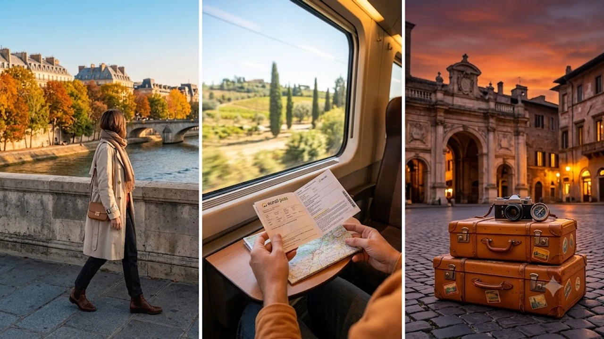

2026년 9월 하반기 들어 8월 여름 휴가철보다 예약률이 역전되는 가을 유럽여행 열풍이 거세다. 극심한 폭염과 살인적인 인파를 피해 합리적인 경비로 떠나는 숄더시즌(Shoulder Season) 여행자들은 이전과 완전히 다른 동선과 전략을 취한다.

## 가을 유럽여행, 왜 8월 성수기보다 9·10월 예약이 폭증했나

### 8월 여름 휴가철을 제친 9월 숄더시즌의 예약 역전 현상
2026년 9월 23일 발표된 글로벌 여행 네트워크 Virtuoso의 가을 데이터에 따르면, 9월 가을 여행 예약 매출은 전년 대비 77% 증가해 8월 성수기 수치를 공식적으로 앞질렀다. 7~8월에 집중되던 휴가 수요가 쾌적한 날씨와 비용 절감을 겨냥해 9월 말에서 10월 초로 대거 이동했다.

### 폭염 탈출과 기후 변화가 바꾼 유럽 현지 체감 여행 환경
지난여름 남유럽 전역을 덮친 섭씨 40도 안팎의 극한 폭염은 야외 도보 관광을 마비시켰다. 반면 9월 하순부터는 낮 기온이 22~25도 선으로 내려앉아 로마의 포로 로마노나 파리의 센강변을 무리 없이 걸어 다닐 수 있는 환경이 조성된다. 체력 소모가 절반 이하로 줄어드는 점이 가을 행을 결정하는 실질적 요인이다.

### 주요 항공권·호텔 요금 변동 추이와 비용 절감 현실
직항 왕복 항공권 기준 8월 극성수기에 230만~260만 원대를 호가하던 인천발 서유럽 주요 노선 가격은 9월 말 140만~160만 원 선으로 내려간다. 파리와 바르셀로나 중심부 4성급 호텔 역시 1박당 평균 400유로 선에서 250유로 안팎으로 낮아져 동일 예산으로 체류 기간을 3~4일 더 확보할 수 있다.

## 다구간 장기 체류 '시티맥싱(City-maxxing)' 여행법 집중 분석

### 한 도시에 머물지 않고 국경을 넘나드는 연계 루트의 매력
올해 숄더시즌의 핵심 키워드는 단연 **시티맥싱(City-maxxing)**이다. 한 도시에 1주일 내내 체류하는 전통적 방식 대신, 최적화된 철도망을 바탕으로 2~3개국 주요 거점 도시를 촘촘하게 묶어 경험을 극대화하는 방식이 표준으로 자리 잡았다.

### 남유럽(이탈리아·남프랑스·스페인) 골든 루트 최적 동선
밀라노에서 출발해 피렌체와 로마를 거쳐 니스, 마르세유, 바르셀로나로 빠지는 지중해 연안 벨트가 대표적이다. 특히 이탈리아 거점 도시를 방문할 때는 [베네치아 당일치기 300유로 벌금 피하는 법](/posts/world-travel/venice-day-trip-entry-fee-qr-fine-guide/)처럼 도시별로 강화된 관광세 규정을 미리 파악해야 예상치 못한 지출을 막는다.

> **시티맥싱 동선 설계 핵심 팁**  
> 국가 간 이동 시 공항 왕복과 수속으로 버리는 4시간을 줄이려면 300km 이하 구간은 초고속 열차, 600km 이상 구간은 야간 침대열차나 주간 저비용 항공을 선택하는 편이 유리하다.

### 도시간 초고속 열차와 저비용 항공 조합 팁
프랑스 TGV, 이탈리아 트랜이탈리아(프레치아로사), 스페인 렌페(Renfe)를 유기적으로 조합하면 도심 중앙역 간 이동이 가능해 공항 부대비용을 아낄 수 있다. 출발 30일 전에 예약하면 정상가 대비 최대 60% 저렴한 얼리버드 좌석 확보가 가능하다.

## 가을 유럽 숄더시즌 여행 시 반드시 주의해야 할 3가지 리스크

### 비수기 진입에 따른 박물관·관광지 단축 운영 및 정기 보수
10월로 넘어가면서 상당수 국공립 미술관과 유적지가 동절기 운영 체제로 전환된다. 관람 종료 시간이 오후 7시에서 5시로 앞당겨지거나 분수대 및 외벽 보수 공사가 시작되는 경우가 많아 방문 전 공식 홈페이지의 주간 일정을 확인해야 헛걸음을 피한다.

### 일교차 급변과 지중해성 가을 우기 대비 패킹 리스트
낮에는 쾌적하지만 해가 지는 오후 6시 이후로는 기온이 10도 초반까지 급격히 떨어진다. 10월부터 본격화되는 지중해 연안의 국지성 가을비를 막기 위해 방수 기능이 있는 경량 윈드브레이커와 얇은 메리노 울 스웨터를 겹쳐 입는 레이어드 방식이 적합하다.

### 2026년 가을 유럽 공항 입출국 심사 대기 변수
솅겐 조약국 전역에 디지털 국경 관리 체계가 본격 적용되면서 지문 및 안면 생체 정보 등록 절차로 인해 주요 허브 공항의 출입국 심사 시간이 늘어났다. 귀국 당일에는 최소 출발 3시간 30분 전까지 공항에 도착해 체크인과 심사를 마쳐야 돌발 변수를 방지할 수 있다.

## 실패 없는 가을 유럽 숄더시즌 일정 설계 실전 가이드

### 7박 9일 vs 13일 이상 장기 일정별 추천 코스
- **7박 9일 단기 집중형:** '로마-피렌체-베네치아' 또는 '파리-니스'처럼 철도 이동 2시간 이내 2개 도시 압축 구성.
- **13박 15일 시티맥싱형:** '마드리드-바르셀로나-남프랑스-밀라노'로 이어지는 육로 국경 통과 루트 구성.

### 다구간 인아웃(In-Out) 항공권 발권으로 이동 시간 단축
IN/OUT 도시를 다르게 설정하는 다구간 발권은 왕복 티켓 대비 현지 이동 시간과 1회 분량의 철도 요금을 획기적으로 줄여준다. 예를 들어 파리 IN - 로마 OUT 구조로 끊으면 출발지로 되돌아가는 불필요한 하루를 통째로 절약한다.

### 현지 투어 및 인기 명소 사전 예약 타이밍
루브르 박물관, 바티칸 미술관, 사그라다 파밀리아 성당은 숄더시즌에도 최소 2~3주 전 온라인 타임슬롯 예약이 마감된다. 현장 발권 대기 줄이 여전히 1~2시간 이상 이어지므로 공식 앱을 통한 사전 모바일 티켓 수령이 필수적이다. 더 깊이 있는 글로벌 루트 정보는 [세계여행지 최신 트렌드](/posts/world-travel/world-travel-1783348391782/)에서 확인할 수 있다.

[압축 파우치 및 여행용품 쿠팡에서 보기](https://www.coupang.com/np/search?q=%EC%97%AC%ED%96%89%EC%9A%A9%ED%92%88&sourceType=affiliate&trackingCode=AF8691300)

#가을유럽여행 #숄더시즌 #유럽자유여행 #시티맥싱 #남유럽여행 #유럽항공권 #유럽기차여행