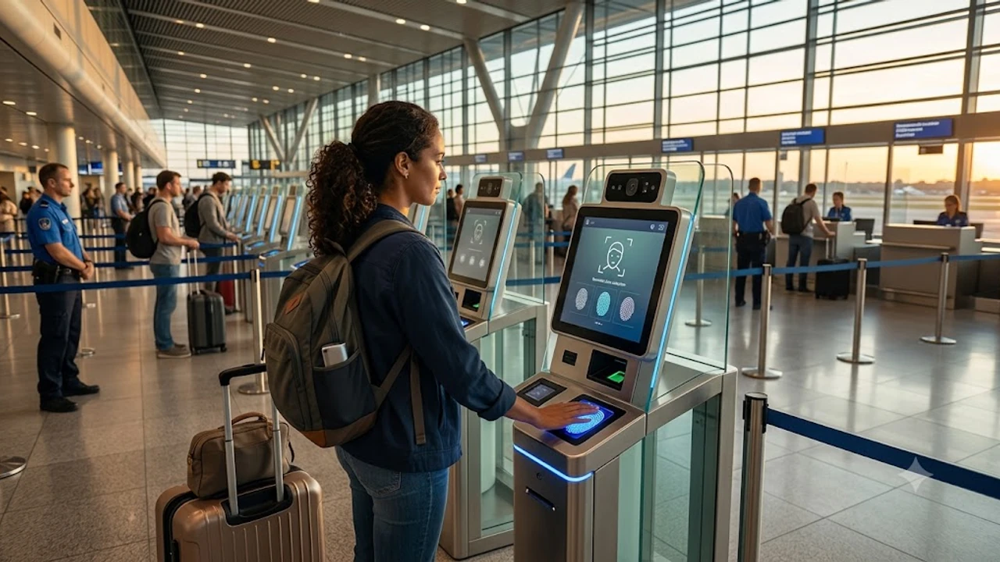

2026년 10월 본격 가동을 앞두고 유럽 연합 주요 공항이 전례 없는 긴장감에 휩싸였습니다. 비EU 국적 여행자의 생체 정보를 사전 수집하는 유럽 EES 입국심사 체계가 가동되면서, 솅겐 조약 가입국으로 향하는 가을 여행객 사이에서 심사 대기시간 폭증에 대한 우려가 현실화되고 있습니다. 특히 유럽 환승 항공권을 쥐고 있는 승객이라면 입국 심사 지연이 단순한 불편을 넘어 연결편 결항으로 이어질 수 있어 철저한 대비책이 요구됩니다.

## 10월부터 바뀌는 유럽 공항: EES 생체인식 시스템의 실체

### 여권 도장 폐지와 첫 대면: 지문·안면 데이터 등록 절차
EES(Entry/Exit System)의 핵심은 기존에 심사관이 손으로 찍어주던 여권 입출국 스탬프의 완전한 디지털화에 있습니다. 대한민국을 포함한 제3국 여권 소지자는 솅겐 지역에 처음 발을 들이는 순간, 전용 키오스크에서 **지문 4개(오른손 검지부터 새끼손가락)와 고해상도 안면 사진**을 현장 등록해야 합니다. 수집된 생체 데이터는 중앙 데이터베이스에 최대 3년간 보관되므로 이후 재방문 시에는 간소화 절차를 밟지만, 최초 1회 등록 과정에서 1인당 최소 2~3분이 소요됩니다.

### 기존 전자여권 자동게이트와의 차이점 및 비EU 국적자 적용 범위
과거 한국 여권 소지자 일부가 런던 히드로 공항이나 로마 피우미치노 공항에서 이용하던 e-게이트와 EES는 본질적으로 다른 시스템입니다. 기존 게이트가 칩에 내장된 정보와 실물을 단순 대조했다면, EES는 유럽 전역의 중앙 출입국 전산망에 신규 생체 프로필을 생성하고 솅겐 단기 체류 허용 기간(180일 중 90일)을 분 단위로 자동 추적합니다. 이는 무비자 관광객은 물론 단기 상용 목적 입국자 전원에게 강제 적용됩니다. 최근 강화되는 글로벌 국경 통제 흐름은 [미국 여행 입국 바뀐 규정 진짜 3가지](/posts/world-travel/us-travel-reentry-advance-parole-rule-change-2026/) 사례에서도 뚜렷하게 확인되는 부분입니다.

### 런던·파리·프랑크푸르트 주요 허브 공항의 초기 시범 운영 현황
유럽공항협회(ACI Europe)의 현장 보고에 따르면 파리 샤를드골(CDG)과 프랑크푸르트(FRA) 공항 등 대형 허브 터미널에서는 비행기 여러 대가 동시 착륙하는 피크 시간대에 키오스크 기기 오류 및 안내 인력 부족 문제가 반복적으로 노출되었습니다. 특히 영국 세인트 팬크라스 역의 유로스타 터미널과 도버 항구의 병목 현상은 이미 시범 운영 단계에서부터 도마 위에 올랐으며, 프랑스 국경경찰(PAF) 측도 시스템 가동 초기 시스템 안정화 전까지 수속 병목이 불가피함을 인정했습니다.

## 입국 대기 3시간 실화? 주요 공항별 혼선 구간 분석

### 비수기 환승객도 위험하다: 솅겐 첫 진입 공항의 병목 현상
가을 비수기라 안심하던 장거리 승객들의 발목을 잡는 지점은 바로 **솅겐 첫 경유지**입니다. 예를 들어 인천에서 루프트한자를 타고 프랑크푸르트를 거쳐 스페인 바르셀로나로 가는 여정이라면, 바르셀로나가 아닌 첫 기착지인 프랑크푸르트에서 EES 등록과 입국 심사를 한꺼번에 통과해야 합니다. 환승객과 프랑크푸르트 최종 목적지 승객이 한꺼번에 솅겐 국경 심사 라인으로 몰리면서 2026년 9월 말 시범 운영 구간부터 대기열이 터미널 복도 끝까지 이어지는 혼잡이 목격되었습니다.

### 키오스크 사전 등록 vs 유인 심사대 통과 시간 비교
현장 동선은 [키오스크 셀프 등록] → [유인 심사관 최종 대면 확인]의 2단계로 진행됩니다. 

> * **기존 아날로그 방식:** 여권 제출 및 심사관 육안 대조 (평균 40초~1분)
> * **EES 2단계 방식:** 셀프 키오스크 지문 스캔 오류 재시도(1분 30초) + 유인 부스 이동 후 심사관 승인(1분) = **총 2분 30초 이상**

단순 계산으로도 수속 시간이 기존 대비 2.5배 늘어납니다. 대형 와이드바디 기종 1대(약 300명)만 내려도 키오스크가 20대 미만으로 배치된 터미널에서는 대기 시간이 기하급수적으로 늘어납니다.

### 환승 시간 2시간 미만 티켓 소지자가 겪게 될 잠재적 리스크
유럽 항공사들이 판매하는 1시간 15분~1시간 40분 안팎의 환승 조합은 현시점 가장 피해야 할 선택지입니다. 항공기 착륙 후 유도로 이동(20분), 게이트 접안 및 하기(15분), 터미널 간 셔틀 이동(15분)을 빼면 순수 입국 심사에 쓸 수 있는 시간은 30분 안팎에 불과합니다. 입국 대기열이 1시간을 초과하는 순간 최종 목적지로 가는 연결편 탑승 게이트는 닫히며, 위탁 수하물 환적 실패까지 겹쳐 현지 첫날 일정이 완전히 틀어질 위험이 큽니다.

## 지연 대란 피하는 유럽 여행 출국 전후 꿀팁 3가지

### 모바일 사전 등록 앱(Mobile App) 지원 국가별 사전 체크
유럽 집행위원회는 공항 혼잡 완화를 위해 여행자가 여권 정보와 얼굴 사진을 미리 등록할 수 있는 사전 전송 앱 시스템을 마련했습니다. 다만 모든 솅겐 국가가 이를 동시 지원하는 것은 아닙니다. 스웨덴, 핀란드 등 북유럽 공항은 전용 레인을 별도 배정해 모바일 등록 승객을 빠르게 빼주는 반면, 남유럽 일부 국가에서는 시스템 연동 지연으로 현장 키오스크 재입력을 요구하는 사례가 잦습니다. 출국 전 본인이 착륙하는 첫 경유국 이민국 포털을 통해 모바일 사전 정보 입력이 가능한지 필히 확인해야 합니다.

### 솅겐 내 환승 시 최소 환승 여유 시간(MCT) 3시간 이상 확보법
현재 유럽 노선을 예약 중이거나 발권을 마쳤다면, 경유지 체류 시간을 재점검하는 결단이 필요합니다.

- **동일 터미널 환승:** 최소 2시간 30분 이상 확보
- **터미널 간 트레인/셔틀 이동 환승:** 최소 3시간 30분 이상 확보
- **발권 팁:** 분리 발권(별도 예약번호)은 연결편 노쇼 시 전액 승객 과실이 되므로, 반드시 한 장의 통발권(Single Ticket)으로 묶어 항공사의 대체편 제공 의무를 살려두어야 합니다.

유럽 각 도시의 과밀화 규제와 현지 이동 변수는 출국 전 [베네치아 당일치기 300유로 벌금 피하는 법](/posts/world-travel/venice-day-trip-entry-fee-qr-fine-guide/) 포스팅을 함께 읽어두면 일정 차질을 방지하는 데 큰 도움이 됩니다.

### 입국 지연으로 인한 연결편 놓침 대비 항공권·여행자 보험 보장 기준
유럽연합 항공 승객 권리 규정(EC 261/2004)에 따르면, 국경 통제 기관의 입국 지연은 '특별한 사유(Extraordinary Circumstances)'로 분류되어 항공사로부터 정액 보상금을 받기 어렵습니다. 따라서 단일 항공권으로 발권해 다음 항공편 무료 변경 권리를 지키는 것과 별개로, 개인 여행자 보험 약관에서 **'항공기 결항/지연으로 인한 추가 숙박비 및 식비 실비 특약'**이 포함되어 있는지 꼼꼼하게 따져보아야 합니다.

## 출발 당일 공항 현장에서 써먹는 비상 행동 요령

### 비행기 착륙 직후 입국 심사대로 치고 나가는 좌석 선점 노하우
EES 체제 하에서는 비행기 문이 열린 뒤 얼마나 빨리 복도를 빠져나가 심사장에 도착하느냐가 대기 시간 1시간을 좌우합니다. 이코노미 클래스를 이용하더라도 기내 앞쪽 복도 좌석을 사전 유료 지정하거나, 오버헤드 빈에 짐을 넣을 때 본인 좌석 바로 위를 사수해 착륙 직후 지체 없이 짐을 빼야 합니다. 보딩 브릿지를 통과하자마자 화장실 방문은 뒤로 미루고, 터미널 모니터의 'Passport Control' 표지판을 따라 최단 동선으로 경보해야 키오스크 선두 그룹에 안착할 수 있습니다.

### 지문 스캔 지연 방지를 위한 손 상태 관리와 조명 확인
현장 키오스크에서 지문 인식 실패로 경고창이 뜨면 유인 심사관에게 이관되어 대기 시간이 배로 늘어납니다. 장시간 비행으로 손가락이 지나치게 건조하거나 유분기가 많으면 광학 센서가 지문 융선을 읽지 못하므로, 착륙 30분 전 보습제를 가볍게 바르고 물티슈로 손끝을 정리해두는 습관이 체증을 줄여줍니다. 안면 인식 기기 앞에서는 모자, 굵은 뿔테 안경, 마스크는 물론 과도하게 드리워진 앞머리까지 단정히 넘겨야 단번에 승인을 받아낼 수 있습니다.

장거리 비행과 긴 입국 대기열 속에서 여권과 필수 서류, 스마트폰을 안전하게 보호하려면 몸에 밀착되는 분실 방지 가방을 갖추는 편이 유리합니다.
[RFID 차단 도난방지 크로스백 쿠팡에서 보기](https://www.coupang.com/np/search?q=%EC%97%AC%ED%96%89%EC%9A%A9%ED%92%88&sourceType=affiliate&trackingCode=AF8691300)

#유럽여행 #EES입국심사 #유럽입국지문등록 #유럽공항대기시간 #솅겐조약 #프랑크푸르트공항환승 #샤를드골공항환승 #유럽출입국시스템 #해외여행꿀팁