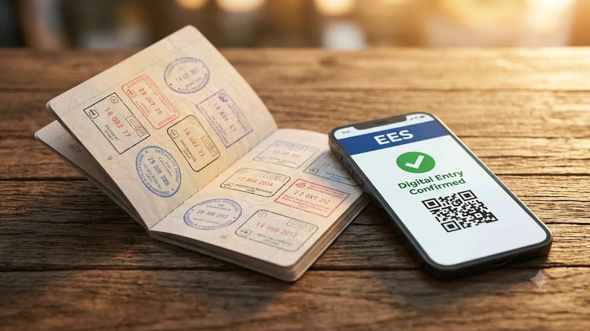

유럽 연합이 시행하는 새로운 출입국 시스템인 **유럽 EES**(Entry/Exit System)가 현장에 적용되면서 유럽 공항 입국장 풍경이 완전히 뒤바뀌고 있습니다. 기존에 심사관이 여권에 날짜 도장을 찍어주던 아날로그 방식 대신 지문 채취와 안면 인식을 결합한 생체 데이터 등록이 의무화되었기 때문입니다. 현지 공항에 도착하자마자 키오스크 대기열에 갇혀 일정을 망치지 않으려면 사전에 바뀐 규정과 동선을 명확히 짚어두어야 합니다.

## 유럽 EES 전면 도입과 입국장 현장 변화

### 생체 인식 사전 등록 의무화로 달라진 심사 절차
쉥겐 조약국에 단기 무비자로 입국하는 비EU 국적 여행객은 입국 심사대 통과 전 무인 단말기(키오스크)에서 네 손가락 지문 스캔과 얼굴 사진 촬영을 마쳐야 합니다. 과거에는 여권 제시 후 대면 질문 몇 가지로 1분 안팎에 끝나던 절차가 승객 1인당 최소 2~3분 이상 소요되는 구조로 전환되었습니다. 특히 만 12세 이상 승객 전체가 개별 등록을 거쳐야 하므로 가족 단위 여행객이 몰리는 시간대에는 입국장 정체가 평소보다 서너 배 길어지는 양상을 보입니다.

### 쉥겐 조약국 주요 공항별 무인 키오스크 설치 현황
파리 샤를 드골(CDG), 프랑크푸르트(FRA), 암스테르담 스키폴(AMS) 등 유럽 내 초대형 허브 공항들은 터미널 입구 곳곳에 대규모 EES 전용 키오스크 존을 구축했습니다. 반면 로마 피우미치노나 남유럽 중소 규모 국제공항은 장비 확충 속도가 입국자 수를 따라가지 못해 기기 앞 대기 줄이 길게 늘어서는 사례가 잦습니다. 단말기 인터페이스 자체는 다국어 안내를 지원하지만, 기기 오작동이나 지문 인식 오류가 간헐적으로 발생해 현장 진행 요원의 도움을 기다리느라 정체가 가중되기도 합니다.

### 첫 등록 시 예상되는 입국 심사 대기 시간 증가 실태
EES 시스템은 생체 정보를 처음 등록할 때 가장 많은 시간이 소요됩니다. 한 번 등록된 데이터는 중앙 서버에 3년간 보관되어 차후 재입국 시에는 간소화 절차를 밟지만, 최초 방문객에게는 상당한 진입 장벽입니다. 장거리 대형 항공기 두세 대가 10~20분 간격으로 연달아 착륙하는 피크 시간대에는 입국 심사장을 빠져나오는 데만 2시간 이상 걸리는 상황이 속출하고 있습니다.

## 기존 여권 스탬프 방식과 EES 디지털 시스템 비교

### 수기 도장 폐지와 전산 체류일 자동 계산 방식
과거 심사관의 재량이나 판독 불명확한 잉크 도장에 의존하던 방식에서 벗어나, 이제는 승객의 입출국 기록이 EU 통합 전산망에 실시간으로 기록됩니다. 쉥겐 구역 내 합법 체류 한도인 **'최근 180일 중 90일'** 규칙이 초 단위로 자동 연산되므로 단 하루라도 체류 기한을 넘기면 출국 심사대에서 즉각 오버스테이 경고가 뜹니다. 유럽 각국의 강화된 행정 절차는 도시 관광세 징수 방식에서도 드러나는데, 이와 맞물려 까다로워진 현지 규정 흐름은 [베네치아 당일치기 300유로 벌금 피하는 법](/posts/world-travel/venice-day-trip-entry-fee-qr-fine-guide/)에서도 확인할 수 있습니다.

### 환승 공항과 최종 목적지 간 심사 소요 시간 차이
유럽 내 다른 도시로 환승할 때 입국 심사가 이뤄지는 시점은 '쉥겐 구역에 최초로 발을 딛는 공항'입니다. 예를 들어 인천발 파리 경유 바르셀로나행 항공권을 이용한다면, 파리 샤를 드골 공항에서 EES 생체 등록과 입국 심사를 모두 치러야 합니다. 환승 대기 시간이 2시간 미만으로 짧게 잡힌 항공편을 예약한 여행객들이 환승 전용 심사대에서 발이 묶여 연결편을 놓치는 사례가 급증하고 있어 각별한 주의가 요구됩니다.

### 단기 관광객과 장기 체류 비자 소지자의 심사 라인 구분
워킹홀리데이, 유학, 주재원 비자 등 장기 체류 비자를 소지한 입국자는 원칙적으로 EES 생체 등록 대상에서 제외되어 별도의 대면 심사 라인으로 안내됩니다. 그러나 현장 동선 분리가 미흡한 혼잡 공항에서는 단기 무비자 여행객과 장기 비자 소지자가 같은 대기열에 섞여 혼선을 빚는 경우가 빈번합니다. 본인의 체류 자격에 맞는 전용 라인을 공항 진입 즉시 확인하고 이동하는 순발력이 필요합니다.

## 입국 대기 시간을 최소화하는 사전 체크리스트

### 혼잡 시간대 항공편 도착 시 빠른 심사를 위한 좌석 선택 팁
EES 체제 하에서는 기내에서 얼마나 빨리 내려 입국장 키오스크에 도달하느냐가 대기 시간을 30분에서 1시간까지 좌우합니다. 복도 좌석이나 기체 전면부 좌석을 사전 지정해 착륙 직후 신속하게 내리는 전략이 유효합니다. 하기 후 수하물 수취대로 이동하기 전, 다른 항공편 승객들이 몰려들기 전에 키오스크 대기선에 진입하는 것만으로도 병목 현상을 상당 부분 피할 수 있습니다.

### 모바일 사전 등록 지원 앱 유무와 현장 안내선 확인법
일부 국가와 공항에서는 공항 내 대기를 줄이기 위해 개인 스마트폰으로 여권 정보와 기본 인적 사항을 미리 업로드할 수 있는 사전 입력 앱을 시범 도입하고 있습니다. 공항 도착 전 해당 국가 출입국 관리국 웹사이트나 항공사 공지를 통해 사전 등록 절차가 열려 있는지 확인하는 편이 안전합니다. 현장에 도착했을 때는 바닥과 천장에 표기된 생체 등록 전용 라인(Bio-registration) 유도선을 정확히 따라 이동해야 불필요한 줄서기를 방지할 수 있습니다.

### 수하물 연계 및 도시간 열차 환승 버퍼 시간 확보 기준
유럽 주요 허브 공항에 착륙한 뒤 TGV, ICE 등 도시 간 고속열차나 국내선 저비용 항공사(LCC)로 갈아탈 계획이라면 환승 간격을 최소 3시간 30분 이상 확보하는 배치가 필수적입니다. 수하물 수취 시간 자체는 이전과 비슷하지만, 심사장을 통과해 짐을 찾는 구역으로 빠져나오는 시간 자체가 크게 지연되었기 때문입니다. 일정이 촉박하다면 환승역 연결 티켓은 현장 발권이나 시간 변경이 자유로운 유연 요금제로 결제하는 편이 안전합니다.

## 입국 지연 및 시스템 오류 발생 시 대처 가이드

### 지문 및 안면 인식 오류 발생 시 대면 심사 전환 요령
손가락에 땀이 많거나 건조한 경우, 혹은 안경이나 모자 착용으로 인해 키오스크에서 반복적으로 스캔 에러가 날 수 있습니다. 화면에 오류 메시지가 연속 3회 이상 출력되면 당황하지 말고 즉시 호출 버튼을 누르거나 대기 중인 공항 안내 요원에게 손을 들어 상황을 알려야 합니다. 장비에 매달려 시간을 지체하기보다 수동 대면 심사 라인으로 재배치받는 편이 통과 속도를 높이는 지름길입니다.

> **현장 팁:** 안면 인식 카메라 앞에서는 렌즈, 뿔테 안경, 마스크는 물론 이마를 덮는 모자까지 완전히 벗고 정면 카메라 렌즈의 중앙점을 3초간 응시해야 재촬영 확률을 줄일 수 있습니다.

### 환승 항공편 지연 발생 시 항공사 보상 및 증명서 발급법
입국 심사 지연 탓에 연결편을 탑승하지 못했다면 단일 항공권(Through-ticket) 여부를 먼저 확인해야 합니다. 한 번에 발권된 여정이라면 항공사 환승 데스크를 찾아가 공항 혼잡으로 인한 미탑승 사실을 알리고 대체편 배정을 요구할 수 있습니다. 이때 출입국 관리 구역에서 발급하는 지연 확인 스탬프나 대기 시간 확인증을 확보해 두면 항공사 과실 면책 주장 시 유용한 반박 근거가 됩니다.

### 쉥겐 체류 기간 계산 착오 방지를 위한 기록 보관 팁
여권에 도장이 찍히지 않으므로 여행자 스스로 본인의 출입국 일자를 증명할 수 있는 보조 자료를 남겨두어야 합니다. 항공권 탑승권(Boarding Pass) 실물이나 모바일 티켓 캡처본, 호텔 숙박 영수증을 클라우드에 백업해 두면 향후 출국 심사나 타국 이동 중 발생할 수 있는 전산 시스템 오류에 신속하게 소명할 수 있습니다. 

장시간 입국 대기열에서 여권과 탑승권을 안전하게 보관하고 스마트폰 배터리를 관리하려면 [여행용 목걸이 카드지갑 및 파우치 쿠팡에서 보기](https://www.coupang.com/np/search?q=%EC%97%AC%ED%96%89%EC%9A%A9%ED%92%88&sourceType=affiliate&trackingCode=AF8691300)를 활용해 현장 분실 위험을 미연에 방지할 수 있습니다.

#유럽여행 #유럽EES #쉥겐조약 #유럽입국심사 #유럽환승 #공항입국지연 #유럽여행준비