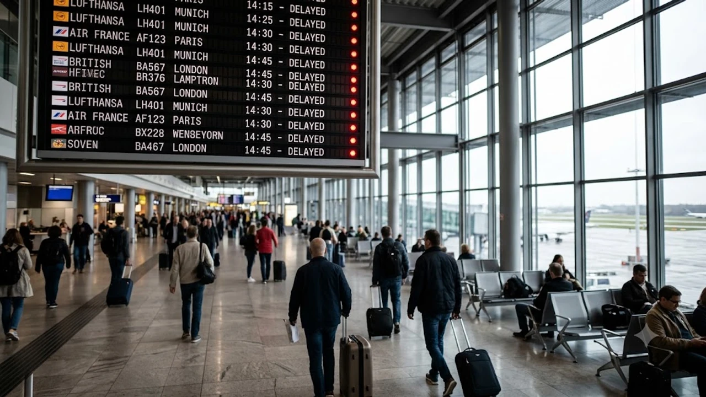

2026년 8월 여름 휴가철을 맞이해 유럽 주요 공항의 노조 파업과 연쇄 지연으로 항공 대란이 본격화하면서 여행객들의 발이 묶이고 있습니다. 현지에서 갑작스러운 항공편 취소나 연착을 겪었다면 승객의 정당한 권리인 **유럽 비행기 지연 보상** 규정을 정확히 파악해야 피해를 최소화할 수 있습니다. 유럽연합(EU) 법률인 EC 261 규정을 활용하면 상황에 따라 최대 600유로(약 90만 원)의 현금 보상금과 숙식 지원을 동시에 챙길 수 있습니다.

## 2026년 8월 유럽 항공 대란: 내 비행기 지연·결항 시 보상 가능 여부

### 유럽 주요 공항 파업 및 지연 현황 실시간 점검
현재 프랑스 파리 샤를드골(CDG), 독일 프랑크푸르트(FRA) 등 유럽 주요 허브 공항은 8월 초부터 이어진 지상 조업 및 항공권 점검 인력의 연쇄 파업으로 연일 혼잡을 겪는 중입니다. 하루 평균 수백 편의 항공편이 최소 2~4시간 이상 늦어지거나 출발 직전 전격 취소되는 상황이 반복되고 있습니다. 출발 전 본인이 이용하는 항공사 앱과 공항 실시간 운항 전광판을 지속적으로 조회하는 조치가 필수입니다.

### 항공사 귀책 사유와 불가항력(기상/공항 통제)의 차이
모든 지연에 보정이 따르는 것은 아닙니다. 유럽연합 사법재판소 판례에 따르면 **항공사 자체 결함(기체 정비, 자체 승무원 부족, 항공사 파업)**은 보상 대상인 '귀책 사유'에 해당합니다. 반면 태풍이나 기습 폭설 같은 기상 악화, 공항 관제탑 통제, 국가 비상사태는 '예외적 불가항력'으로 분류되어 현금 보상 대상에서 제외됩니다. 다만 공항 자체 파업이라 하더라도 항공사가 대체편을 제때 마련하지 못했다면 부분적 권리를 주장할 수 있습니다.

### 내가 이용하는 항공 노선이 EU 규정(EC 261) 적용 대상인지 확인하는 법
EC 261/2004 규정은 모든 항공편에 동일하게 적용되지 않으며, 출발지와 운항 항공사의 국적에 따라 판가름 납니다.

* **EU 출발 모든 항공편:** 국적을 불문하고 한국 국적기(대한항공, 아시아나 등)를 포함한 모든 항공사에 100% 적용됩니다.
* **EU 도착 항공편:** EU 회원국에 본사를 둔 항공사(루프트한자, 에어프랑스, KLM 등)를 이용해 들어갈 때만 적용됩니다.
* **영국 및 스위스:** 영국은 EU 탈퇴 후 동일한 내용을 골자로 하는 UK 261 규정을 운용하므로 실질적인 보상 기준은 같습니다.

---

## 최대 600유로까지! EC 261 보상 조건 및 액수 산정 기준

### 비행 거리별 보상 금액(250유로, 400유로, 600유로) 완벽 비교
EC 261 보상금은 티켓 구매 가격과 상관없이 **비행 거리**를 기준으로 정액 지급됩니다.

> * **1,500km 이하 (단거리):** 250유로 (약 37만 원)
> * **1,500km ~ 3,500km (중거리):** 400유로 (약 60만 원)
> * **3,500km 초과 (장거리 - 한국↔유럽 노선):** **600유로 (약 90만 원)**

한국과 유럽을 오가는 직항 및 경유 노선은 대부분 3,500km를 초과하므로 최댓값인 600유로 구간에 진입합니다.

### 3시간 이상 지연 도착 시 적용되는 보상 기준
출발 지연 시간이 아닌 **'최종 목적지 도착 시각'**을 기준으로 시간을 계산합니다. 비행기 문이 열리고 승객 탈출이 허용된 시점이 예정 시각보다 **3시간 이상** 늦어졌다면 600유로 지급 대상이 됩니다. 만약 대체편을 제공받아 최종 목적지에 예상보다 일찍 도착했다면 보상금이 50% 감액될 수 있습니다. 

이번 휴가 시즌 글로벌 항공 대란의 자세한 여파가 궁금하다면 [세계여행지 최신 트렌드](/posts/world-travel/world-travel-1783348391782/)에서 최근 현황을 함께 파악해보는 것을 추천합니다.

### 대체 편 제공 거부 및 결항 통보 시점에 따른 추가 환불 권리
출발일 기준 **14일 이내**에 결항 통보를 받았다면 현금 보상금과 더불어 티켓 전액 환불 또는 최단 시간 대체 항공편 제공을 요구할 선택권이 생깁니다. 항공사가 제시한 대체편이 마음에 들지 않아 거부할 경우, 미사용한 항공권의 환불은 물론 목적지까지 이동할 수 있는 타 항공사 티켓 비용을 청구할 명분이 확보됩니다.

---

## 공항 현장에서 당장 챙겨야 할 필수 증빙 자료 및 현장 대응

### 항공사 서면 지연·결항 확인서 발급받는 노하우
운항 차질이 발생한 즉시 게이트 구역이나 항공사 데스크로 이동해 **'지연·결항 사유서(Delay Certificate)'**를 서면 또는 이메일로 받아 두어야 합니다. 문서 내에 단순 '운항 일정 변경'이 아닌 정확한 원인(예: 기체 결함, 승무원 연결 지연)이 기재되어 있는지 현장에서 반드시 확인해야 이후 서류 심사에서 유리합니다.

### 식사권(Meal Voucher) 및 숙박 지원 요청 절차
지연 대기 시간이 2시간을 넘어서면 항공사는 승객에게 생필품과 편의를 제공할 의무(Duty of Care)를 집니다.

* **2시간 이상 지연:** 대기 시간에 비례하는 식사권(쿠폰) 및 음료 제공, 무료 통화 2회 제공
* **야간 대기 또는 1박 이상 지연:** 호텔 숙박비 전액 및 공항-호텔 간 왕복 이동 수단(택시/셔틀) 제공

데스크 인원이 부족해 쿠폰을 받지 못했다면 승객 사비로 결제한 뒤 추후 청구하는 방식을 취해야 합니다.

### 영수증(식비, 이동비, 숙박비) 수집 및 보관 가이드
항공사의 지원 공백으로 직접 지출한 모든 영수증은 실물과 디지털 파일로 이중 보관합니다. 식비, 숙박비, 현지 이동비 영수증에는 항목과 날짜, 금액이 명확히 찍혀 있어야 합니다. 단, 과도한 럭셔리 호텔 이용이나 고가의 알코올 음료 구매 내역은 승인 거절 대상이 되므로 상식적인 범위 내의 지출을 유지해야 합니다. 

여름철 예상치 못한 일정 변경으로 새로운 동선이나 일정을 계획해야 하는 경우 [2026년 여름 해외여행 추천 도시 5곳](/posts/world-travel/summer-travel-cities-2026/)을 참고하여 대체 여행지를 구상하는 것도 좋은 대안입니다.

---

## 보상금 실전 청구 단계별 튜토리얼 및 대처 방법

### 항공사 공식 홈페이지 직접 청구 양식 작성법
대행 수수료를 아끼려면 해당 항공사 공식 웹사이트의 **'EU261 Claim'** 또는 **'Customer Compensation'** 메뉴를 활용하는 편이 현명합니다.

1. 항공사 웹사이트 내 고객지원(Help/Contact Us) 서식 접속
2. 예약 번호(PNR 6자리), 탑승권 보딩패스 스캔본, 은행 계좌 정보(IBAN/SWIFT 코드) 입력
3. 결항·지연 확인서 및 지출 영수증 첨부 후 제출
4. 접수 번호(Reference Number)를 기록하고 대기

### 항공사 거절 시 유럽 항공 당국 및 대행 서비스 활용 전략
항공사가 '불가항력적인 기상 악화'를 이유로 보상을 거부하는 사례가 빈번합니다. 이 경우 해당 항공편이 출발한 국가의 **최고 항공 당국(National Enforcement Body, NEB)**에 직접 이의를 제기할 수 있습니다. 

혼자서 법적 조율이 까다롭다면 에어헬프(AirHelp), 스카이리펀드(SkyRefund) 같은 전문 대행 플랫폼을 활용하는 것도 방법입니다. 보상금 수령 성공 시 25~35% 수준의 수수료가 차감되지만, 승소율이 높고 복잡한 법적 분쟁을 알아서 대리해 줍니다.

### 여행자 보험과의 중복 보상 수령 체크리스트
국내 해외 여행자 보험의 '항공기 지연/결항 특약'은 항공사 보상과 **별개로 중복 청구**가 가능합니다. 보험사는 통상 4시간 이상 지연 시 발생한 식비와 생필품 구매비(약 10만~20만 원 한도)를 보상합니다. 항공사로부터 EC 261 정액 보상금을 받더라도 보험사에 영수증을 제출해 지출 비용을 추가로 돌려받을 수 있으므로 두 가지 채널을 모두 가동하는 것이 이득입니다.

#유럽비행기지연보상 #EC261보상금 #유럽항공대란 #비행결항보상 #유럽여행팁 #항공기지연지원 #해외여행자보험청구