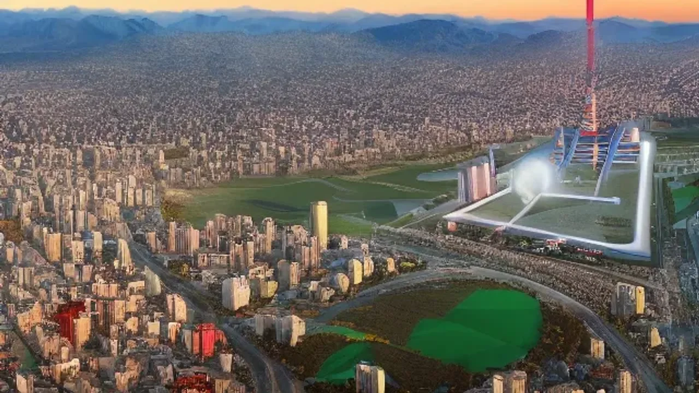
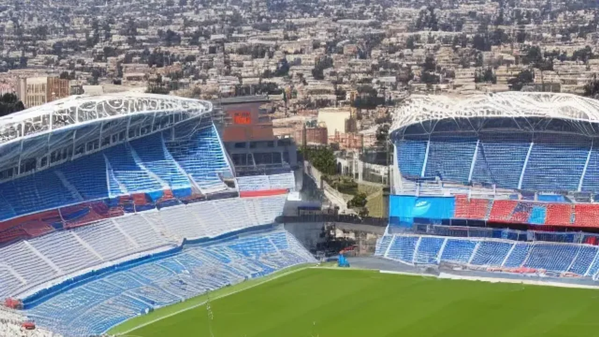

2026 북중미 월드컵 개최가 눈앞으로 다가오면서 전 세계 축구팬들의 시선이 북미 대륙으로 쏠리고 있습니다. 항공권과 숙소 수요가 역대 최고치를 경신하는 지금, 철저한 사전 준비 없이는 막대한 비용 지출과 동선 낭비를 피하기 어렵습니다. 이번 가이드에서는 성공적인 **2026 월드컵 도시 여행**을 위해 폭등하는 현지 물가를 방어하고 개최 도시별 최적의 동선을 구축하는 진짜 꿀팁을 핵심만 정리하여 전해 드립니다.

## 개최 도시별 실시간 숙소·항공 트렌드 비교

### 미국 주요 개최 도시 vs 멕시코·캐나다 물가 분석
미국 에어비앤비 및 호텔 연합회의 6월 실시간 공시 자료에 따르면, 뉴욕(뉴저지)과 LA 등 미국 메가 시티의 경기 당일 숙박 요금은 전년 동기 대비 평균 240% 이상 상승했습니다. 반면 멕시코시티나 과달라하라는 상대적으로 숙박비 상승 폭이 110% 선에 머물러 있어 예산이 한정된 여행자에게 훌륭한 대안이 됩니다. 캐나다 토론토와 밴쿠버의 경우 숙박비 자체는 미국과 유사하나, 대중교통 연계 패스 효율이 높아 체류 비용을 상쇄하기 알맞습니다.

### 경기장 인근 에어비앤비 예약률 및 요금 폭등 현황
> **실시간 예약 경고:** 댈러스 AT&T 스타디움 and 마이애미 하드록 스타디움 반경 5km 이내의 숙소 예약률은 이미 92%를 돌파했습니다. 일반적인 2인 기준 스튜디오 객실이 1박당 600달러를 호가하는 기현상이 벌어지고 있습니다. 

단순히 경기장과 가깝다는 이유만으로 시설이 낙후된 숙소를 고가에 계약하는 우를 범해서는 안 됩니다. 무료 취소 옵션이 없는 상품은 현지 사정 변경 시 고스란히 손해로 이어지므로 결제 전 약관을 반드시 확인해야 합니다.

### 인파를 피하는 도시별 외곽 거점 숙소 추천 리스트
비용을 획기적으로 줄이기 위해서는 경기장 직통 전철이나 광역 버스 노선이 연결되는 30분 거리의 외곽 위성 도시를 거점으로 삼는 전략이 유효합니다.
- **LA 경기장 대응:** 잉글우드 본 도심 대신 전철 노선이 잘 갖춰진 롱비치나 패사디나 인근 숙박
- **뉴욕 경기장 대응:** 맨해튼 중심가 대신 뉴저지 철도(NJ Transit) 라인의 호보컨 또는 저지시티 확보
- **애틀랜타 경기장 대응:** 미드타운 외곽의 마르타(MARTA) 전철역 주변 비즈니스 호텔 공략

## 경기 일정에 맞춘 도시별 이동 동선 최적화

### 미국 동부-서부 대륙 이동 시 항공편 연계 노하우
미국은 하나의 거대한 대륙이므로 동부와 서부를 오가는 일정은 시차와 피로도를 극심하게 유발합니다. 뉴욕에서 LA로 이동할 경우 순수 비행시간만 6시간이 소요되며 3시간의 시차가 발생하므로, 경기 당일 이동은 절대 금물입니다. 델타항공 및 아메리칸항공의 다구간 항공권(Multi-city) 프로그램을 활용해 입국 도시와 출국 도시를 다르게 설정해야 이중 지출을 막을 수 있습니다.

### 개최 도시 내 대중교통(도시철도·셔틀) 100% 활용법
경기 당일 스타디움 주변은 반경 수 킬로미터가 통제되므로 자가용이나 택시 진입이 불가능에 가깝습니다. 애틀랜타의 메르세데스-벤츠 스타디움은 마르타 전철역과 곧바로 연결되며, 시애틀의 루멘 필드 역시 링크 라이트 레일(Link Light Rail)을 이용하면 공항에서 경기장까지 직행할 수 있습니다. 각 지자체가 월드컵 기간 한정으로 운영하는 '월드컵 특별 패스'를 미리 모바일 앱으로 발급받으면 개별 승차권 구매 시간을 아끼게 됩니다.

### 멕시코시티 및 과달라하라 간 광역 이동 가이드
멕시코 내부에서 개최 도시 간을 이동할 때는 도로 정체와 치안 요소를 고려해 고속버스보다는 국내선 항공편을 우선순위에 두어야 합니다. 아에로멕시코와 볼라리스항공이 증편 운항을 실시하고 있으나 수하물 규정이 까다로우므로 배낭 하나로 이동할 수 있는 미니멀 라이프 스타일의 짐 싸기가 요구됩니다. 공항에서 시내로 진입할 때는 반드시 공항 공식 인증 택시(Taxi Autorizado) 매표소에서 티켓을 선결제하고 탑승해야 안전합니다.

## 직관족을 위한 도시별 현지 직수령 및 경기장 주변 인프라

### 티켓 오프라인 수령처 및 경기장 반입 금지 품목 장단점
이번 대회는 철저한 디지털 모바일 티켓팅을 원칙으로 하지만, 시스템 오류를 대비한 현장 발권 센터가 도시별로 운영됩니다. 현장 수령은 여권과 결제 카드가 일치해야 하므로 지갑 관리에 각별한 주의가 필요합니다.
- **장점:** 모바일 네트워크 먹통 사태 시 가장 확실한 입장 수단 확보
- **단점:** 대기 시간이 최소 2시간 이상 소요되며 경기 당일에는 혼잡도가 극에 달함

특히 모든 경기장은 A4 용지 크기 이상의 가방 반입을 금지하며, 투명한 플라스틱 백(Clear Bag)만 허용하는 규칙을 엄격하게 적용하므로 소지품을 최소화해야 합니다.

### 팬 존(Fan Zone) 근처 로컬 스트리트 푸드 구역의 명암
공식 피파 팬 페스티벌(FIFA Fan Festival) 구역은 대형 스크린으로 경기를 관람하며 축제 분위기를 만끽할 수 있는 최적의 장소입니다. 지역 소상공인들이 참여하는 푸드 트럭 존에서 이색적인 북미·멕시코 길거리 음식을 맛볼 수 있는 기회가 열립니다. 다만 행사장 내부의 음식과 음료 가격은 시중 물가보다 1.5배에서 2배 가까이 비싸게 책정되며, 카드 결제만 가능한 구역이 많아 비자나 마스터카드를 필히 지갑에 소지해야 합니다.

### 경기 당일 스타디움 주변 공유 차량(Uber) 이용의 현실과 대안
우버나 리프트 같은 차량 공유 서비스는 경기 종료 직후 심각한 '수요 폭증 요금(Surge Pricing)'이 적용됩니다. 평소 20달러면 이동할 거리가 150달러까지 치솟는 일이 빈번하게 발생합니다. 차량을 호출하더라도 지정된 공유 차량 픽업 존(Ride-share Zone)까지 최소 20분 이상 걸어가야 하므로, 차라리 경기장 인근에서 도보로 30분 이상 벗어난 뒤 일반 주택가나 지하철역 근처에서 차량을 호출하는 방법이 현명합니다.

[관련 글 보기](/posts/world-travel/)

## 현지 마케터가 제안하는 월드컵 시즌 숨은 명소 연계 코스

### 애틀랜타·보스턴 경기 전후로 들르기 좋은 역사적 명소
애틀랜타에서 경기를 관람한다면 다운타운의 코카콜라 박물관과 조지아 아쿠아리움을 연계한 당일치기 도보 여행이 동선상 가장 매끄럽습니다. 보스턴의 경우 질레트 스타디움이 있는 폭스보로 외곽에서 시내로 들어와 미국의 역사를 따라 걷는 '프리덤 트레일'을 체험하는 동선이 알맞습니다. 빨간 벽돌 선을 따라 걷는 이 코스는 보스턴 커먼 공원부터 찰스타운까지 이어지며 올여름 활기찬 미국 동부의 진면목을 보여줍니다.

### 멕시코시티 경기장 근처 로컬 타코 맛집 탐방기
아즈테카 스타디움이 위치한 멕시코시티 남부 구역은 유서 깊은 타코 전문점들이 즐비한 곳입니다. 경기 시작 전 이른 아침에 방문하기 좋은 코요아칸 지역은 프리다 칼로 생가와 함께 골목마다 숯불 향이 가득한 타코 알 파스토르(Taco al Pastor) 노포들이 성업 중입니다. 현지인들이 줄을 서서 먹는 가게를 선택하되, 위생을 위해 생수병은 반드시 밀봉된 새 제품만 개봉하여 마시는 규칙을 지켜야 안전한 여행이 완성됩니다.

### 직관과 휴양을 동시에 잡는 나만의 북미 단기 로드트립 코스
경기가 없는 휴식일에는 도심을 벗어나 렌터카를 이용한 단기 로드트립으로 대자연을 만끽하는 일정을 추천합니다. LA에서 출발해 산타모니카 해변을 지나 1번 국도를 따라 올라가는 캘리포니아 해안 드라이브는 탁 트인 태평양을 마주하는 최고의 힐링 코스입니다. 토론토에 머무는 여행자라면 나이아가라 폭포까지 이어지는 왕복 3시간 코스의 렌터카 투어를 조합하여 스포츠의 열기와 대자연의 웅장함을 동시에 경험하는 알찬 일정을 완성할 수 있습니다.

**함께 읽으면 좋은 글**
- [2026 유럽 항공 지연, 진짜 보상받는 3가지](/posts/world-travel/2026-europe-flight-delay-atc-compensation-guide/)
- [스페인 공항 무기한 파업 비상 대처법 3가지](/posts/world-travel/2026-spain-airport-strike-europe-flight-disruption-guide/)

#2026월드컵 #북미월드컵 #월드컵도시여행 #미국여행코스 #멕시코시티여행 #해외축구직관 #세계여행트렌드 #월드컵숙소예약