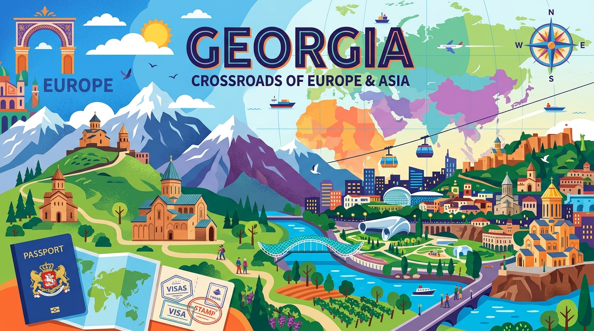
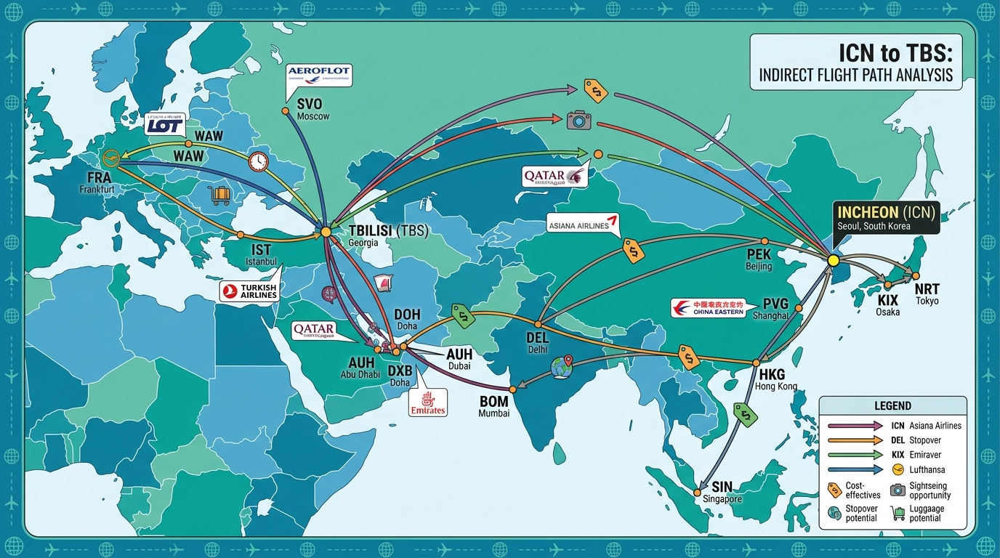

## 2026년 조지아, 왜 지금 주목해야 할까? (매력 분석)

2026년, 당신의 버킷리스트에 **2026 조지아 여행**이 오르지 않았다면, 지금부터 주목해 보세요. 유럽과 아시아의 경계에서 독특한 문화와 압도적인 자연경관을 뽐내는 조지아는 여행자들 사이에서 '가장 뜨거운 여행지'로 떠오르고 있답니다. 왜 조지아가 이토록 많은 이들의 마음을 사로잡는지, 그 숨겨진 매력을 함께 파헤쳐 볼까요?

### 유럽과 아시아의 교차점, 독특한 문화와 자연의 조화

조지아는 지리적으로 유럽과 아시아가 만나는 길목에 자리 잡고 있어, 두 대륙의 문화가 절묘하게 섞인 독특한 매력을 자랑합니다. 서유럽의 세련됨이나 동남아시아의 열대 분위기와는 확연히 다른, 오직 조지아에서만 느낄 수 있는 분위기가 있죠. 수도 트빌리시는 고대 유적과 현대적인 건축물, 그리고 소비에트 시대의 흔적이 어우러져 마치 시간 여행을 하는 듯한 기분을 안겨줍니다. 좁은 골목길을 걷다 보면 벽화 예술가들의 작품을 만나기도 하고, 현대적인 카페에서 조지아 전통 와인을 맛볼 수도 있어요. 이런 예상치 못한 조합이 여행의 재미를 더해준다고 생각해요.

### 코카서스의 웅장함과 8천년 와인 역사의 만남

조지아를 이야기할 때 코카서스 산맥을 빼놓을 수 없죠. 웅장한 산세는 그 자체로 한 폭의 그림 같고, 특히 카즈베기 지역의 스테판츠민다 성 삼위일체 교회는 코카서스의 압도적인 풍경과 어우러져 잊을 수 없는 장관을 연출합니다. 마치 영화 속 한 장면 같아요. 저는 개인적으로 그곳에 서서 드넓은 자연을 바라보며 깊은 평화와 경이로움을 동시에 느꼈답니다.

더 놀라운 것은 조지아가 무려 8,000년 이상의 와인 생산 역사를 지닌 '와인의 발상지'라는 사실이에요. 유네스코 세계문화유산으로 등재된 전통 와인 양조 방식인 '크베브리(Qvevri)'는 조지아만의 자부심이죠. 카헤티 지역에서는 수많은 와이너리를 방문해 직접 와인 테이스팅을 하고, 오랜 역사를 간직한 포도밭을 거닐며 와인의 매력에 흠뻑 빠질 수 있습니다. 와인 애호가라면 절대 놓쳐서는 안 될 경험이라고 감히 말씀드릴 수 있어요.

## 2026 조지아 항공권, 최적가로 예약하는 비법

조지아 여행을 계획한다면 가장 먼저 걱정되는 것이 바로 항공권이겠죠? 2026년 현재, 인천(ICN)에서 조지아의 수도 트빌리시(TBS)까지 가는 직항편은 아쉽게도 없습니다. 하지만 걱정 마세요! 스마트한 경유편을 찾는다면 생각보다 합리적인 가격으로 조지아에 닿을 수 있답니다.

### 인천-트빌리시 직항은 없지만, 스마트한 경유편 찾기

직항이 없다는 사실에 실망하지 마세요. 오히려 다양한 항공사와 경유지를 선택할 수 있다는 장점이 있습니다. 중국국제항공, 루프트한자, 중국남방항공 등 여러 주요 항공사들이 트빌리시행 경유편을 운항하고 있어요. 경유 시간이 조금 길어질 수는 있지만, 이를 이용해 잠시 다른 도시를 탐험하는 '스톱오버' 기회를 잡을 수도 있죠. 저는 개인적으로 경유 시간이 짧으면서도 서비스가 좋은 항공사를 선택하는 편인데, 여러분도 자신에게 맞는 기준을 세워보세요.

### 2026년 항공권 가격 트렌드와 알림 설정 꿀팁

2026년 현재, 인천-트빌리시 왕복 항공권은 최저 625,799원부터, 편도 항공권은 348,131원부터 찾아볼 수 있습니다. 이 가격은 시기와 예약 시점에 따라 변동성이 크다는 점을 기억해야 해요. 스카이스캐너 데이터에 따르면 10월이 가장 저렴한 달로 나타나기도 하고, 트립닷컴 데이터 기준으로는 5월이 가장 저렴할 때도 있다고 합니다.

가장 좋은 방법은 여러 항공권 비교 사이트에서 '가격 변동 알림'을 설정해두는 거예요. 원하는 날짜와 목적지를 입력해두면, 항공권 가격이 떨어졌을 때 알림을 받을 수 있어서 최적의 구매 시점을 놓치지 않을 수 있습니다. 저도 이 방법으로 여러 번 득템을 했답니다! 미리미리 움직이는 사람이 좋은 기회를 잡는 법이죠.

## 한국인 조지아 비자 및 2026년 필수 준비물 총정리

해외여행을 떠나기 전, 비자 문제와 준비물을 체크하는 것은 필수 중의 필수입니다. 2026년 조지아 여행을 계획하고 계신다면, 한국 여권 소지자에게는 아주 좋은 소식이 있어요!

### 한국 여권 소지자, 조지아 무비자 입국 조건은?

대한민국 여권을 가지고 있다면, 조지아는 별도의 비자 없이 무비자로 입국할 수 있는 국가입니다. 무려 1년 동안 체류가 가능하니, 장기 여행이나 한 달 살기를 계획하는 분들에게는 정말 매력적인 조건이죠. 저도 비자 걱정 없이 여유롭게 여행을 즐길 수 있어서 마음이 편했어요. 다만, 여권 유효기간이 충분히 남아있는지 (일반적으로 6개월 이상) 미리 확인하는 것을 잊지 마세요.

### 2026년 여행자 보험 가입, 놓치지 마세요

조지아는 무비자 입국이 가능하지만, 여행자 보험은 '선택이 아닌 필수'라고 강조하고 싶어요. 2026년 현재, 조지아 입국 시 여행자 보험 가입이 의무화되었다는 정보는 없지만, 예상치 못한 사고나 질병, 수하물 분실 등에 대비하기 위해서는 반드시 가입하는 것이 현명합니다. 해외에서 의료비는 상상 이상으로 비쌀 수 있거든요. 저도 혹시 모를 상황에 대비해 항상 넉넉한 보장 내용으로 가입하는 편이에요. 최소한의 비용으로 큰 걱정을 덜 수 있으니, 꼭 가입하고 떠나세요!

이 외에도 여권 사본, 숙소 예약증, 비상 연락처 등 기본적인 여행 서류들을 꼼꼼하게 챙기는 것이 좋습니다. 또한, 현지에서 사용할 소액의 현금(조지아 라리, GEL)과 신용카드, 상비약, 휴대용 충전기 등 개인에게 필요한 물품들도 미리 리스트업 해서 준비하면 여행이 훨씬 순조로울 거예요.

## 유럽 속 가성비 갑! 2026년 조지아 물가 완전 분석

유럽 여행이라고 하면 으레 비싼 물가를 떠올리곤 합니다. 하지만 조지아는 유럽 내에서도 손꼽히는 '가성비'를 자랑하는 여행지예요. 2026년 조지아 여행을 계획하면서 물가 때문에 고민할 필요는 전혀 없답니다!

### 환율부터 일일 예산까지, 조지아 물가 미리보기

2026년 5월 28일 기준, 1 조지아 라리(GEL)는 약 548 KRW입니다. 환율은 변동되니 여행 전 다시 한번 확인하는 것이 좋아요. GoTripzi 데이터에 따르면, 조지아 여행의 일일 예산은 약 86,300원(GEL 157)으로 추정됩니다. 이 정도면 서유럽의 웬만한 도시에서 하루 예산의 절반 수준이라고 볼 수 있죠. 숙박, 식사, 교통까지 모두 합쳐서 이 정도 예산이라면 정말 매력적이지 않나요?

-   **숙박비:** 트빌리시 3성급 호텔은 1박당 평균 93,947원 수준이며, 호스텔은 14,683원부터 시작합니다. 트립닷컴 데이터 기준, 트빌리시 호텔 요금은 11월이 가장 저렴하고 7월이 가장 높다고 하니, 여행 시기에 따라 숙박비를 조절할 수 있습니다.
-   **식비:** 현지 식당에서는 저렴하면서도 맛있는 조지아 전통 음식을 실컷 즐길 수 있어요. 힌칼리(만두), 하차푸리(치즈빵) 같은 대표 음식들은 가격도 착하고 양도 푸짐하죠. 작은 현지 식당이나 시장을 이용하면 훨씬 저렴하게 식사를 해결할 수 있습니다. 저는 시장에서 신선한 과일과 빵을 사서 간식으로 먹곤 했는데, 정말 꿀맛이었어요.
-   **교통비:** 트빌리시 등 주요 도시의 대중교통은 비교적 저렴하고 편리하게 이용할 수 있습니다. 메트로, 버스 등이 잘 되어 있어 시내 이동에 전혀 불편함이 없어요.

### 숙박, 식비, 교통비 절약하는 현지 꿀팁 대방출

조지아에서 여행 경비를 더욱 절약하고 싶다면 몇 가지 팁을 알려드릴게요.

1.  **호스텔 또는 게스트하우스 이용:** 저렴한 숙소를 찾는다면 호스텔 도미토리나 현지인이 운영하는 게스트하우스를 이용해 보세요. 현지 문화를 더 가까이서 경험할 수 있는 좋은 기회가 됩니다.
2.  **현지 시장 이용:** 대형 마트보다는 데세르티르 바자르(Deserter Bazaar) 같은 현지 시장에서 식료품이나 간식을 구매하면 훨씬 저렴합니다. 신선한 과일, 치즈, 빵 등을 맛보는 재미도 쏠쏠하죠.
3.  **마르슈루트카(Marshrutka) 이용:** 도시 간 이동 시에는 '마르슈루트카'라고 불리는 봉고차 형태의 대중교통을 이용해 보세요. 기차나 택시보다 훨씬 저렴하고, 현지인들과 함께 여행하는 색다른 경험을 할 수 있습니다. 물론 조금 불편할 수는 있지만, 그 또한 여행의 묘미라고 할 수 있죠.

## 조지아 여행, 이것만 알면 성공! 추천 코스 & 현지 팁

조지아는 볼거리, 즐길 거리가 풍부해서 여행 계획을 세울 때 어디부터 가야 할지 고민될 수 있어요. 제가 직접 경험하고 추천하는 코스와 현지에서 유용한 팁들을 알려드릴게요.

### 5월이 최고? 조지아 추천 여행 시기와 필수 방문지

조지아 여행에 가장 좋은 시기 중 하나는 5월입니다. 날씨가 온화하고 자연이 푸르러서 야외 활동을 하기에 최적이죠. 물론 트빌리시는 일 년 중 언제 방문해도 매력적이지만, 5월의 조지아는 특히 아름답다고 느꼈어요.

**추천 방문지:**

-   **트빌리시(Tbilisi):** 조지아의 수도이자 심장입니다. 올드 타운의 좁은 골목길을 거닐고, 나리칼라 요새에 올라 도시 전경을 감상하고, 유황 온천에서 피로를 풀어보세요. 보헤미안적인 매력과 활기 넘치는 분위기가 정말 독특합니다.
-   **카즈베기(Kazbegi):** 웅장한 코카서스 산맥의 풍경을 만끽할 수 있는 곳입니다. 특히 스테판츠민다 성 삼위일체 교회의 모습은 평생 잊지 못할 거예요. 트레킹을 즐기는 분들에게 강력하게 추천합니다.
-   **카헤티(Kakheti):** 와인의 발상지답게 수많은 와이너리가 자리하고 있습니다. 아름다운 시그나기 마을을 둘러보고, 와인 투어에 참여해 조지아 와인의 깊은 맛을 경험해 보세요.
-   **바투미(Batumi):** 흑해 연안에 위치한 해변 도시로, 여름에는 해수욕을 즐기는 휴양객들로 북적입니다. 현대적인 건축물과 야자수가 어우러져 이국적인 분위기를 풍겨요.
-   **쿠타이시(Kutaisi):** 고대 유적과 동굴을 탐험하고 싶다면 쿠타이시를 방문해 보세요. 바그라티 대성당과 프로메테우스 동굴은 꼭 가봐야 할 명소입니다.

### 안전, 언어, 현금, 인터넷까지! 현지에서 유용한 A to Z

낯선 곳으로 떠나는 여행은 언제나 설렘과 동시에 약간의 긴장을 동반하죠. 조지아에서 유용하게 쓰일 현지 팁들을 알려드릴게요.

-   **안전 및 건강:** 조지아는 일반적으로 안전한 여행지입니다. 하지만 어느 여행지에서나 그렇듯이 소지품 관리에 유의하고, 밤늦게 혼자 다니는 것은 피하는 것이 좋습니다. 기본 상비약을 챙기는 것도 잊지 마세요.
-   **언어 및 문화:** 조지아어는 고유의 문자를 가진 독특한 언어입니다. 트빌리시 등 주요 도시의 젊은 세대 사이에서는 영어가 통용되지만, 기본적인 조지아어 인사말 정도는 익혀두면 현지인들과 소통하는 데 큰 도움이 됩니다. '가마르조바(안녕하세요)', '마들로바(감사합니다)' 같은 간단한 표현만으로도 환대받는 느낌을 받을 수 있을 거예요. 조지아 사람들은 환대가 뛰어나기로 유명하며, 교회 방문 시에는 어깨와 무릎을 가리는 단정한 복장을 착용해야 합니다. 스카프나 치마를 빌려주는 곳도 많으니 너무 걱정하지 마세요.
-   **현금 준비:** 신용카드가 통용되는 곳이 많지만, 작은 상점이나 시장, 시골 지역에서는 현금만 받는 경우가 꽤 있습니다. 따라서 조지아 라리(GEL)를 미리 환전하거나 현지 ATM에서 인출하여 소액의 현금을 항상 소지하는 것이 편리합니다.
-   **인터넷:** 조지아 여행 시에는 현지 유심(SIM) 카드나 eSIM을 구매하여 사용하는 것이 편리합니다. Magti, Silknet, Cellfie 등 현지 통신사에서 고속 5G/4G 데이터를 이용할 수 있어요. 특히 eSIM은 온라인으로 구매하여 간편하게 설치할 수 있어서 물리적인 유심 교체 없이 바로 사용할 수 있다는 장점이 있습니다. 저도 eSIM을 사용했는데, 정말 편리하더라고요.

[다른 세계여행지 정보 보러가기](/posts/world-travel/)

## 2026 조지아 여행, 그래서 추천할까? (장단점 & 총평)

이제 조지아의 매력과 실용적인 정보들을 충분히 살펴보았으니, 마지막으로 제가 느낀 조지아 여행의 장단점을 솔직하게 이야기해볼까 해요. 과연 2026년 조지아 여행, 당신에게도 추천할 만할까요?

### 조지아 여행의 매력적인 장점과 아쉬운 점

조지아 여행의 가장 큰 장점은 바로 **압도적인 가성비**입니다. 유럽의 다른 어떤 나라와 비교해도 저렴한 물가로 숙박, 식사, 교통, 액티비티까지 모두 풍족하게 즐길 수 있어요. 덕분에 예산 걱정 없이 더욱 여유로운 여행이 가능했죠. 또한, **독특한 문화와 웅장한 자연경관**의 조화는 다른 곳에서는 경험하기 어려운 특별한 추억을 선사합니다. 8,000년 와인 역사, 코카서스 산맥의 비경, 그리고 친절한 현지인들의 환대는 조지아를 잊을 수 없는 여행지로 만들어요.

하지만 아쉬운 점도 물론 있습니다. 인천에서 트빌리시까지 **직항이 없다는 점**은 짧은 일정의 여행자들에게는 다소 불편할 수 있어요. 경유 시간을 잘 활용하면 되지만, 이동 시간이 길어지는 것은 피할 수 없죠. 또한, 트빌리시 같은 대도시를 벗어나면 영어가 잘 통하지 않는 경우가 많아 **언어 장벽**을 느낄 수도 있습니다. 저는 번역 앱을 적극적으로 활용했는데, 기본적인 조지아어 인삿말을 외워두면 현지인들과 더욱 친밀하게 소통할 수 있었어요.

### 잊지 못할 조지아 경험, 나만의 추억 만들기

종합적으로 볼 때, 조지아는 분명 **매력적인 장점이 훨씬 많은 여행지**입니다. 저렴한 비용으로 유럽과 아시아의 독특한 문화를 동시에 경험하고, 숨 막히는 자연 속에서 진정한 휴식을 찾고 싶은 분들에게는 최고의 선택이 될 거예요. 북적이는 관광지보다는 조금 더 여유롭고, 색다른 경험을 추구하는 여행자라면 조지아는 분명 당신의 기대를 뛰어넘는 감동을 선사할 것입니다.

2026년, 당신만의 조지아 여행을 계획하고 직접 경험해보세요. 코카서스 산맥의 신비로운 풍경, 달콤한 조지아 와인 한 잔, 그리고 따뜻한 현지인들의 미소는 당신의 기억 속에 오래도록 아름다운 추억으로 남을 것이라고 확신합니다.

**함께 읽으면 좋은 글**
- [2026 AI 여행 플래너로 꿀 빠는 가성비 일정 완전 정리](/posts/world-travel/2026-ai-travel-planner-budget-itinerary-guide/)
- [2026 여권 순위 발표! 한국 2위로 바뀐 무비자 국가는?](/posts/world-travel/2026-global-passport-ranking-korea-visa-free-travel-guide/)

#2026조지아여행 #조지아항공권 #조지아비자 #조지아물가 #조지아여행팁 #트빌리시 #코카서스 #와인의발상지