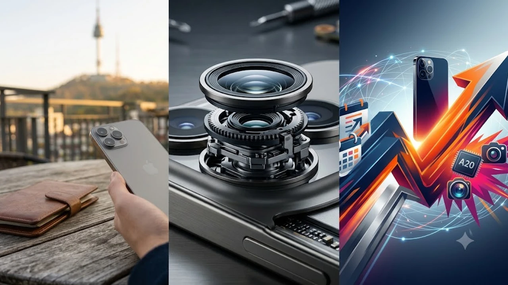

2026년 가을 애플 스페셜 이벤트를 거치며 **아이폰18 출시일**과 세부 사양이 윤곽을 드러냈다. 이번 신작은 전작의 아쉬운 점을 보완한 하드웨어 도약과 실사용 체감 중심의 기술 개편이 맞물려 사전예약 시점부터 뜨거운 관심을 받는다. 이동성과 카메라 촬영이 잦은 사용자라면 신제품으로의 기변 실익을 따져볼 타이밍이다.

## 아이폰18 출시일 및 사전예약 세부 일정

### 1차 출시국 발표와 한국 사전예약 시작일
한국이 1차 출시국 지위를 유지하면서 본사 발표 직후 주 금요일 자정부터 통신 3사와 공인 리셀러 채널에서 일제히 사전예약이 열렸다. 

* **공식 사전예약 기간**: 발표 주간 금요일 00시 오픈 후 일주일간
* **공식 출시 및 수령일**: 사전예약 마감 직후 금요일부터 순차 택배 수령 및 매장 픽업 진행

초기 입고 물량은 프로 및 프로 맥스 티타늄 그레이 계열에 몰려 1차 차수가 10분 만에 마감되는 패턴을 보였다.

### 통신사 혜택과 자급제 카드 할인 비교
구매 방식은 통신사 약정 결합과 자급제 일시불 구매로 극명하게 갈린다. 

* **자급제 오픈마켓**: 카드사 즉시 할인 5~8%와 최대 18개월 무이자 할부를 제공해 통신 기본료를 낮추는 알뜰폰(MVNO) 이용자에게 가장 유리하다.
* **통신 3사 개통**: 번호이동 중심의 전환지원금과 공시지원금을 일시에 얹어 초기 기깃값을 깎는 대신, 고가 요금제(월 9만 원 이상)를 최소 6개월 유지해야 한다.

> 무약정 알뜰 요금제를 쓰고 있다면 오픈마켓 자급제에 카드사 청구 할인을 얹어 기기를 확보하는 편이 2년 총유지비 측면에서 20만 원 이상 이득이다.

---

## 전작과 무엇이 다른가: 핵심 스펙 변화 3가지

### 2나노 A20 칩셋 탑재로 인한 전력 및 AI 연산 성능
TSMC의 차세대 2나노 공정으로 양산된 A20 바이오닉 칩셋이 기본형과 프로형 전 라인업에 나뉘어 들어갔다.

- **전력 효율**: 전작 대비 고부하 작업 시 전력 소모가 18% 감소해 화면 켜짐 시간이 1시간 반가량 늘었다.
- **온디바이스 AI 구동**: 뉴럴 엔진 대역폭이 30% 넓어져 통신망 연결 없는 실시간 음성 번역과 사진 속 복잡한 배경 오브젝트 지우기 속도가 즉각 반응한다.

발열 해소를 위해 프로 라인업에는 흑연 시트와 개선된 증기 챔버(Vapor Chamber) 구조를 덧대어 고사양 게임 구동 시 프레임 드롭을 잡았다.

### 메인 카메라 가변 조리개 적용과 저조도 품질
프로 라인업 메인 렌즈에 기계식 가변 조리개가 들어갔다. 조리개 값이 f/1.4에서 f/2.4 사이로 유연하게 조절되면서 근접 촬영 시 피사체 주변부가 무너지는 왜곡 현상을 대폭 억제한다. 

야간 촬영에서는 f/1.4 개방값을 통해 셔터스피드를 확보하므로 흔들림 없는 원경 야경을 담을 수 있고, 주간 야외 인물 모드에서는 과도한 디지털 누끼 효과 없이 자연스러운 광학 보케를 살려낸다. 해외 출국 시 낯선 골목 야경을 고화질로 기록하려는 여행자에게 유용한 포인트다. 해외 현지 여행 팁이 궁금하다면 [세계여행지 최신 트렌드](/posts/world-travel/world-travel-1783348391782/)나 규정이 까다로워진 [베네치아 당일치기 300유로 벌금 피하는 법](/posts/world-travel/venice-day-trip-entry-fee-qr-fine-guide/)을 함께 참고해도 좋다.

### 티타늄 마감 개선과 디스플레이 베젤 축소
프레임 모서리의 곡률을 손바닥 밀착형으로 다듬고 2세대 티타늄 합금을 적용해 지문 얼룩과 흠집 취약점을 보완했다. 테두리 베젤 폭을 1.1mm 수준까지 깎아내 기기 자체의 가로 세로 치수는 키우지 않은 채 디스플레이 면적만 넓혔다. 그 결과 무게 배분이 중앙으로 집중되어 장시간 한 손 파지 시 손목 피로도가 확연히 줄었다.

---

## 일반 모델 vs 프로 라인업: 나에게 맞는 선택 가이드

### 주사율·AP 차이로 갈리는 실체감 성능
디스플레이 주사율과 AP 탑재 급 나누기는 이번에도 명확하다.

* **일반 및 플러스 모델**: A20 일반형 칩셋과 60Hz 재생률을 유지해 웹서핑과 SNS, 동영상 시청 위주의 가벼운 사용 패턴에 집중했다.
* **프로 및 프로 맥스**: 가변 120Hz 프로모션(ProMotion)과 올웨이즈 온 디스플레이(AOD)를 지원해 스크롤 전환이나 빠른 텍스트 읽기에서 눈 피로도가 낮다.

### 망원 줌 성능과 전문 비디오 기능 필요성
* **일반형**: 메인 48MP 센서 크롭을 통한 2배 무손실 줌을 지원하므로 카페 스냅이나 일상 기록용으로 알맞다.
* **프로형**: 5배 테트라프리즘 망원 렌즈와 전문가용 ProRes Log 4K 120fps 녹화를 독점 제공한다. 공연장 관람이나 멀리 떨어진 피사체를 왜곡 없이 당겨 찍어야 한다면 프로 모델이 필수적이다.

---

## 전작 사용자 기변 가치 및 출고가 비교

### 아이폰16·17 사용자의 체감 업그레이드 폭
아이폰16이나 17 기본형 사용자가 프로로 넘어온다면 120Hz 주사율과 망원 카메라, 대폭 개선된 야간 저조도 화질에서 즉각적인 체감을 얻는다. 반면 17 프로 라인업 사용자는 가변 조리개와 AI 연산 속도를 제외하면 일상 영역에서의 차이가 크지 않아 한 세대 더 건너뛰어도 무방하다.

### 모델별 최종 확정 출고가와 중고 보상 프로그램
환율 여파에도 불구하고 국내 출고가는 동결 기조를 지켰다.

- **아이폰18 (128GB)**: 125만 원부터
- **아이폰18 프로 (128GB)**: 155만 원부터
- **아이폰18 프로 맥스 (256GB)**: 190만 원부터

애플 트레이드인이나 사설 중고 보상 플랫폼을 연계하면 1~2년 사용한 전작 기기 반납 시 45~70만 원 선의 실부담금 상쇄가 가능하다. 

출국이나 야외 출사가 잦아 보조배터리와 맥세이프 액세서리를 함께 구비할 계획이라면 [아이폰 맥세이프 보조배터리 쿠팡에서 보기](https://www.coupang.com/np/search?q=%EB%A7%A5%EC%84%B8%EC%9D%B4%ED%94%84+%EB%B3%B4%EC%A1%B0%EB%B0%B0%ED%84%B0%EB%A6%AC&sourceType=affiliate&trackingCode=AF8691300)를 둘러보고 사전에 준비해두는 것을 권한다.

#아이폰18 #아이폰18출시일 #아이폰18사전예약 #아이폰18스펙 #아이폰가변조리개 #자급제사전예약 #애플스페셜이벤트