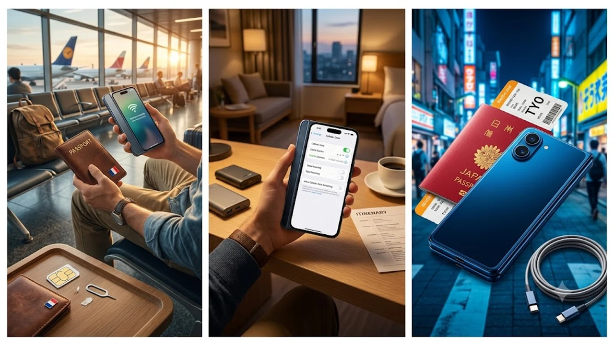

애플이 여권 비율의 독자적인 폴더블 폼팩터를 발표하며 전 세계 출시 모델에서 물리 유심 트레이를 전면 배제하자, 자유여행객의 통신 준비 체계도 완전히 전환되었습니다. 기존처럼 공항 카운터에서 플라스틱 칩을 사 뾰족한 핀으로 갈아 끼우는 풍경 대신, 기기 내에 디지털 프로필을 직접 내려받는 **아이폰 Duo 해외여행 eSIM** 세팅 및 로밍 최적화가 필수 테크로 자리 잡았습니다. 하드웨어 슬롯이 아예 없는 단말기 기준으로 공항 착륙 직후 데이터 먹통을 방지하는 실전 세팅 수칙을 정리했습니다.

## 물리 유심 트레이 퇴출과 공항 입국장 풍경의 변화

### 추출 핀 분실 걱정 없는 여권 규격 폼팩터의 현장 체감
가로 폭을 여권 규격에 맞춘 덕분에 기내 좌석 그물망이나 여권 케이스 안쪽에 자연스럽게 들어가는 휴대성을 자랑합니다. 기기 테두리 어디에도 유심 트레이 구멍이 없어 비행기 좌석 틈새로 손톱만 한 나노 유심을 떨어뜨려 발을 구를 일이 원천 차단되었습니다. 착륙 안내 방송이 나오면 화면을 펼치고 미리 등록해 둔 현지 통신사 토글을 켜는 즉시 셀룰러 망에 연결됩니다.

### 부스 대기열을 건너뛰는 무유심 단말기 운용 전략
북미 출시 기기에만 적용되던 무유심 정책이 글로벌 전 라인업으로 확대되면서, 파리 샤를 드골이나 방콕 수완나품 공항에 도착해 환전소 옆 통신사 부스 앞에 30분씩 줄을 설 이유가 사라졌습니다. 출발 전 집이나 국내 공항 라운지 와이파이에서 QR 코드를 인식시켜 셀룰러 프로필을 저장해 두면, 현지 도착 게이트를 통과하자마자 곧바로 메신저와 지도 앱을 구동할 수 있습니다.

## 출국 전 듀얼 프로필 구성과 과금 차단 설정

### 8개 저장 슬롯을 활용한 메인 및 보조 회선 분리
단말 내부에는 최대 8개의 가상 회선을 보관할 수 있으며, 일상과 여행 목적에 맞춰 2개 회선을 동시에 대기 상태로 두는 듀얼 심 모드를 지원합니다. 여행자에게 가장 이상적인 구성은 명확합니다.

- **메인 회선 (국내 알뜰폰·통신사)**: 음성 통화 및 SMS 수신 유지 (카드 결제 승인 번호, 본인 인증 문자 전용)
- **보조 회선 (현지 로컬 데이터)**: 셀룰러 데이터 단독 할당 및 '셀룰러 데이터 전환 허용' 비활성화

> **데이터 폭탄 원천 차단 팁**  
> `설정 > 셀룰러 > 셀룰러 데이터`에서 데이터 통신 회선을 반드시 구매한 현지 프로필로 지정해야 합니다. 이때 하단의 `셀룰러 데이터 전환 허용` 옵션이 켜져 있으면, 현지 기지국 신호가 일시적으로 약해질 때 한국 메인 번호로 자동 전환되어 종량제 데이터 폭탄 요금이 청구되므로 반드시 꺼두어야 합니다.

### 다구간 이동자를 위한 국가별 사전 다운로드 수칙
유럽이나 미주처럼 여러 국가를 연속 이동할 때는 대륙 통합형 프로필을 준비하거나, 이동할 국가별 프로필을 국내 출발 전에 미리 받아두는 편이 안전합니다. [미국 여행 입국 바뀐 규정 진짜 3가지](/posts/world-travel/us-travel-reentry-advance-parole-rule-change-2026/)와 같은 까다로운 입국 심사대에서는 공항 무료 와이파이 접속 장애가 빈번하므로, 비행기 문이 열리자마자 작동하는 로컬 셀룰러 망이 모바일 전자 서류(입국 심사서, 세관 신고서) 제출에 큰 힘을 발휘합니다.

## 현지 통신망 먹통 오류 해결과 전력 관리

### APN 수동 설정과 통신사 수동 검색 프로토콜
현지에 도착해 비행기 탑승 모드를 해제했는데도 '서비스 없음'이나 '검색 중' 문구만 맴돌 때가 있습니다. 현지 제휴 통신망 자동 인식이 늦어질 때 일어나는 흔한 문제입니다. 이럴 때는 `설정 > 셀룰러 > 네트워크 선택`으로 들어가 '자동'을 끄고, 바우처 안내장에 기재된 현지 1위 통신사(예: 일본 SoftBank, 미국 T-Mobile)를 수동 지정하면 즉각 안테나가 복구됩니다. 신호는 잡히는데 웹페이지가 열리지 않는다면 `데이터 로밍` 토글이 켜져 있는지 가장 먼저 확인해야 합니다.

### 듀얼 스탠바이 발열 억제 및 배터리 절감 테크닉
두 개의 무선 통신 칩셋이 기지국 전파를 동시 탐색하는 환경에서는 단일 회선 사용 대비 시간당 10~15% 수준의 배터리가 더 소모됩니다. 일정 중 전력 낭비를 줄이려면 세 가지 수칙을 기억해야 합니다.

- 낮 시간 동안 한국 음성 통화 수신이 불필요하다면 메인 회선 토글 일시 비활성화
- 5G 망 구축이 미흡한 외곽 지역이나 고속 이동 구간에서는 `음성 및 데이터`를 `LTE 우선`으로 변경
- 백그라운드 앱 새로고침 목록에서 메신저와 지도 앱을 제외한 스트리밍·SNS 앱 동기화 차단

## 여행 실전 상황별 멀티태스킹과 하드웨어 보완

### 카드 결제 인증과 차량 호출 앱의 실시간 연동
해외 현지 식당 예약이나 미술관 입장권 결제 시 국내 카드사에서 발송하는 SMS 인증번호(OTP)를 제때 받아내지 못해 일정이 꼬이는 경우가 많습니다. 한국 번호를 수신 회선으로 살려두면 별도 통화료 지출 없이 문자를 실시간 확인할 수 있습니다. 동시에 데이터 회선으로는 그랩(Grab)이나 우버(Uber) 기사의 위치를 지도 위에서 실시간 추적할 수 있어 해외 현지 이동 동선이 매끄럽게 연결됩니다.

### 여권 비율 와이드 화면의 지도·탑승권 2분할 활용
화면을 가로로 넓게 쓸 수 있는 폴더블 규격 특성상, 좌측 화면에는 지도 경로를 띄우고 우측 화면에는 기차 탑승권이나 바우처 QR 코드를 나란히 배치해 개찰구를 빠르게 통과할 수 있습니다. 2개 앱을 동시에 구동해도 현지 로컬 망 직결 상태라 로딩 지연이 발생하지 않습니다. 여행 환경과 스마트 기기가 결합된 최신 여행 방식은 [세계여행지 최신 트렌드](/posts/world-travel/world-travel-1783348391782/) 자료에서도 뚜렷하게 관찰되는 흐름입니다.

물리 트레이가 사라진 초박형 단말기 환경에서는 장시간 내비게이션 구동 시 발열과 전력 소모를 효과적으로 방어해 줄 고출력 보조배터리 구비가 현지 여행의 필수 조건으로 꼽힙니다.
[여행용 초고속 보조배터리 쿠팡에서 보기](https://www.coupang.com/np/search?q=%EC%97%AC%ED%96%89%EC%9A%A9%EB%B3%B4%EC%A1%B0%EB%B0%B0%ED%84%B0%EB%A6%AC&sourceType=affiliate&trackingCode=AF8691300)

#아이폰Duo #아이폰해외eSIM #데이터로밍설정 #듀얼eSIM활용 #해외여행데이터 #스마트폰세팅 #공항통신망 #가을해외여행