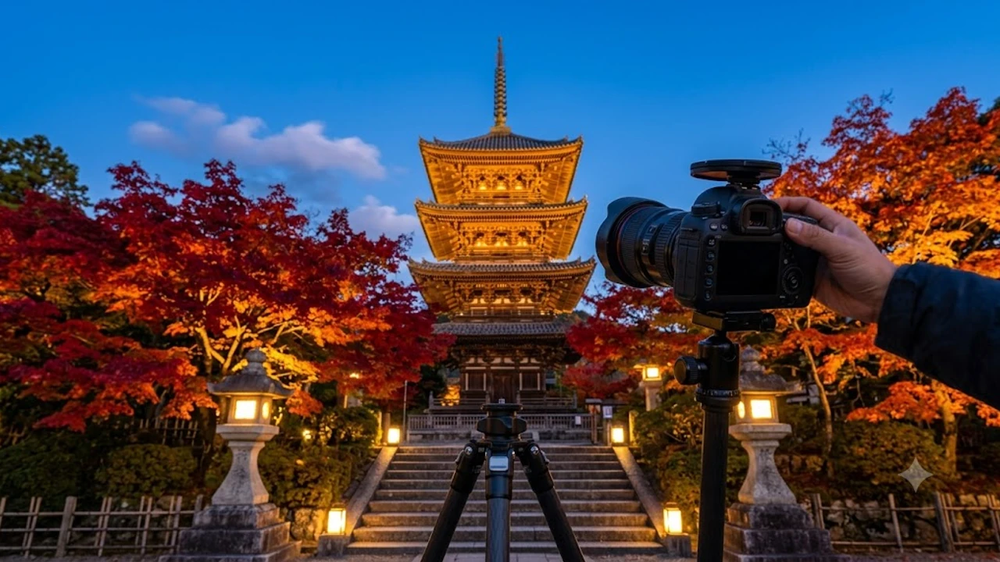

일본기상협회(JMC)가 공식 발표한 1차 단풍 예측 지도에 따르면, 올해 **2026 일본 단풍 시기**는 9월 초까지 이어진 기록적인 늦더위 여파로 평년보다 개엽 시점이 3일에서 최대 일주일가량 늦춰질 전망입니다. 가을 모미지 사냥을 계획 중인 여행자라면 홋카이도 고산지대부터 간사이 단풍 명소까지 달라진 절정기 일정을 미리 파악하고 항공권과 호텔 예약을 재점검해야 헛걸음을 피할 수 있습니다.

## 2026년 가을 단풍 예측 지도 발표와 개엽 지연 원인

### 고온 현상이 단풍선 남하에 미친 기상학적 영향
단풍은 최저기온이 약 8도 이하로 떨어지면서 나뭇잎 내부의 엽록소가 파괴되고 안토시아닌이 생성될 때 붉은빛을 띱니다. 2026년 8월 말부터 9월 초까지 일본 열도 전역에 걸친 아열대 고기압의 장기 정체는 야간 기온 하강을 가로막았습니다. 북태평양 고기압의 세력이 9월 둘째 주까지 유지되면서 차가운 북방 기단의 남하가 평년 대비 5~7일가량 늦어지는 기상이변이 발생했습니다.

### 평년 데이터와 비교한 2026년 단풍선의 이동 경로
일반적으로 단풍선은 홋카이도 북부 고산지대를 출발해 하루 약 20~25km 속도로 남하합니다. 하지만 올해 1차 공식 발표 자료에 따르면 단풍선의 전진 속도가 시속 15km 안팎으로 둔화했습니다. 통상 10월 중순이면 절정에 접어들던 도호쿠 지역 산간부조차 10월 하순으로 일정이 밀려나면서, 전통적인 단풍 축제 기간과 실제 단풍 절정기의 괴리가 불가피해졌습니다.

### 붉은 단풍(모미지)과 노란 은행나무(이초)의 시기 차이
기온 변화에 반응하는 민감도는 수종에 따라 뚜렷하게 나뉩니다. 단풍나무류는 일교차와 최저기온에 즉각 반응해 개엽이 대폭 늦춰진 반면, 은행나무는 일조량 감소에 민감하게 작용해 평년과 비슷한 일정으로 노랗게 물듭니다. 따라서 11월 중순 도쿄 메이지진구 가이엔의 은행나무 가로수길은 황금빛을 띠는 반면, 하코네나 교토의 단풍나무 사찰은 여전히 초록빛과 붉은빛이 섞인 과도기에 머무를 가능성이 높습니다.

## 평년보다 절정기가 늦어지는 일본 핵심 명소 3곳

### 홋카이도 다이세쓰잔 아사히다케
일본에서 가장 먼저 단풍이 시작되는 홋카이도 다이세쓰잔 국립공원은 평년 9월 10일 무렵 정상부부터 붉게 타오르기 시작합니다. 그러나 2026년 관측 데이터 기준, 로프웨이 종점부인 스가타미역 주변의 첫 단풍 관측일은 9월 18일 전후로 늦춰졌습니다. 산 중턱에서 소운쿄 협곡으로 이어지는 단풍 터널은 10월 초순에 도달해서야 본래의 선명한 주홍빛을 뽐낼 것으로 관측됩니다.

### 교토 아라시야마와 도후쿠지
전통 고택과 어우러져 압도적인 절경을 연출하는 간사이 지역의 핵심 명소 교토는 11월 4주 차에나 최정점에 도달합니다. 평년 11월 15~20일 사이 절정을 이루던 도후쿠지 쓰텐교 다리와 아라시야마 텐류지 호수 주변 정원은 11월 28일에서 12월 5일 사이에 만개할 확률이 큽니다. 단풍 철을 노려 11월 중순으로 숙소를 선점한 여행객이라면 산림 깊은 교토 북부의 오하라 산젠인이나 기부네 신사로 동선을 급히 틀어야 제대로 된 붉은 잎을 만끽할 수 있습니다.

> **현지 여행 팁:** 간사이 도심 지역의 늦어진 단풍선 때문에 일정 조정이 필요하다면 고지대 사찰을 먼저 방문하고, 평지 정원은 12월 초순 방문 일정으로 배치해야 낭패를 겪지 않습니다.

### 도쿄 메이지진구 가이엔과 롯폰기 미드타운 가든
도쿄 도심의 도심형 단풍 스폿 역시 전반적인 지연 흐름을 피하지 못했습니다. 신주쿠교엔의 정원과 롯폰기 도쿄 미드타운 가든의 단풍은 11월 말이 되어서야 붉은 기운이 짙어지며, 절정기는 12월 첫 주까지 이어질 것으로 예보되었습니다. 11월 초·중순에 도쿄를 방문하는 일정이라면 단풍 명소 탐방 대신 인근 도쿄 근교의 닛코 주젠지호나 다카오산 정상부로 당일치기 코스를 변경하는 접근이 현명합니다.

## 변화된 단풍 지도에 맞춘 숙소 및 이동 동선 재설계

### 항공권 일정 변경과 호텔 무료 취소 옵션 점검
단풍 절정기 변동으로 인해 기존 항공편 날짜가 애매해졌다면, 발권한 항공사의 변경 수수료 규정과 프로모션 운임 조건을 즉시 확인해야 합니다. 주요 호텔 예약 플랫폼에서 무료 취소 기한이 남아 있는 객실을 확보하고 있다면, 11월 초순 예약건을 11월 말 또는 12월 초순으로 미루는 작업이 시급합니다. 단풍 시즌 일본 주요 도시 숙소는 2개월 전부터 예약이 꽉 차기 마련이므로 빈 객실이 보일 때 취소 후 재예약을 민첩하게 마쳐야 합니다. 가을철 독특한 분위기의 숙소를 찾는다면 [2026 이색 숙소 여행, 숨은 인생 역대급 호텔 5곳](/posts/world-travel/unconventional-accommodations-historical-stays-2026/)을 참고해 색다른 체류 경험을 설계할 수도 있습니다.

### JR 패스를 활용한 표고차(해발고도) 역방향 동선 공략
단풍선은 북쪽에서 남쪽으로 내려오지만, 같은 위도 안에서는 고도가 높은 산지에서 평지로 내려옵니다. 이 원리를 역이용하면 항공권 날짜를 바꾸지 않고도 만개한 단풍을 만날 수 있습니다. 도쿄 시내에 머물더라도 신칸센과 JR 특급열차를 타고 해발 1,000m가 넘는 나가노현 가미코치나 군마현 구사쓰 온천 일대로 이동하면 10월 하순에도 절정의 단풍을 목격할 수 있습니다. 광역 교통패스를 보유하고 있다면 도심 정원에 머무르지 말고 해발고도가 높은 근교 산악 지대로 이동하는 편이 유리합니다.

### 지자체별 단풍 라이트업(야간 조명) 운영 기간 확인
교토 기요미즈데라(청수사), 고다이지, 나고야 도쿠가와엔 등 일본 주요 명소는 단풍 기간에 맞춰 야간 특별 관람(라이트업)을 운영합니다. 단풍이 늦게 물드는 2026년 기상 상황에 맞춰 다수 사찰과 정원이 라이트업 행사 일정을 12월 초순까지 1~2주간 연장하는 추세입니다. 낮 동안 덜 물든 잎이라도 조명을 받으면 붉은 채도가 극대화되므로, 일정 중 해질녘 이후 야간 개장 입장권을 미리 예매해 두는 방식이 실속 있습니다.

## 가을 일본 여행 준비물과 실패 없는 촬영 가이드

### 기온 급강하에 대비한 레이어드 방한 장비
가을 단풍철의 일본은 낮과 밤의 기온차가 15도 이상 벌어지는 경우가 잦습니다. 낮에는 가벼운 셔츠 한 장으로 충분하지만, 해가 지고 야간 라이트업을 관람하거나 산간부 로프웨이를 탑승할 때는 초겨울 수준의 한기에 노출됩니다. 얇은 경량 패딩, 울 머플러, 접이식 방풍 재킷을 가방 안에 상시 소지해야 체온 저하로 인한 피로를 방지할 수 있습니다.

### 고화질 단풍 사진을 위한 노출값과 렌즈 세팅 노하우
단풍의 붉은 색조를 육안에 가깝게 담아내려면 카메라나 스마트폰 카메라의 노출값을 -0.3에서 -0.7EV 정도로 약간 어둡게 수동 조절해야 채도가 번지지 않습니다. 흐린 날씨에는 화이트 밸런스를 '그늘(Shade)' 모드나 6000K 이상으로 올려주면 단풍 본연의 따뜻하고 붉은 색감이 극대화됩니다. 사람이 몰리는 사찰 목조 다리나 좁은 산책로에서는 삼각대 설치가 엄격히 금지되므로, 셔터스피드를 확보할 수 있는 조리개 F2.8 이하의 밝은 단렌즈를 준비하는 편이 결과물 확보에 유리합니다. 더 넓은 범위의 여행지 동향이 궁금하다면 [세계여행지 최신 트렌드](/posts/world-travel/world-travel-1783348391782/)에서 전 세계 여행 패턴 변화를 확인할 수 있습니다.

- 장시간 도보 이동 시 발의 피로도를 줄여줄 쿠션감 좋은 트레킹화 착용
- 현지 기차역 코인라커 매진에 대비한 기내 반입용 소형 캐리어 운용
- 장시간 야외 체류 및 지도 앱 사용을 위한 대용량 보조배터리 지참

가을철 장시간 도보 여행과 급변하는 환절기 날씨에 대비해 체온을 지켜줄 기능성 여행용품을 철저히 준비해야 이동 중 체력 소모를 줄일 수 있습니다.
[관련상품 쿠팡에서 보기](https://www.coupang.com/np/search?q=%EC%97%AC%ED%96%89%EC%9A%A9%ED%92%88&sourceType=affiliate&trackingCode=AF8691300)

#2026일본단풍시기 #일본단풍절정기 #교토단풍시기 #도쿄단풍명소 #홋카이도단풍여행 #일본가을여행일정 #일본기상협회단풍예측