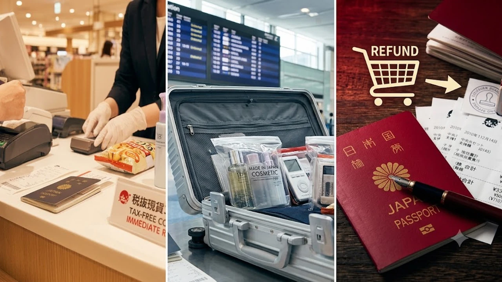

일본 현지 매장에서 결제할 때 10% 소비세를 즉시 빼주던 면세 방식이 공항 사후 환급 방식으로 전면 전환됩니다. 이번 **일본 택스프리 개편** 정책은 면세품을 사들여 현지에서 되파는 부정 유통을 차단하려는 목적이지만, 여행자 입장에서는 출국 당일 공항 체류 계획을 통째로 재설계해야 합니다. 시내 매장 결제부터 세관 실물 검사까지 단계별로 달라진 핵심을 짚었습니다.

## 현장 즉시 면세 폐지와 출국장 사후 환급의 기본 구조

예전에는 돈키호테나 백화점 계산대에서 여권만 내밀면 10% 소비세를 뺀 가격으로 물건을 샀습니다. 이제는 매장에서 소비세를 포함한 정가를 전액 지불하고, 출국 공항 세관 검사대에서 물품과 구매 내역을 확인받아야 세금을 돌려받습니다.

### 변경된 시내 결제 및 영수증 관리

매장에서는 일반 내국인과 동일하게 세금이 포함된 총액을 지불합니다. 결제 직후 여권 정보와 연동된 전자 면세 전표나 QR코드가 발급되며, 종이 영수증 원본은 출국 심사를 마칠 때까지 따로 보관해야 합니다. 해외 각국의 국경 검역 및 면세 변동 사항은 [세계여행지 최신 트렌드](/posts/world-travel/world-travel-1783348391782/)에서도 함께 살펴볼 수 있습니다.

### 공항 무인 키오스크 스캔과 세금 정산

공항 출국 로비에 마련된 전용 키오스크에서 여권과 구매 영수증 QR코드를 차례로 스캔합니다. 데이터 전산 대조가 완료되면 신용카드 승인 취소, 모바일 간편결제 충전, 현금 환급 창구 중 원하는 방식을 택해 세금을 돌려받습니다.

## 위탁수하물 부치기 전 반드시 거쳐야 할 물품 확인 절차

가장 빈번하게 벌어지는 실수는 짐을 항공사 카운터에 먼저 부쳐버리는 일입니다. 세관 검사관이 물품 실물 확인을 요구할 때 이미 위탁 수하물로 부친 상태라면 면세 승인이 즉시 취소됩니다.

### 액체류와 고가품 포장 분리 팁

- **100ml 초과 액체류**: 기내 반입이 불가능하므로 항공사 카운터에서 발권을 마친 뒤 "세관 확인 대상 수하물"임을 밝히고 세관 검사대에서 확인 도장을 받아 위탁합니다.
- **고가 전자기기 및 명품 잡화**: 반드시 기내 반입용 가방에 따로 챙겨 보안검색대를 통과한 뒤 세관 데스크에서 실물을 제시합니다.

### 현품 분실 시 과세 및 가산세 위험

영수증에는 물품이 등록되어 있으나 세관 검사대에서 실물을 보여주지 못하면 부정 면세 시도로 처리됩니다. 세금 환급이 거부되는 것은 물론 현장에서 소비세 10%와 함께 가산세까지 추가 징수당할 수 있습니다.

## 환급 수수료 차감과 결제 통화 선택에 따른 손실 방지

소비세 10%를 고스란히 돌려받는다고 계산하면 착오가 생깁니다. 환급 대행 플랫폼 수수료와 외화 환전 수수료가 함께 빠져나가기 때문입니다.

### 환급 수단별 실질 수령액 비교

- **신용카드 승인 취소**: 수수료가 가장 적으나 계좌 반영까지 길게는 3주에서 한 달 정도 걸립니다.
- **현금 엔화 수령**: 현장에서 바로 지폐를 받지만 대행사 수수료가 최대 2% 차감됩니다. 남은 엔화를 한국으로 가져와 원화로 바꿀 때 2차 환전 손실이 발생합니다.
- **모바일 간편결제 연동**: 네이버페이나 카카오페이 등 제휴 전자지갑으로 직접 송금받는 편이 수수료 손실을 줄이는 방법입니다.

### 자잘한 영수증 통합 결제 요령

영수증 건당 최저 환급 수수료가 부과되는 경우가 많습니다. 드럭스토어나 잡화점에서 매번 소액으로 결제하기보다 하루 일정 중 한 매장에서 몰아 결제해 영수증 건수를 줄여야 실질 환급률이 올라갑니다.

## 출국장 혼잡을 피하는 공항 도착 시간표와 필수 준비물

공항 도착 기준을 평소보다 최소 1시간 앞당겨 잡아야 항공기 탑승을 놓치지 않습니다. 나리타, 간사이, 후쿠오카 공항은 출국 인파가 몰려 세관 검사와 환급 키오스크 줄에만 40분 이상 소요됩니다.

### 출국 당일 동선 단축 체크리스트

- 면세 영수증이 훼손되거나 섞이지 않도록 전용 방수 파우치에 전량 모아둡니다.
- 비짓재팬웹의 면세 QR코드 인터페이스를 미리 캡처해 통신 장애에 대비합니다.
- 세관 검사관이 요청했을 때 지체 없이 물건을 꺼낼 수 있도록 캐리어 상단에 물품을 배치합니다.

쇼핑 물품이 늘어나 짐 정리가 어렵다면 가방 부피를 손쉽게 분산하고 캐리어 무게를 조절할 수 있는 확장형 보조 가방을 챙기는 편이 동선 관리에 훨씬 유리합니다.

[여행용 접이식 대용량 확장 보스턴백 쿠팡에서 보기](https://www.coupang.com/np/search?q=%EC%97%AC%ED%96%89%EC%9A%A9%ED%92%88&sourceType=affiliate&trackingCode=AF8691300)

#일본여행 #일본면세 #택스프리 #엔화환급 #공항세관 #일본쇼핑 #면세제도개편