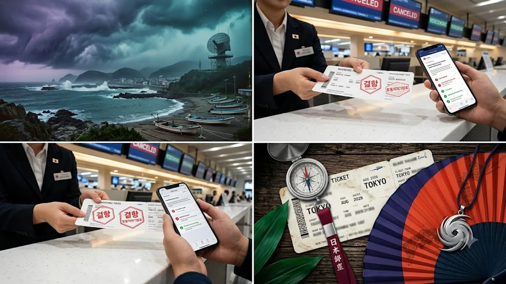

2026년 8월 현재, 일본 최대 명절인 오봉 연휴 기간과 15호 태풍의 영향권이 맞물리면서 현지 항공편과 대중교통 운행 차질이 속출하고 있습니다. 갑작스러운 기상 악화로 **일본 여행 태풍 결항** 상황에 직면했다면, 당황하지 않고 실시간 비행기 결항 보상 및 대체 교통수단을 빠르게 확보하는 사전 대책이 필요합니다. 예상치 못한 연휴 대혼잡 속에서 손실을 줄이고 안전하게 귀국할 수 있는 긴급 대처 방안을 정리했습니다.

## 2026년 8월 오봉 연휴와 15호 태풍의 복합 위기 상황

### 오봉(Obon) 명절 대이동과 현지 교통 혼잡도 분석
일본의 오봉 연휴는 매년 8월 13일부터 16일을 전후로 전 국민적인 귀성 및 휴가가 집중되는 최대 대이동 기간입니다. 이 시기에는 도쿄, 오사카 등 대도시에서 지방으로 이동하는 신칸센, 고속버스, 내륙선 항공편의 좌석 점유율이 95% 이상을 기록하며 만석에 가깝게 운영됩니다. 현지 교통망이 극도로 과부화된 상태에서 태풍 같은 외부 변수가 발생하면 대체편 확보가 일반적인 시기보다 수배 이상 어려워집니다.

### 15호 태풍 이동 경로에 따른 영향권 지역 및 예상 비행 영향
8월 8일 발생한 15호 태풍이 오키나와 해상을 거쳐 일본 본토 남단으로 북상함에 따라 나하 공항을 비롯해 간사이, 나고야, 하네다 공항의 결항률이 급증하고 있습니다. 강풍 및 뇌우 특보가 발효된 지역에서는 항공기 이착륙 지연은 물론 결항 조치가 잇따르는 실정입니다. 특히 [2026년 동남아·일본 여행 트렌드, 한국인이 가장 많이 찾는 목적지 완전 분석](/posts/world-travel/southeast-asia-japan-travel-2026/) 사례에서 확인되듯, 한국인 방문객 비중이 높은 주요 관광 노선이 직접적인 영향권에 들어있어 실시간 기상 예보 및 공항 운항 정보를 매시간 체크해야 합니다.

## 항공사별 결항 및 지연 시 긴급 환불·변경 규정

### FSC(대형 항공사) vs LCC(저비용 항공사) 대체 편 제공 기준
천재지변으로 인한 결항 발생 시 대형 항공사(FSC)와 저비용 항공사(LCC)의 대응 방식에는 차이가 존재합니다.

* **대형 항공사(FSC):** 동일 항공권 조합 내에서 타 항공사 동맹체(스타얼라이언스, 스카이팀 등)의 대체편을 연계하거나, 운항 재개 시 최우선 탑승 승인을 지원합니다.
* **저비용 항공사(LCC):** 자사 항공편의 다음 이용 가능한 빈 좌석으로만 여정을 변경해 주는 경우가 많아, 연휴 기간 만석 상태에서는 대체편 배정까지 수일이 소요될 수 있습니다.

> **주의사항:** 태풍과 같은 불가항력적 기상 악화 시에는 항공사 귀책사유가 아니므로, 공항 대기 중 발생하는 숙박비나 식비 지원 의무가 대부분 면제됩니다.

### 결항 확인서 발급 방법과 수수료 면제 환불 절차
항공편 결항이 확정되면 결항 취소 수수료 면제를 받기 위해 항공사 공식 앱이나 공항 카운터에서 **결항 증명서(Cancellation Certificate)**를 즉시 발급받아야 합니다. 여행사를 통해 예약한 티켓이라도 항공사 측의 공식 결항 승인이 등록되면 연동된 모든 구간의 취소 수수료가 전액 면제됩니다.

### 항공사 지연·결항 보상 특약 및 여행자 보험 청구 요건
해외 여행자 보험에 '항공기 지연 및 결항 특약'이 포함되어 있다면 4시간 이상 지연 또는 결항 시 발생하는 필수 식비, 교통비, 숙박비를 보상받을 수 있습니다.

- 결항 확인서 원본 (전자 문서 가능)
- 지연 시간 동안 지출한 식비·숙박비·생필품 영수증
- 대체 교통수단 이용 영수증 및 항공권 탑승권 실물

## 신칸센 및 현지 대중교통 운행 중단 시 대체 이동 수단

### JR 신칸센 실시간 운행 상황 확인 앱 및 환불 창구
태풍이 강타할 경우 JR 도카이도·산요 신칸센 등 주요 철도 노선은 사전 계획 운휴(計画運休)에 들어갑니다. JR 공식 앱인 'SmartEX'나 'JR-WEST' 모바일 서비스를 설치해두면 실시간 운행 중단 구간을 빠르게 파악할 수 있으며, 운휴 결정이 내려진 신칸센 티켓은 수수료 없이 100% 자동 환불 처리됩니다.

### 고속버스·고속선 대체 수단 예약 방법과 이동 경로 최적화
철도가 마비되었을 때는 주간·야간 고속버스가 유일한 이동 수단이 될 수 있습니다. 'WILLER Express'나 'Japan Bus Online' 플랫폼을 통해 대체 버스 노선을 검색할 수 있으나, 도로 통제 상황에 따라 버스 역시 운행이 중단될 수 있으므로 출발 직전까지 도로 교통 정보센터(JATIC) 안내를 확인해야 합니다.

### 공항 고립 시 인근 숙소 확보 및 긴급 체류 팁
공항 내에 고립되었을 경우, 터미널 내부 대기 공간 제공 여부를 안내방송으로 확인해야 합니다. 인근 호텔을 예약해야 한다면 당일 취소 물량이 발생하는 온라인 호텔 예약 플랫폼을 실시간으로 확인하거나, 공항 철도 연선 밖의 한적한 지역 숙소를 찾아보는 편이 유리합니다. 여름철 다른 휴가지 정보가 필요하다면 [2026년 여름 해외여행 추천 도시 5곳](/posts/world-travel/summer-travel-cities-2026/) 가이드를 참고하시기 바랍니다.

## 현지 결항 사태 발생 시 필수 대응 행동 요령 3가지

### 영사콜센터 및 주일 한국대사관 긴급 연락처 활용법
기상 악화로 현지 신변 안전에 위협을 느끼거나 대규모 고립 사태가 발생하면 주일본 대한민국 대사관 및 영사관의 긴급 연락처를 활용해야 합니다. 외교부 영사콜센터(+82-2-3210-0404)는 24시간 대응 체계를 유지하고 있으며, 무료 전화 앱을 이용하면 해외 통화료 부담 없이 현지 상황을 신고하고 구호 안내를 받을 수 있습니다.

### 해외 결제 카드사 및 호텔 예약 사이트 무료 취소 요청 전략
비행기 결항으로 예약한 숙소에 체크인하지 못하는 '노쇼(No-show)' 상황이 발생할 경우, 사유 증빙을 통해 위약금을 감면받을 수 있습니다.

1. 공항에서 발급받은 결항 증명서를 사진으로 촬영
2. 호텔 예약 플랫폼 고객센터에 '불가항력(Force Majeure) 사유'로 무료 취소 접수
3. 거절 시 현지 호텔 프런트로 직접 이메일을 보내 결항 증빙 첨부 후 환불 요청

### 여행 일정 변경 시 유심(eSIM) 및 렌터카 기간 연장 노하우
체류 기간이 예정보다 연장되면 데이터 통신과 이동 수단 연장이 필수적입니다. 데이터 로밍이나 eSIM의 경우 사용 중인 데이터 앱에서 추가 용량을 일 단위로 즉시 충전할 수 있습니다. 렌터카는 반납 시간 전 영업소에 직접 전화하여 반납 연장을 신청해야 하며, 무단 연장 시 보험 적용이 불가할 수 있으므로 반드시 사전에 동의를 받아야 합니다. 더 다양한 전 세계 여행 정보는 [세계여행지 전체 글 보기](/posts/world-travel/)에서 확인할 수 있습니다.

#일본여행태풍결항 #오봉연휴태풍 #일본비행기결항환불 #15호태풍일본 #일본여행자보험청구 #신칸센운휴환불 #해외여행결항대응 #일본자유여행꿀팁 #공항결항대처법