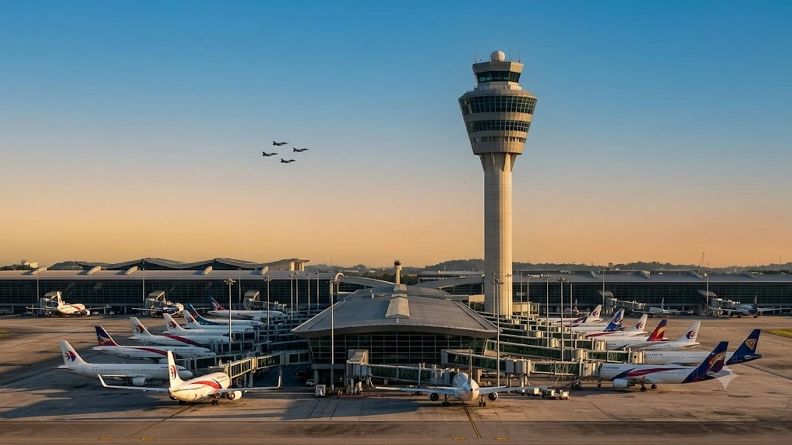

말레이시아의 주요 허브인 쿠알라룸푸르 국제공항(KLIA)을 이용할 계획이라면 현지 운항 통제 소식을 반드시 확인해야 합니다. 8월 말 국경일 행사 준비로 공항 주변 하늘길이 일시 차단되면서 **쿠알라룸푸르 공항 지연** 및 결항 사례가 속출하고 있습니다. 경유편 환승객과 직항 승객 모두 연결편을 놓치지 않으려면 실시간 운항 정보와 빠른 터미널 이동 동선을 사전에 파악해 두어야 합니다.

## 쿠알라룸푸르 공항(KLIA) 영공 일시 폐쇄 원인과 현황

### 말레이시아 국경일(Merdeka Day) 에어쇼 연습 일정과 통제 시간
말레이시아 민간항공청(CAAM)에 따르면 제69회 국경일(메르데카 데이) 기념 공군 편대 비행 및 에어쇼 연습으로 인해 공항 영공 통제가 시작되었습니다. 8월 26일부터 8월 31일까지 매일 오전 9시부터 10시 30분, 그리고 오후 특정 시간대 등 하루 2회 이상 항공기 이착륙이 전면 중단됩니다. 전투기 편대 비행 훈련 시간대에는 안전거리 확보를 위해 공항 반경 수십 킬로미터 내 민간 항공기 진입이 완전히 막힙니다.

### 8월 26일~31일 항공편 결항 및 연쇄 지연 규모
통제 시간 전후로 약 80~100편 이상의 항공편이 연쇄적으로 출발·도착 지연을 겪고 있습니다. 오전 착륙 대기 상태에 들어간 항공기들이 착륙하지 못하고 상공에서 선회 비행(Holding)을 이어가면서, 이후 연결되는 오후편과 야간편 스케줄까지 2~4시간 이상 밀리는 도미노 현상이 발생합니다. 

> 말레이시아 항공청 공식 공지에 따르면 연습 기간 및 8월 31일 본행사 당일 KLIA를 출발하거나 도착하는 승객은 최소 4시간 전에 공항 터미널에 도착해야 합니다.

### 터미널 1(KLIA1)과 터미널 2(KLIA2) 혼잡도 차이 분석
말레이시아항공, 대한항공 등 풀서비스 캐리어(FSC)가 취항하는 KLIA1과 에어아시아 중심의 저비용항공사(LCC) 전용 터미널인 KLIA2 모두 혼잡도가 극에 달한 상태입니다. 
- **KLIA1:** 장거리 환승객과 유럽·동아시아 대형 기종이 밀려 수하물 수취대와 탑승구 변경이 잦음
- **KLIA2:** 단거리 노선이 촘촘한 LCC 특성상 한 번의 지연이 당일 전체 스케줄 취소로 번지는 빈도가 높음

## 실시간 항공편 지연 및 결항 조회·알림 설정법

### 항공사별(말레이시아항공·에어아시아) 긴급 변경 공지 확인처
항공사 공식 모바일 애플리케이션의 '푸시 알림'을 켜두는 것이 가장 빠른 대응책입니다. 말레이시아항공 승객은 웹사이트 내 'Flight Status' 메뉴에서 편명(예: MH066)을 직접 입력해 변경된 출발 예정 시각(Estimated Time)을 실시간으로 확인해야 합니다. 에어아시아 이용객은 AirAsia MOVE 앱의 알림 탭에서 항공편 변경 안내 문자를 지속적으로 체크해야 헛걸음을 줄일 수 있습니다.

### Flightradar24 및 공항 공식 앱을 활용한 실시간 트래킹
공항 전광판보다 전 세계 항공기 추적 서비스인 Flightradar24가 기체의 실제 위치 파악에 유리합니다. 내가 탈 비행기가 현재 쿠알라룸푸르 상공에 도달했는지, 아니면 인근 수방(Subang) 공항이나 페낭으로 회항(Diverted)했는지 레이더 화면으로 즉시 확인할 수 있습니다. KLIA 공식 포털에서도 활주로 운영 재개 시점을 실시간 공지하므로 교차 검증이 필요합니다.

### 카카오톡 및 이메일 결항 알림 우선 수신 세팅
국내 여행사나 OTA(아고다, 트립닷컴 등)를 통해 발권했다면 이메일 스팸함 필터링을 해제하고 알림톡 수신 설정을 켜두어야 합니다. 항공사가 대행사에 통보하는 시점과 승객에게 직접 닿는 시점에 시차가 생기기 쉬우므로, 항공권 예약 번호(PNR 6자리)를 항공사 공식 홈페이지에 직접 등록해 1차 수신 채널을 확보해야 합니다. [2026년 여름 해외여행 추천 도시 5곳](/posts/world-travel/summer-travel-cities-2026/) 일정과 맞물려 동남아 허브 공항을 거치는 여정이라면 세부 알림 체크를 놓쳐선 안 됩니다.

## 환승객을 위한 연결편 놓침 방지 및 수속 단축 팁

### 최소 환승 시간(MCT) 계산 및 무료 터미널 셔틀 동선
일반적인 KLIA 내 동일 터미널 최소 환승 시간은 60분이지만, 영공 통제 기간에는 최소 180분(3시간) 이상을 확보해야 안전합니다. KLIA1과 KLIA2 사이를 이동해야 하는 분리 발권 승객이라면 터미널 간 무료 셔틀버스나 KLIA 익스프레스(공항철도)를 이용해야 합니다. 
- **KLIA 트랜짓/익스프레스:** 터미널 간 이동 시간 3분 소요, 배차 간격 15~20분
- **무료 공항 셔틀버스:** 24시간 10분 간격 운행 (KLIA1 레벨1 도어4 ↔ KLIA2 레벨1 도어3)

### 자동출입국심사(Autogate) 이용 자격 및 등록 방법
대한민국 여권 소지자는 말레이시아 입국 시 무인 자동출입국심사대(Autogate)를 이용할 수 있어 대면 심사 줄을 대폭 줄일 수 있습니다.
- 입국 3일 전부터 말레이시아 디지털 입국카드(MDAC) 온라인 사전 제출 필수
- 최초 입국 시에도 오토게이트 레인으로 직행하여 여권 스캔 후 지문/얼굴 인식으로 30초 내 통과 가능
- 입국 심사 대기열을 건너뛰면 터미널 이동 시간을 최소 40분 이상 단축 가능

### 수하물 연계(Interline) 미지원 시 수하물 긴급 회수 절차
저비용항공사를 연계해 분리 발권한 경우 짐이 최종 목적지까지 자동 연결되지 않습니다. 착륙 직후 수하물 수취대(Baggage Claim)로 직행해 짐을 찾은 뒤 출발 층으로 다시 올라가 체크인을 마쳐야 합니다. 지연으로 인해 수하물 수취 시간이 촉박할 때는 공항 내 항공사 그라운드 핸들링 직원에게 다음 편 탑승권을 제시하고 수하물 우선 인계를 요청하는 배기지 익스프레스 태그 부착 여부를 확인해야 합니다. [세계여행지 최신 트렌드](/posts/world-travel/world-travel-1783348391782/) 정보에서도 강조하듯 분리 발권 환승 시에는 기내 수하물만 챙기는 단출한 짐 구성이 유리합니다.

## 결항·지연 발생 시 무료 변경 및 보상 청구 가이드

### 항공사 카운터 무료 여정 변경 및 환불 요청 절차
국경일 에어쇼 연습과 같은 국가적 통제로 인한 운항 차질 발생 시 대부분의 항공사는 특별 변경 규정을 적용합니다. 
1. 일정 지연 시간이 2시간을 초과할 경우 수수료 없이 동일 구간 전후 14일 이내 항공편으로 무료 날짜 변경(Rebooking) 지원
2. 여정을 완전히 포기할 경우 위약금 없는 전액 현금 환불(Full Refund) 또는 크레딧 쉘 지급 선택 가능
3. 대체편 좌석이 부족할 경우 스타얼라이언스나 원월드 등 동일 동맹체 항공사로의 엔도스(Endorsement)를 카운터 매니저에게 요청

### 항공사 지연 확인서 발급 방법과 필수 기재 항목
여행자보험 청구와 현지 숙소 위약금 면제를 위해 공항 체크인 카운터나 공식 웹사이트 고객센터를 통해 '항공편 지연 증명서(Flight Delay Certificate)'를 즉시 발급받아야 합니다.
- 탑승객 영문 성명 및 전자 항공권 번호(E-ticket Number)
- 원래 출발 예정 시각과 실제 출발/도착 시각
- 지연 사유 명시(Air Traffic Control Restriction 또는 Operational Reason)
- 항공사 공식 직인 및 담당자 서명

### 해외여행자보험 지연 보상 청구 서류 및 실시간 라운지 바우처 수령법
항공편이 4시간 이상 지연되면 해외여행자보험의 '항공기 및 수하물 지연 비용' 특약을 통해 식음료비, 공항 인근 호텔 숙박비, 필수 생필품 구입비를 청구할 수 있습니다. 결항 현장에서 발생한 카드 영수증 원본과 탑승권을 실물이나 사진으로 남겨두어야 합니다. 항공사 사정에 따라 현장에서 식사 쿠폰(Meal Voucher)이나 제휴 라운지 입장권을 배부하므로 게이트 앞 지상직 승무원에게 지급 기준을 확인하고 챙기는 편이 유리합니다.

[항공기 지연 대비 여행용 목베개 쿠팡에서 보기](https://www.coupang.com/np/search?q=%EC%97%AC%ED%96%89%EC%9A%A9%ED%92%88&sourceType=affiliate&trackingCode=AF8691300)

#쿠알라룸푸르공항지연 #KLIA환승 #말레이시아항공결항 #에어아시아지연 #항공편지연보상 #쿠알라룸푸르공항오토게이트 #말레이시아여행주의사항