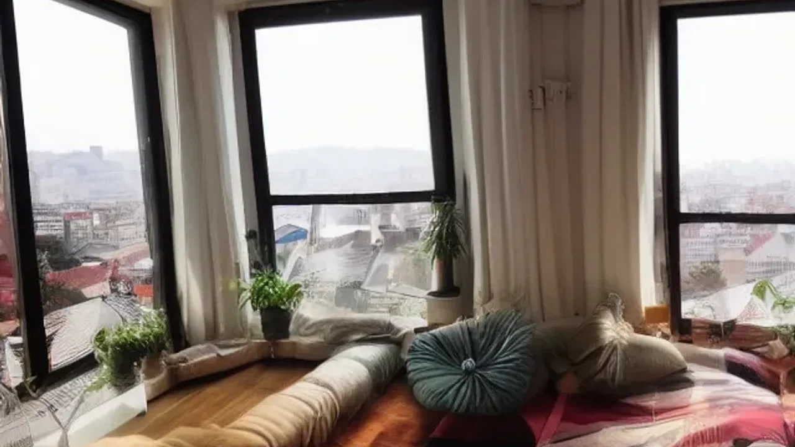

Markdown
2026년 여름 휴가 시즌을 맞이하여 반복되는 일상과 직장 생활의 번아웃을 치료하기 위한 대안으로 새로운 형태의 장기 체류형 **한달살기 추천** 명소들이 각광을 받고 있습니다. 은퇴 이후로 행복을 미루기보다 현재의 커리어 중간 단계에서 미리 단기 은퇴를 경험하려는 3040 세대가 급증하는 추세입니다. 이러한 트렌드는 단순한 관광을 넘어 현지 문화에 깊숙이 스며드는 슬로우 트래블의 진수를 보여줍니다.

## 왜 2026년 직장인은 '마이크로 은퇴'에 열광하는가?

### 짧은 휴가 vs 2주 이상의 마이크로 리타이어먼트 효과 비교
기존의 3박 4일 일정은 피로만 가중시킨 채 귀국 길에 오르기 일쑤였습니다. 반면 2주에서 한 달 이상 한 지역에 머무는 마이크로 리타이어먼트는 뇌의 휴식과 재충전에 전혀 다른 차원의 자극을 제공합니다. 글로벌 숙박 플랫폼의 2026년 트렌드 리포트에 따르면, 14일 이상 장기 체류한 여행객의 신체적 스트레스 지수는 단기 여행자 대비 평균 34% 이상 낮게 측정되었습니다. 동네 마트에서 식재료를 고르고 느긋한 아침 산책을 즐기며 현지 생체 리듬에 동화되는 과정 자체가 강력한 정신적 치유 작용을 일으킵니다.

### 번아웃 증후군을 커리어 징검다리로 바꾸는 '새바티컬'의 가치
과거의 장기 여행이 커리어 단절을 의미했다면, 지금의 '새바티컬(Sabbatical)'은 다음 단계로 도약하기 위한 생산적인 안식월로 통합니다. 직장을 그만두지 않고 무급 휴직이나 사내 복지 제도를 활용해 떠나는 이들은 현지에서 전혀 새로운 인사이트를 수확해 옵니다.

> "한 달 동안 이국적인 환경에서 보낸 시간은 단순한 공백이 아니라, 내 마케팅 커리어의 시야를 글로벌로 넓혀준 가장 생산적인 투자였습니다." — 2026년 초 치앙마이에서 새바티컬을 보낸 6년 차 마케터의 후기

업무와 완전히 격리된 환경 속에서 스스로를 객관적으로 돌아보는 경험은 장기적인 직무 몰입도를 높이는 확실한 동력이 됩니다.

### 원격 근무와의 결합이 가져온 비용 효율성 분석
하이브리드 근무 시스템이 정착하면서 한달살기의 경제적 진입 장벽이 획기적으로 낮아졌습니다. 노트북 하나만 있으면 전 세계 어디서든 본업을 유지할 수 있어 소득 공백 없이 타국에서의 삶을 누리는 구조가 가능합니다. 한국 시차를 활용해 오전에는 현지 서핑이나 요가 클래스에 참여하고, 오후나 저녁 시간에 집중적으로 원격 업무를 처리하는 라이프스타일이 주류로 굳어졌습니다. 이는 무소득 상태로 저축을 소진하던 과거의 배낭여행 패턴과 가장 뚜렷하게 구별되는 지점입니다.

## 가성비와 치안을 모두 잡은 2026 한달살기 추천 도시 TOP 3

### [아시아] 디지털 노마드의 성지, 태국 치앙마이와 치앙라이의 진화
전 세계 노마드들의 고향인 치앙마이는 단순한 저가 휴양지를 넘어 고도화된 워킹 인프라를 갖춘 도시로 진화했습니다. 님만해민과 싼티탐 지역을 중심으로 초고속 와이파이와 24시간 개방형 코워킹 스페이스가 촘촘하게 들어서 있습니다. 조금 더 한적하고 자연 친화적인 환경을 원한다면 차로 3시간 거리인 치앙라이가 훌륭한 대안입니다. 치앙라이는 님만해민 대비 주거 비용이 약 25% 저렴하며, 울창한 정글과 예술가 커뮤니티가 결합되어 고요한 몰입이 필요한 프리랜서나 창작자들에게 최적의 선택지입니다.

### [유럽] 동유럽의 숨은 보석, 헝가리 부다페스트 vs 폴란드 크라쿠프
서유럽의 살인적인 물가와 오버투어리즘에 지쳤다면 동유럽의 두 도시가 명쾌한 해결책을 제시합니다. 헝가리 부다페스트는 저렴한 대중교통 비용과 세체니 온천 등 풍부한 문화유산을 보유하여 장기 체류 시 만족도가 매우 높습니다. 반면 폴란드 크라쿠프는 유럽 내에서 치안 지수가 가장 높은 지역 중 하나로 손꼽히며, 구시가지 전체가 유네스코 세계문화유산이라 중세 유럽의 정취를 온전히 느끼기에 부족함이 없습니다. 두 도시 모두 한 달 기준 원룸 형태의 플랫 렌트비가 서유럽 대도시의 절반 수준인 80만~120만 원 선이라 경제적 부담이 덜합니다.

### [중남미] 안전과 이국적 매력을 동시에, 코스타리카 산호세의 매력
북미 직장인들 사이에서 가장 뜨거운 인기를 얻고 있는 코스타리카 산호세는 '푸라 비다(Pura Vida)'精神을 온몸으로 체험할 수 있는 곳입니다. 군대가 없는 평화 국가로 중남미 내에서 독보적으로 안정적인 치안 체계를 자랑합니다. 도시 자체의 현대적인 편의시설과 조금만 외곽으로 나가면 펼쳐지는 원시림, 태평양 해변의 접근성이 아주 뛰어납니다. 에코 투어리즘과 서핑, 생태학적 라이프스타일에 관심이 많은 직장인이라면 산호세를 기반으로 주변 소도시들을 탐험하는 여정이 최고의 리프레시를 선사합니다.

## 현지인처럼 살아보기: 단순 휴양을 넘어선 '로컬 기술' 습득하기

### 태국에서 쿠킹 클래스 및 무에타이 마스터하기
단순히 카페에 앉아 노트북만 두드리는 한달살기는 자칫 지루해지기 쉽습니다. 올여름 트렌드의 핵심은 현지의 고유한 문화적 기술을 직접 체득하는 '로어 게이닝(Lore-gaining)'입니다. 치앙마이 장기 체류자들은 아침마다 로컬 마켓에서 직접 신선한 식재료를 골라 팟타이와 카오소이를 만드는 4주 코스 쿠킹 스쿨에 등록합니다. 혹은 오후 시간에 현지 무에타이 체육관에서 땀을 흘리며 체력을 단련하기도 합니다. 이러한 신체적, 문화적 활동은 현지인들과 깊은 유대감을 형성하는 계기가 됩니다.

### 유럽 고도시에서 중세 요리 및 향수 워크숍 참여하기
부다페스트나 크라쿠프 같은 유럽 소도시에서는 수백 년의 역사를 간직한 워크숍들이 장기 여행자들을 기다립니다. 전통 방식으로 호밀빵을 굽는 베이킹 클래스나, 지역 천연 허브를 추출해 자신만의 시그니처 향수를 조향하는 롱텀 아틀리에 프로그램이 대표적입니다. 박물관 유리창 너머로 감상하던 역사를 손끝으로 직접 만지고 경험하는 과정은 일상으로 돌아간 후에도 오랫동안 지속되는 강렬한 예술적 영감을 남깁니다.

### 장기 체류 중 현지 커뮤니티(Meetup)를 활용한 글로벌 네트워킹 성공 수기
외국 장기 체류가 남기는 가장 큰 자산은 전 세계에서 모여든 다양한 직군의 사람들과 교류할 수 있다는 점입니다. 글로벌 네트워킹 플랫폼인 Meetup이나 지역 페이스북 그룹을 적극적으로 활용하면 매주 열리는 언어 교환 모임, 러닝 크루, 테크 세미나에 쉽게 참여할 수 있습니다. 실제로 현지에서 만난 글로벌 개발자들과 사이드 프로젝트를 시작하거나, 귀국 후 해외 이직 기회를 잡는 등 인생의 경로가 바뀌는 긍정적인 터닝포인트를 맞이하는 사례가 빈번하게 발생하고 있습니다.

[관련 글 보기](/posts/world-travel/)

## 예산을 절반으로 줄이는 장기 체류형 여행 실전 가이드

### 에어비앤비 장기 할인 및 현지 부동산 플랫폼(Sublet) 안전하게 예약하는 법
장기 여행에서 가장 큰 비중을 차지하는 주거 비용을 절감하려면 플랫폼 시스템을 영리하게 이용해야 합니다. 에어비앤비는 28일 이상 예약 시 자동 적용되는 '월간 장기 숙박 할인' 요율이 최소 30%에서 최대 50%에 달하므로, 애매한 25일 일정보다 차라리 28일을 채워 예약하는 편이 총비용 면에서 훨씬 유리합니다. 더욱 확실한 가성비를 원한다면 현지 노마드들이 애용하는 서블렛(Sublet) 전용 플랫폼이나 'Flathunter' 같은 지역 신뢰 기반 부동산 사이트를 이용하는 방법이 좋습니다. 단, 이 경우 보증금 사기 예방을 위해 반드시 에스크로 서비스나 대면 계약을 원칙으로 삼아야 안전합니다.

### 다구간 항공권(Open-jaw)과 비자(디지털 노마드 비자) 발급 가이드
In-Out 도시를 다르게 설정하는 다구간 항공권(Open-jaw)을 적절히 매칭하면 편도 항공권을 각각 끊는 것보다 비용을 약 20% 이상 아킬 수 있으며 동선 낭비도 줄어듭니다. 아울러 한달살기를 준비할 때는 해당 국가의 체류 가능 기간과 비자 조건을 꼼꼼히 확인해야 합니다. 2026년 현재 태국, 유럽 여러 국가, 코스타리카 등은 원격 근무자를 위한 전용 '디지털 노마드 비자'를 활발히 발급하고 있습니다.

- **체크리스트:**
  - 여권 만료 기간 최소 6개월 이상 확보
  - 현지 원격 근무 소득 증빙 서류 구비
  - 디지털 노마드 비자 신청용 범죄경력증명서 아포스티유 발급

### 해외 장기 체류자 실손 보험 비교 및 현지 의료비 청구 팁
외국에서 불의의 사고나 질병이 발생했을 때 상상을 초월하는 의료비 폭탄을 피하려면 장기 체류자 전용 보험 가입은 필수 사항입니다. 일반 단기 여행자 보험은 3개월 미만 일정만 커버하지만, 글로벌 노마드 전용 보험(SafetyWing 등)은 매월 자동 갱신 형태로 저렴하게 이용할 수 있어 편리합니다. 현지 병원을 이용하게 될 경우, 귀국 후 국내 보험사나 글로벌 보험사에 비용을 청구하기 위해 의사의 진단서(Medical Report)와 항목별 영수증(Itemized Receipt)을 반드시 영문으로 발급받아 보관해 두어야 불필요한 분쟁을 막을 수 있습니다.

#한달살기추천 #마이크로은퇴 #새바티컬 #슬로우트래블 #디지털노마드 #해외장기체류 #치앙마이한달살기 #유럽소도시여행 #2026여행트렌드 #워케이션가이드