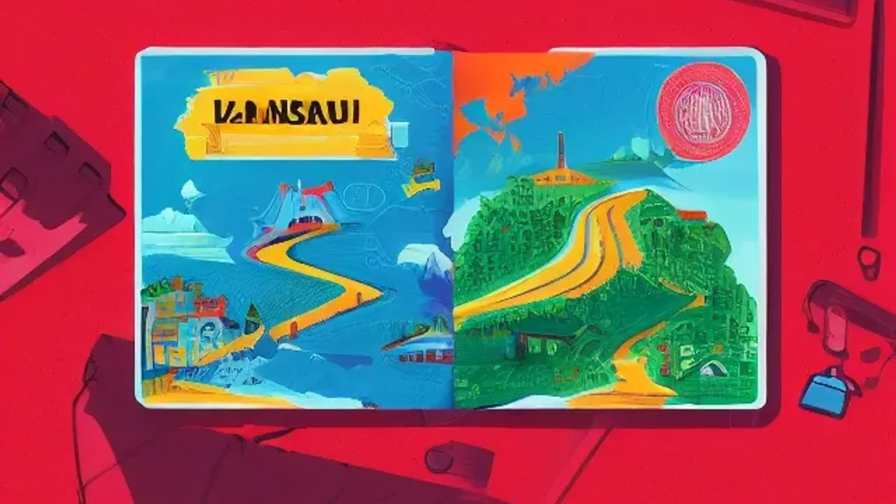
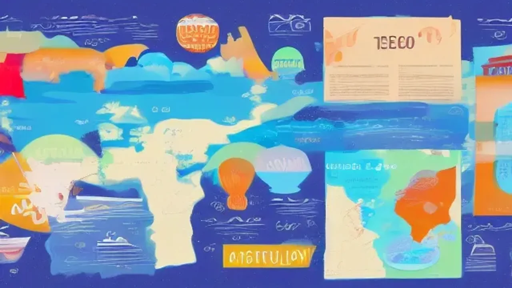

2026년 여름, 전 세계를 뒤흔드는 기록적인 폭염 속에서 복잡한 해변을 떠나 서늘한 고지대로 향하는 **산악 바이브 여행**에 대한 관심이 뜨겁습니다. 푹푹 찌는 도심에서 벗어나 만년설과 푸른 초원이 어우러진 대자연 속에서 온전한 휴식을 취하는 이 새로운 여행 패러다임은 올여름 가장 완벽한 피서책이 됩니다. 청량한 공기와 압도적인 풍경이 기다리는 고요한 산속으로 지금 떠나야 할 이유와 핵심 정보를 전합니다.

## 왜 지금 해변 대신 '산악 바이브 여행'인가?

### 역대급 여름 폭염 vs 쾌적한 고지대 기후
세계기상기구(WMO)의 기후 분석 데이터에 따르면, 올해 글로벌 평균 기온은 관측 사상 최고치를 경신하고 있습니다. 전통적인 여름 휴양지였던 지중해 연안이나 동남아시아 해변은 낮 기온이 40°C를 육박하여 정상적인 야외 활동이 불가능한 수준입니다. 반면 해발 1,500m 이상의 고지대는 한여름에도 낮 최고 기온이 20°C 안팎에 머무르며, 아침저녁으로는 10°C 이하로 떨어져 쾌적하고 서늘한 기후를 선호하는 여행자들에게 천국 같은 환경을 제공합니다.

### 인파로 북적이는 바다 vs 고요한 치유의 설산 초원
파라솔과 호객 행위, 소음으로 가득 찬 해수욕장은 도심의 스트레스를 연장할 뿐입니다. 산악 바이브를 추구하는 여행은 시각적, 청각적 자극을 최소화하고 대자연과의 교감에 집중합니다. 눈앞에 펼쳐지는 거대한 설산과 야생화가 가득한 초원, 정적을 깨는 바람 소리는 지친 현대인의 뇌를 쉬게 만드는 최고의 힐링 요소입니다. 오염되지 않은 청정 구역에서 즐기는 느린 걸음은 가치 있는 휴식을 보장합니다.

### 2026년 글로벌 여행자들이 산으로 향하는 진짜 이유
글로벌 트래블 트렌드 보고서에 따르면, 올해 여행자들의 약 65%가 '기후 피난형 휴가'를 계획 중이라고 답했습니다. 단순히 명소를 찍고 이동하는 관광에서 탈피하여, 한 지역에 머물며 하이킹을 하고 로컬 문화를 깊이 있게 체험하는 웰니스 여행이 주류로 부상했기 때문입니다. 스마트폰을 잠시 내려놓고 자연 속에서 스스로를 정화하는 디지털 디톡스의 목적지로도 산악 지역이 최적의 선택지로 꼽힙니다.

## 올여름 당장 떠나야 할 글로벌 산악 명소 BEST 3

### 야생화가 만개한 스위스 알프스 & 돌로미티 코스
6월의 스위스 융프라우 지역과 이탈리아 돌로미티는 겨울철 스키장에서 푸른 야생화 천국으로 완벽하게 탈바꿈합니다. 특히 돌로미티의 '트레 치메 디 라바레도' 루프 코스는 거대한 삼형제 바위 봉우리를 보며 평탄한 초원을 걷는 코스로, 초보자도 무리 없이 **산악 바이브 여행**의 진수를 맛볼 수 있습니다. 이 시기 알프스 산맥의 고개들은 겨우내 쌓인 눈이 녹아 흐르는 맑은 계곡물과 푸른 잔디가 대비를 이루며 경이로운 풍경을 선사합니다.

### 대자연의 웅장함에 압도되는 캐나디안 로키 하이킹
캐나다 밴프 국립공원과 재스퍼 국립공원을 잇는 아이스필드 파크웨이는 세계에서 가장 아름다운 고산 도로로 정평이 나 있습니다. 빙하가 녹아내려 에메랄드빛을 띠는 레이크 루이스와 모레인 레이크를 배경으로 걷는 하이킹 코스는 현실감을 잊게 만들 정도로 압도적입니다. 고도가 높은 탓에 한여름에도 거대한 빙하 조각을 직접 만질 수 있는 설원 차 투어 등 이색적인 대자연 체험이 상시 가능합니다.

### 아시아에서 만나는 서늘한 천국, 일본 북알프스 다테야마
비행시간이 짧은 아시아권에서도 훌륭한 대안이 존재합니다. 도야마현에 위치한 다테야마 구로베 알펜루트는 '일본의 지붕'이라 불리는 북알프스를 관통하는 고산 관광 코스입니다. 6월 중순까지도 거대한 눈벽 사이를 걷는 '눈의 대계곡' 축제가 이어지며, 해발 2,450m의 무로도 평원은 여름이 시작되면서 푸른 초원과 잔설이 어우러진 독특한 절경을 만듭니다. 접근성이 좋고 산악 열차, 로프웨이 등 편리한 교통 인프라가 갖춰져 동선이 매끄럽습니다.

[관련 글 보기](/posts/world-travel/)

## 산악 여행을 완벽하게 즐기기 위한 필수 준비물

### 고지대 가변 날씨에 대처하는 레이어드 의류 코디법
산의 날씨는 기압과 지형의 영향으로 예측 불가능하게 변합니다. 방심하고 반바지에 반소매 차림으로 올랐다가는 급격한 저체온증을 겪기 십상입니다. 땀을 빠르게 흡수하고 마르게 하는 기능성 티셔츠를 기본으로 입고, 그 위에 보온을 위한 가벼운 플리스 재킷을 걸쳐야 합니다. 맨 겉에는 비바람을 완벽하게 차단해 주는 고어텍스 소재의 바람막이 재킷을 매치하는 3단계 레이어드 스타일링이 안전을 지키는 기본 공식입니다.

### 트레킹 초보자도 발이 편안한 기능성 등산화 고르기
포장되지 않은 흙길과 자갈밭, 때로는 미끄러운 바위를 걸어야 하므로 일반 운동화는 부상의 위험이 큽니다. 발목을 단단하게 잡아주어 접질림을 방지하는 미드컷 또는 하이컷 등산화가 필수적입니다. 접지력이 우수한 비브람 등의 아웃솔이 적용되었는지 확인하고, 장시간 걸어도 발이 붓는 것을 감안하여 평소 신는 운동화 사이즈보다 5mm에서 10mm 정도 여유 있게 선택하는 것이 발가락 통증을 줄이는 노하우입니다.

### 자외선 차단제와 고산병 예방을 위한 필수 상비약 리스트
해발 고도가 1,000m 높아질 때마다 자외선 복사량은 약 10%에서 12%씩 증가합니다. 맑은 산 위의 햇빛은 도심보다 훨씬 강렬하므로 SPF 50+ 이상의 자외선 차단제와 편광 선글라스, 넓은 챙 모자는 필수입니다. 아울러 해발 2,500m 이상의 고지대로 급격히 이동할 경우 두통이나 어지러움을 동반한 고산병 증세가 나타날 수 있으므로, 타이레놀 같은 진통제나 현지 처방 고산병 약을 미리 구비해 두어야 안전합니다.

## 초보자를 위한 산악 여행지 숙소 및 패스 예약 팁

### 전망 좋은 알프스 샬레 vs 가성비 좋은 시내 호텔 비교
전통 목조 가옥인 '샬레'는 창문을 열면 곧바로 거대한 설산이 펼쳐지는 낭만이 있지만, 가격이 비싸고 마트나 기차역 등 편의시설과의 접근성이 떨어지는 단점이 명확합니다. 반면 기차역 인근 시내 중심가의 일반 호텔은 이동이 편리하고 가성비가 좋지만 산악 마을 특유의 아늑한 감성을 느끼기 어렵습니다. 일정의 첫 이틀은 접근성 좋은 시내에 묵고, 휴식에 집중할 이틀은 고지대 샬레를 예약하는 믹스 앤 매치 전략이 합리적입니다.

### 얼리버드 산악 열차 패스 예매로 교통비 30% 아끼는 법
스위스나 일본의 고산 지대는 철도와 케이블카 이용료가 전체 여행 경비의 상당 부분을 차지합니다. 스위스 트래블 패스나 다테야마 알펜루트 옵션권 같은 외국인 전용 교통 패스를 출발 전 한국에서 미리 구입하면 현장 발권보다 최소 20% 이상 지출을 줄일 수 있습니다. 특히 유럽의 고속열차나 인기 산악 구간은 탑승일 기준 2\~3개월 전에 얼리버드 티켓을 오픈하므로 예약 시점이 빠를수록 지갑을 지키기 수월합니다.

> 현지 산악 기차와 곤돌라는 기상 악화 시 운행이 갑자기 중단되기도 하므로, 예약 전 환불 및 날짜 변경 규정을 꼼꼼히 확인하는 절차가 반드시 선행되어야 예기치 못한 금전적 손실을 막을 수 있습니다.

### 현지 가이드 투어 상품 이용의 장점과 셀프 하이킹의 단점
자유 하이킹은 시간 제약 없이 원하는 곳에서 머물 수 있어 자유롭지만, 길을 잃거나 현지 지형 정보 부족으로 위험한 상황에 직면할 우려가 있습니다. 반면 현지 전문 가이드가 동행하는 소규모 투어 프로그램은 지역의 역사와 생태계 설명을 들을 수 있고, 조난 위험이 없어 안전성이 극대화됩니다. 초행길이거나 체력에 자신이 없다면 핵심 코스만큼은 일일 가이드 투어를 신청해 동행하는 방식을 권장합니다.

#산악바이브여행 #해외여름휴가 #스위스알프스 #돌로미티트레킹 #캐나다로키 #다테야마알펜루트 #피서지추천 #여름해외여행 #웰니스여행 #기후피난처