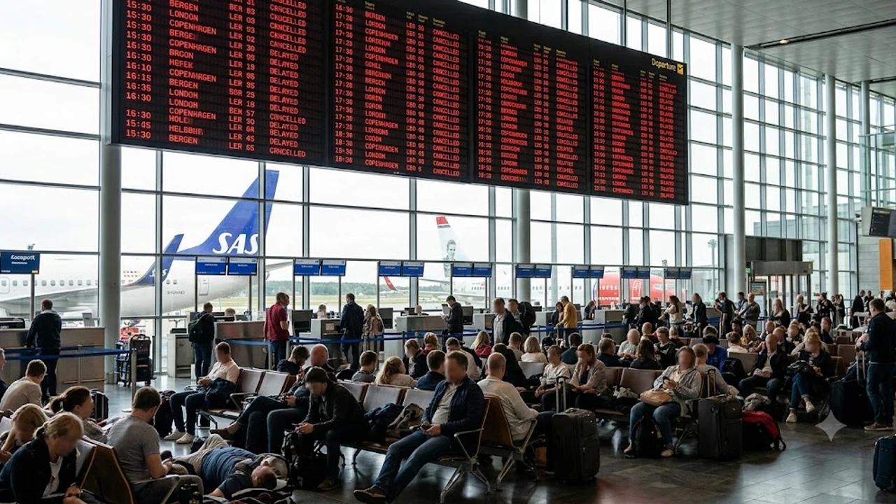

노르웨이 항공관제사협회의 기습적인 쟁의 돌입으로 수도 오슬로 가르데르모엔 공항을 비롯한 주요 거점 공항이 일시 셧다운되며 전례 없는 **노르웨이 공항 마비** 사태가 벌어졌다. 북유럽 여름 성수기 막바지에 항공편 결항과 연쇄 지연이 쏟아지는 만큼, 발이 묶인 여행객들은 탑승권 상태와 현지 보상 규정을 한시라도 빨리 확인해야 한다. 공항 혼란 속에서 [세계여행지 최신 트렌드](/posts/world-travel/world-travel-1783348391782/)를 미리 챙겨본 여행자라도 현장에서 즉각 써먹을 수 있는 행동 요령을 손에 쥐고 있어야 손해를 줄인다.

## 노르웨이 항공관제사 파업 현황과 오슬로 공항 운항 차질

### 오슬로 가르데르모엔 공항 셧다운 배경과 관제사 파업 쟁점
노르웨이 항공교통관제사협회(Norsk Flygelederforening)는 극심한 인력 부족과 16시간 연속 근무로 누적된 피로 문제를 해결하라며 전격 파업을 단행했다. 국영 공항 공기업 아비노르(Avinor)와의 협상이 최종 결렬되자 관제 인력이 즉각 자리를 비웠고, 수도 오슬로 가르데르모엔 공항은 약 5시간 동안 모든 항공기의 이착륙이 멈춰 섰다.

### 베르겐·트롬쇠 등 주요 공항 연쇄 결항 및 지연 규모
오슬로를 허브로 삼는 지방 공항망 역시 직격탄을 맞았다. 피오르드 관광 관문인 베르겐(Bergen) 공항을 비롯해 트롬쇠(Tromsø), 트론헤임(Trondheim) 공항에서 하루 만에 120편이 넘는 노선이 줄줄이 취소되거나 기약 없이 밀렸다. 스칸디나비아항공(SAS), 노르웨이지안(Norwegian), 위데뢰에(Widerøe) 등 핵심 항공사의 지연율은 당일 기준 80%를 훌쩍 넘어섰다.

### 파업 확대 일정과 북유럽 여행 일정에 미치는 영향
노조 측은 교대근무 개선과 법정 최소 휴게 시간 보장을 쟁취할 때까지 단계적 투쟁을 이어갈 태세다. 이 여파로 노르웨이 국내선뿐 아니라 덴마크 코펜하겐, 스웨덴 스톡홀름, 독일 프랑크푸르트로 이어지는 국제선 환승 승객들까지 연결편을 놓치는 피해가 꼬리를 물고 있다.

## 노르웨이 항공편 결항·지연 시 EC 261 보상 가능 여부

### 관제사 파업이 면책 사유인 '특별한 사정'에 해당하는지 분석
유럽연합 승객 보호 규정인 EC 261/2004에 따르면 조종사나 승무원 등 항공사 자체 인력의 파업은 항공사 귀책으로 인정되어 정액 보상을 받는다. 반면 국영 항공관제소(ATC) 파업은 항공사가 통제할 수 없는 '특별한 사정(Extraordinary Circumstances)'에 해당해 250~600유로 상당의 현금 배상 책임은 면제되는 게 원칙이다.

> **항공 승객 권리 필수 확인:** 정액 보상금이 면책되더라도 항공사의 '돌봄 의무(Right to Care)'는 사라지지 않는다. 2시간 이상 지연 시 식음료 제공, 1박 이상 대기 시 인근 호텔 숙박과 왕복 교통편 지원은 항공사에 당당히 요구할 수 있는 법적 권리다.

### EEA 협정에 따른 노르웨이 공항 출발·도착 항공편 적용 기준
노르웨이는 EU 정회원국이 아니지만 유럽경제지역(EEA) 협정국이라 EC 261 규정을 온전히 적용받는다. 
- 노르웨이 영토 내 공항에서 출발하는 모든 여객기
- EU/EEA 국적 항공사를 타고 노르웨이 공항으로 들어오는 여객기
위 조건에 들어맞는 탑승객은 일정이 무너졌을 때 수수료 없는 여정 변경이나 전액 환불을 선택할 권리가 명확히 보장된다.

### 보상금 청구 가능 케이스와 항공사별 약관 비교
관제 파업이 끝난 뒤에도 항공사가 기체 배치를 엉뚱하게 하거나 승무원 근무 일정을 맞추지 못해 추가 결항을 냈다면 얘기가 달라진다. 이는 온전히 항공사의 운영 미숙이므로 최대 600유로 배상 청구가 가능하다. 공항 현장에서 항공사 직원에게 파업과 무관한 지연 사유가 적힌 공식 확인서를 악착같이 받아내야 하는 이유다.

## 비행기 결항 즉시 현장에서 해결하는 실시간 대처법

### 항공사 공식 앱을 활용한 무료 예약 변경 및 리루팅 절차
결항 문자가 오면 공항 카운터 앞의 기나긴 줄에 서는 것보다 스마트폰 앱을 켜는 쪽이 훨씬 빠르다. SAS나 노르웨이지안 항공 앱의 'Manage Booking' 탭에서 대체 노선 변경 권한이 먼저 풀리기 때문이다. 직항이 없더라도 인근 도시를 거치는 코드셰어 편이나 타사 환승 루트를 재빨리 낚아채야 일정을 건진다.

### 공항 대기 시 필수 식음료·숙박 바우처 수령 및 증빙 수집 요령
현장 카운터에서 식사 쿠폰(Meal Voucher)과 제휴 호텔 바우처를 요청하고, 직원이 없거나 시스템이 뻗어 지급이 늦어지면 본인 카드로 결제한 뒤 영수증을 모아야 한다.
- 공항 구내 식당과 카페 결제 내역 (주류 제외)
- 공항철도(Flytoget) 및 택시 영수증
- 직접 잡은 공항 인근 호텔 상세 인보이스

### 여행자 보험 '항공기 지연 및 수하물 지연 특약' 청구 서류 준비
항공사 지원과 별개로 출국 전 들어둔 여행자 보험의 지연 특약을 가동할 때다. 4시간 이상 지연 시 항공사 공식 지연 확인서(Flight Disruption Certificate), 식비 및 비상 생필품 영수증, 기존 항공권과 변경 탑승권을 제출하면 가입 한도(보통 20만~50만 원) 안에서 실비를 돌려받는다.

## 파업 장기화 대비 북유럽 대체 교통수단 활용 전략

### 오슬로-베르겐 등 주요 도시 간 국철(Vy) 및 고속열차 활용법
노르웨이 내륙 하늘길이 막혔을 때는 국철(Vy)을 타는 게 가장 확실한 대안이다. 오슬로 중앙역(Oslo S)과 베르겐역을 잇는 베르겐선(Bergensbanen) 열차는 하루 4~5회 운행하며 험준한 산악 지대를 뚫고 정시에 닿는다. 표가 순식간에 동나므로 Vy 공식 홈페이지나 Entur 어플을 수시로 새로고침해 취소표를 낚아채야 한다.

### 인접국 육로 이동 및 항공편 우회
유럽 밖으로 나가는 장거리 국제선을 타야 한다면 스웨덴 국경을 넘는 육로 우회로가 답이다. 오슬로에서 스웨덴 예테보리나 스톡홀름행 고속열차(SJ) 혹은 장거리 버스(Vy Bus4You, FlixBus)로 이동한 뒤, 정상 운항 중인 스톡홀름 알란다(ARN)나 덴마크 코펜하겐(CPH) 공항에서 출발하는 대체 항공편을 잡는 방식이다.

### 실시간 항공 모니터링 툴을 통한 사전 확인 팁
무작정 공항에 가기 전 실시간 항공 추적 앱인 Flightradar24와 Avinor 관제 공지를 대조해봐야 한다. 내가 탈 비행기가 이전 출발지에서 제시간에 뜨고 있는지(Inbound Aircraft Tracking) 확인하면 공항에 도착하기 최소 2~3시간 전에 결항 여부를 읽어내고 헛걸음을 막을 수 있다.

갑작스러운 공항 대기와 복잡한 이동 경로에 대비해 짐 정리를 수월하게 돕는 여행용 압축 아이템을 미리 챙겨두면 든든하다.
[여행용 캐리어 압축 파우치 및 오거나이저 쿠팡에서 보기](https://www.coupang.com/np/search?q=%EC%97%AC%ED%96%89%EC%9A%A9%ED%92%88&sourceType=affiliate&trackingCode=AF8691300)

#노르웨이공항마비 #오슬로공항결항 #유럽항공파업 #EC261보상규정 #항공기지연대처 #북유럽여행꿀팁 #해외여행자보험청구