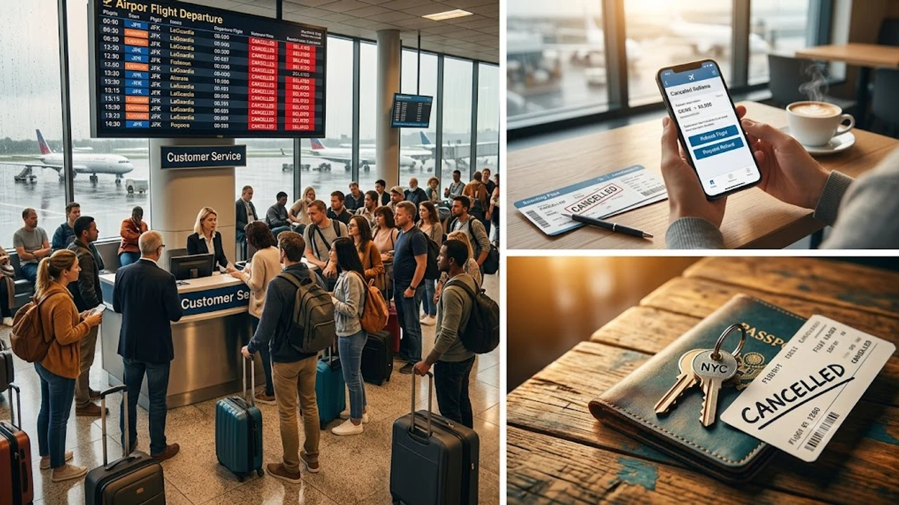

뉴욕 일대에 쏟아진 기록적인 기습 폭우와 토네이도 경보로 존 F. 케네디(JFK)와 라과디아 공항을 중심으로 비행기 운항이 줄줄이 멈춰 섰습니다. 갑작스러운 **뉴욕 폭우 결항** 사태를 겪게 되면 현장에서 발을 동동 구르기 십상이지만, 미국 항공 규정과 실전 행동 요령을 알면 대기 시간을 대폭 줄이고 불필요한 생돈 지출을 막을 수 있습니다. 뉴욕 현지에서 발이 묶였거나 귀국편을 앞둔 여행자가 즉시 써먹을 수 있는 핵심 대응법을 정리합니다.

## 뉴욕 기습 폭우와 JFK·라과디아 항공 대란 현황

### 8월 뉴욕 기습 폭우와 토네이도 경보 상황
미국 국립기상청(NWS)은 뉴욕 5개 자치구와 롱아일랜드 일대에 돌발 홍수 경보와 토네이도 주의보를 발령했습니다. 시간당 50mm가 넘는 기록적인 폭우가 쏟아지며 노후화된 배수 시설이 순식간에 역류했습니다. 맨해튼 도심 지하철 선로와 퀸스·브루클린 주요 간선도로가 물에 잠겨 공항으로 진입하는 도로망 자체가 마비된 상태입니다.

### JFK·라과디아·뉴어크 주요 공항 결항 및 지연 실태
미국 연방항공청(FAA)은 라과디아 공항에 지상 정지(Ground Stop) 조치를 내렸고, JFK 국제공항과 뉴어크 리버티 공항 역시 활주로 침수와 돌풍으로 이착륙 간격을 극단적으로 벌렸습니다. 이 여파로 수백 편의 국제선 및 미 국내선 항공편이 결항되거나 3시간 이상 활주로에 갇히는 사태가 속출하고 있습니다.

### 맨해튼 도심 침수와 지하철·도로 교통 마비 위험
뉴욕 지하철 N, Q, R, E선 등 핵심 노선 구간이 침수로 멈추거나 서행 운행 중입니다. 에어트레인 환승역 주변 도로마저 물이 차올라 우버나 리프트 같은 차량 공유 서비스를 부르면 평소 요금의 3배가 넘는 할증이 붙고 도착 시간도 기약하기 어렵습니다. 미국 내 이동 계획이 있다면 [미국 여행 입국 바뀐 규정 진짜 3가지](/posts/world-travel/us-travel-reentry-advance-parole-rule-change-2026/)와 함께 현지 교통 통제 상황을 필수적으로 확인해야 합니다.

## 항공권 무료 변경 및 환불 권리 총정리

### 항공사 긴급 여행 웨이버(Travel Waiver) 발령 기준
기상 악화가 시작되면 델타, 유나이티드, 아메리칸항공 등 주요 항공사는 해당 공항 노선 승객에게 수수료 면제 정책인 '웨이버(Travel Waiver)'를 즉시 발동합니다.

- **적용 대상:** 특보 발령 기간 내 JFK, LGA, EWR 공항 발착 티켓 소지자
- **제공 혜택:** 추가 운임 차액과 변경 수수료 0원으로 비행 일정 재조정 (보통 기존 일정 전후 3~7일 이내)
- **처리 방법:** 고객센터 대기 없이 항공사 모바일 앱 내 예약 변경 페이지에서 직접 지정

### 미국 교통부(DOT) 규정에 따른 무조건 전액 환불 조건
미국 교통부 규정상 항공편이 **취소**되거나 **중대한 지연(국제선 6시간 이상, 국내선 3시간 이상)**이 발생했을 때, 승객이 항공사가 제안한 대체편을 타지 않겠다고 밝히면 결제 수단으로 전액 현금 환불을 해줘야 합니다.

> 항공사 직원이 소멸 기한이 있는 바우처나 마일리지 적립을 권유하더라도, 결제했던 신용카드 원승인 취소를 요구할 법적 권리가 승객에게 있습니다.

### 날씨로 인한 결항 시 식비·숙박 보상 한계와 대안
기체 결함 같은 항공사 잘못과 달리, **폭우나 폭풍 같은 천재지변 결항은 항공사에 호텔비나 식비를 제공할 법적 의무가 없습니다.** 공항 창구 앞에서 숙소 바우처를 달라고 실랑이하는 것은 시간 낭비입니다. 지연이 하룻밤을 넘길 것 같다면 개인 여행자 보험의 '항공기 지연·결항 특약'을 활용해 숙소를 직접 잡는 편이 훨씬 빠릅니다.

## 결항·지연 발생 시 1분 만에 끝내는 즉각 대처법

### 공항 카운터 대신 항공사 앱 채팅·전화로 재예약하기
결항 소식이 뜨자마자 수백 명이 공항 카운터로 몰려듭니다. 그 줄에 서 있는 동안 남은 좌석은 앱을 켠 사람들에게 다 팔립니다.

- **앱 자동 재예약 탭:** 결항 알림이 뜨는 즉시 앱에 들어가 시스템이 추천하는 가장 빠른 대체편 선택
- **해외 지사 콜센터 우회:** 미국 현지 콜센터 통화 대기가 1시간 이상 걸릴 땐, 대기가 거의 없는 한국 지사나 호주·영국 지사 콜센터로 국제전화 연결
- **공식 X(트위터) 계정 활용:** 항공사 공식 서포트 계정 DM으로 예약번호와 영문 이름을 남기면 전담 상담원이 빠르게 좌석을 변경해 주는 경우가 많음

### 연계 교통편(에어트레인·지하철) 운행 중단 시 대체 경로
지하철이 침수됐다면 침수 위험이 높은 도로 택시 대신 롱아일랜드 철도(LIRR)를 타야 합니다. 맨해튼 펜 스테이션이나 그랜드 센트럴에서 LIRR을 타고 자메이카(Jamaica) 역까지 직통으로 이동한 뒤 JFK 에어트레인으로 갈아타는 경로가 침수 피해로부터 가장 안전합니다. 글로벌 교통망 대응 요령은 [세계여행지 최신 트렌드](/posts/world-travel/world-travel-1783348391782/)에서도 파악할 수 있습니다.

### 여행자 보험 천재지변 특약 청구를 위한 필수 증빙 서류 챙기기
숙박비, 식비, 이동 택시비를 보험사에서 돌려받으려면 현장 증빙 자료를 빠짐없이 챙겨야 합니다.

- **항공사 공식 결항/지연 증명서:** 모바일 앱 다운로드 또는 체크인 키오스크 출력
- **탑승권 원본 또는 모바일 티켓 캡처본**
- **비상 지출 카드 영수증:** 날짜와 결제 시각, 상호명이 찍힌 영수증 보관
- **현지 기상 특보 및 공항 폐쇄 속보 캡처**

## 폭우 시즌 뉴욕 여행자가 반드시 챙겨야 할 3가지 체크리스트

### 항공편 출발 6시간 전 사전 알림 및 실시간 레이더 앱 확인
공항으로 출발하기 전 Flightradar24 앱에서 내가 탈 비행기의 **전 단계 비행편(Inbound Flight)**이 어디에 떠 있는지 추적해야 합니다. 뉴욕 상공 날씨가 잠시 개더라도 들어올 비행기가 다른 공항에 묶여 있다면 출발은 기약 없이 밀립니다.

### 맨해튼 저지대 호텔 및 지하철 침수 구간 우회 전략
월스트리트가 있는 로어 맨해튼과 브루클린 덤보, 퀸스 플러싱 같은 저지대는 물이 빠지는 속도가 매우 느립니다. 침수 특보가 뜬 날에는 침수 위험이 적은 미드타운이나 센트럴파크 인근 지대 높은 빌딩가 실내로 이동해 일정을 이어가야 안전합니다.

### 결항 장기화 대비 공항 인근 비상 숙소 확보 요령
운항 재개가 다음 날 오후로 밀렸다면 JFK 공항 내부 TWA 호텔이나 자메이카 역 인근 호텔을 즉시 예약해야 합니다. 결항 확정 승객들이 호텔 예약 앱을 켜기 시작하면 30분 안에 공항 반경 10km 숙소가 동나고 방값도 3배 이상 치솟습니다.

현지 기상 이변 시 여권과 전자기기 침수를 막기 위해 방수 파우치를 여행 가방에 상시 챙겨 다니는 것을 권장합니다.

[방수 여행 파우치 쿠팡에서 보기](https://www.coupang.com/np/search?q=%EC%97%AC%ED%96%89%EC%9A%A9%ED%92%88&sourceType=affiliate&trackingCode=AF8691300)

#뉴욕폭우결항 #JFK공항결항 #라과디아결항 #미국항공권환불 #항공사웨이버 #비행기결항대처법 #미국여행자보험청구 #미국교통부환불규정