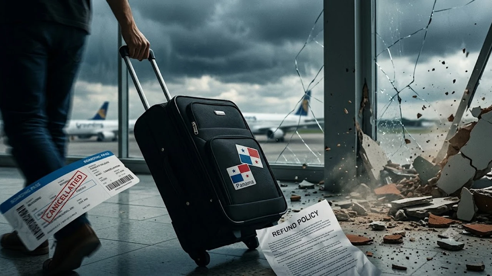

2026년 10월 9일 파나마 남서부 해역에서 발생한 규모 7.7 강진으로 중남미 최대 환승 관문인 토쿠멘 공항 인프라가 흔들리며 여행자들의 발이 묶였습니다. 활주로 점검과 여진으로 연결편 지연이 꼬리를 무는 가운데, 예매해 둔 **파나마 지진 항공권** 무료 취소 기준과 **토쿠멘 공항 결항** 환불 규정에 이목이 쏠리고 있습니다. 코앞으로 다가온 탑승권을 쥐고 있다면 항공사별 특별 면제 지침과 수수료 면제 조건을 한발 앞서 파악해야 수십만 원의 손실을 방어할 수 있습니다.

## 파나마 7.7 강진 발생 현황과 토쿠멘 국제공항(PTY) 운항 상태

### 아수에로 반도 진앙 규모 7.7 강진 및 여진 영향 분석
이번 지진은 파나마시티 남서쪽 아수에로 반도 인근 해역을 강타하며 수도권과 공항 청사 전역을 강하게 흔들었습니다. 본진 직후 규모 5.0 안팎의 여진이 잇따르자 관제탑과 청사 내부 구조물에 대한 긴급 육안 점검이 이뤄졌습니다. 외벽 붕괴 같은 치명적인 파손은 비껴갔으나, 전산망 안정화 작업과 수하물 컨베이어 벨트 재부팅 과정에서 탑승구 앞 대기 줄이 길게 늘어섰습니다.

### 중남미 핵심 허브 토쿠멘 공항의 임시 중단 및 점진적 재개 상황
토쿠멘 국제공항(PTY)은 10월 9일 본진 직후 활주로 균열을 확인하고자 약 4시간 동안 비행기 진입을 전면 차단했습니다. 안전 검측을 끝낸 뒤 항공기 이착륙을 다시 열었으나, 엉켜버린 주기장 스케줄 탓에 출발과 도착 시간이 줄줄이 밀려났습니다. 공항 당국은 시설물 이상이 없다고 공식 발표했으나 병목 현상을 완화하기 위해 슬롯 처리율을 평소의 70% 선으로 억제하며 운항을 통제하고 있습니다.

### 코스타리카·콜롬비아 등 인접국 연계 노선의 실시간 지연 현황
토쿠멘은 북미와 남미를 잇는 길목이라 코스타리카 산호세(SJO), 콜롬비아 보고타(BOG)로 향하는 피더(Feeder) 노선까지 연쇄 타격을 입었습니다. 파나마를 거쳐 멕시코나 미국으로 건너가려던 환승객들이 줄줄이 비행기를 놓치는 사고가 속출하고 있습니다. 미주 환승 루트를 짠 여행자라면 비자 관련 서류와 전자여행허가 상태를 미리 점검해야 하며, 세부 규정은 [미국 여행 입국 바뀐 규정 진짜 3가지](/posts/world-travel/us-travel-reentry-advance-parole-rule-change-2026/) 글을 대조하며 챙기면 확실합니다.

## 주요 항공사 비정상 운항 정책과 무료 취소·변경 기준

### 코파항공(Copa Airlines) 특별 면제 정책(Travel Waiver) 적용 범위
토쿠멘을 허브로 삼는 코파항공은 지진 발생 직후 '자연재해 특별 운항 지침(Travel Waiver)'을 발령했습니다. 10월 9일부터 10월 13일 사이 토쿠멘 공항을 오가거나 경유하는 티켓을 쥐고 있다면 운임 차액이나 페널티 없이 날짜를 옮길 수 있습니다.

> **코파항공 일정 변경 시 확인 규칙**
> - 기존 출발일 기준 7일 이내 동일 클래스 변경 시 수수료 및 운임 차액 전액 면제
> - 여행 취소 및 현금 환불: 항공편이 공식 '결항(Cancelled)' 처리되거나 4시간 이상 지연 통보를 받았을 때만 위약금 0원 적용

막연한 불안감 때문에 승객이 모바일 앱에서 자발적으로 예매를 취소하면 일반 환불 위약금이 고스란히 차감되므로, 항공편 상태가 '결항'이나 '대체편 배정'으로 바뀔 때까지 대기해야 합니다.

### 미국 및 유럽 국적기 경유 항공편의 환불 및 노선 변경 조건
유나이티드항공, 아메리칸항공, 델타항공 등 미국계 항공사 역시 파나마 출도착 및 경유 티켓에 여행 경보(Travel Alert)를 걸었습니다. 미국 항공사 앱 내 '일정 변경' 메뉴로 들어가면 파나마 대신 다른 도시를 거치는 우회 경로를 수수료 0원으로 선택할 수 있습니다. 반면 에어프랑스나 이베리아항공 같은 유럽 국적기는 전산망에 정식 결항 코드가 찍히기 전까지 무료 환불 승인을 보류하는 경향이 짙으니, 공항 카운터나 고객센터 채팅으로 결항 확인 번호부터 받아내야 합니다.

### 항공사 귀책 사유 vs 자연재해 면책 조항 차이점
기체 결함이나 승무원 근로시간 초과는 항공사 과실이라 호텔 바우처, 식사 쿠폰, 대체 교통편이 의무적으로 나옵니다. 하지만 강진 같은 천재지변은 운송약관상 '불가항력(Force Majeure)' 면책 항목에 들어갑니다. 항공사는 일정 변경이나 환불까지만 책임질 뿐, 공항 노숙으로 발생하는 현지 체류비나 숙박비를 물어주지 않습니다. 현장에서 직원과 실랑이를 벌이기보다는 타사 대체편 확약 도장을 찍어내는 데 시간을 쏟는 편이 빠릅니다.

## 여행자보험 자연재해 보상 청구 가이드와 주의사항

### 지진 발생 후 결항 시 해외여행자보험 항공기 지연 담보 적용 여부
출국 전 들어둔 해외여행자보험의 '항공기 및 수하물 지연' 특약은 자연재해 결항 시에도 보상망이 돌아갑니다. 통상 출발이 4시간 이상 지연되거나 결항 판정을 받아 대체편을 기다리며 긁은 필수 지출이 청구 대상입니다.

- 공항 내 식당 및 편의점 식음료 영수증
- 당일 비행기를 타지 못해 급히 묵은 공항 근처 숙박비
- 지연 통보 후 목적지에 연락하느라 쓴 국제통화 요금 및 필수 세면도구 구입비

단, 지진 속보가 언론에 뜬 '이후' 가입한 보험은 '이미 발생한 위험'으로 묶여 전액 면책 처리되므로, 출국 전에 가입을 마친 계약이어야 보험금을 타낼 수 있습니다.

### 결항 확인서 및 e티켓 등 보험금 수령에 필요한 필수 증빙 서류 3가지
보험금 심사를 통과하려면 공항을 떠나기 전 현장에서만 뗄 수 있는 증명서를 확보해야 합니다.

- **항공사 지연·결항 증명서(Flight Irregularity Report):** 지연 사유(Earthquake / Natural Disaster)와 변경된 출발 시각이 도장과 함께 적힌 공식 서류
- **최초 e티켓 및 최종 탑승권(Boarding Pass):** 처음 잡혀 있던 시간표와 실제 공항을 뜬 시간의 시차를 입증할 원본 티켓
- **승인 시각이 찍힌 카드 결제 영수증:** 지연 대기 시간대에 발생한 식비와 숙박비 상세 영수증 (간이 영수증 제외)

### 숙소·현지 투어 취소 수수료 보상 가능 여부 및 청구 체크리스트
파나마시티 호텔이나 운하 투어 업체를 선결제했다면 취소 수수료 환불 협상이 난관에 부딪힙니다. 현지 여행사는 바우처 유효기간 연장을 권하지만, 귀국 일정상 재방문이 어렵다면 공항 폐쇄 확인서를 첨부해 카드사 해외 이의제기(디스퓻) 절차를 밟아야 승산이 있습니다. 가입한 여행자보험에 '여행 중단·취소' 담보가 들어있다면 지진으로 도시 진입이 막혔다는 점을 증명해 위약금을 털어낼 수 있습니다. 다른 지역의 돌발 교통 변수와 대응법은 [세계여행지 최신 트렌드](/posts/world-travel/world-travel-1783348391782/) 글에서도 확인해 볼 수 있습니다.

## 중남미 여행객을 위한 대체 환승 루트 및 안전 대응 팁

### 파나마시티 우회 가능한 멕시코시티(MEX)·보고타(BOG) 대체 노선
토쿠멘 공항의 병목이 길어질 기미가 보이면, 아비앙카(Avianca)를 타고 콜롬비아 보고타(BOG)로 빠지거나 아에로멕시코(Aeromexico)를 경유해 멕시코시티(MEX)로 우회하는 티켓 변경을 카운터에 직접 요구해야 합니다. 같은 항공 동맹(스타얼라이언스, 스카이팀)끼리는 환승 보호 협정이 묶여 있어, 결항 확인서를 내밀며 '타사 이서(Endorsement)'를 강하게 요청하는 승객에게 남은 좌석이 먼저 돌아갑니다.

### 여진 지속 상황 대비 외교부 안전공지 확인 및 비상 연락망 확보
파나마 시내에 체류 중이라면 외교부 해외안전여행 안전공지를 수시로 확인하고, 주파나마 대사관 당직 번호를 휴대폰에 입력해 둬야 합니다. 진동이 감지되면 낙하물 위험이 큰 유리 외벽을 벗어나 탁 트인 공간으로 빠져나와야 하며, 흔들림이 멈추기 전까지 엘리베이터를 타는 행동은 금물입니다. 현지 기지국 붕괴로 데이터가 먹통이 될 사태에 대비해 대사관 번호와 여권 사본은 오프라인 메모장이나 갤러리에 저장해 두는 방식이 안전합니다.

### 공항 대기 장기화 시 대체 숙소 예약 및 현장 라운지 활용 팁
터미널 안에서 날을 새야 할 판이라면 공항 환승 구역 내 라운지나 인근 에어포트 호텔 객실부터 즉시 낚아채야 합니다. 같은 비행기를 놓친 수백 명의 여행자가 한꺼번에 예약 앱을 켜기 때문에 20~30분이면 반경 5km 내 빈방이 사라집니다. 공항 구역 밖으로 나가기 애매한 상황이라면 콘센트와 식수가 확보되는 유료 라운지 이용권을 현장 결제해 체력과 배터리를 비축하는 선택이 현실적입니다.

혼잡한 공항 대기실에서 장시간 머물며 귀중품을 지키려면 몸에 밀착되는 방수 힙색과 도난 방지용 캐리어 결속 밴드를 챙겨두는 습관이 요긴합니다.
[여행용 안전 방수 힙색 및 캐리어 벨트 쿠팡에서 보기](https://www.coupang.com/np/search?q=%EC%97%AC%ED%96%89%EC%9A%A9%ED%92%88&sourceType=affiliate&trackingCode=AF8691300)

#파나마지진 #토쿠멘공항 #파나마항공권환불 #코파항공결항 #해외여행자보험보상 #항공권취소수수료 #지연증명서발급 #중남미여행안전