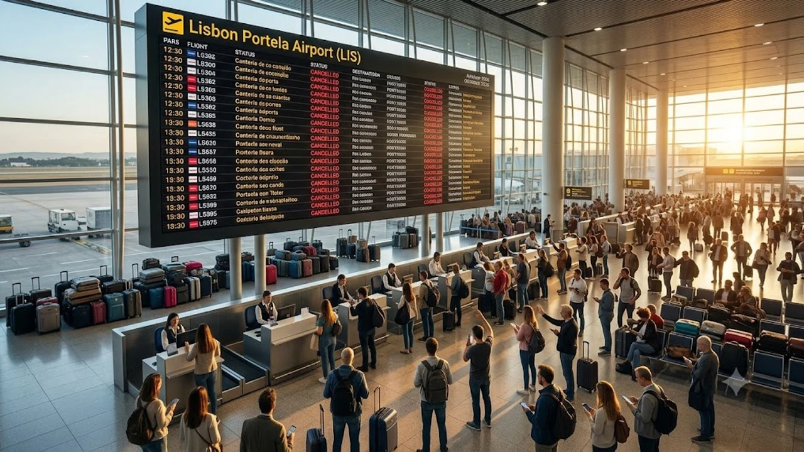

2026년 10월 2일 0시를 기점으로 리스본과 포르투 공항을 오가는 주요 항공편이 멈춰 서며 **포르투갈 항공 파업** 여파가 유럽 전역으로 번지고 있습니다. 이지젯(easyJet) 현지 객실 승무원 노조가 주도한 이번 기습 중단 사태로 인해 가을철 이베리아반도를 찾은 한국인 자유 여행객들의 **유럽 항공편 결항** 피해와 발 묶임 사고가 잇따르는 실정입니다. 현장에 머물고 있거나 스페인·포르투갈 이동을 앞두고 있다면 당장 쓸 수 있는 육로 우회로와 함께 규정에 명시된 승객 권리를 빈틈없이 챙겨야 합니다.

## 10월 기습 시작된 포르투갈발 항공 대란의 실체

### 10월 파업 일정과 리스본·포르투 공항 현황
이번 집단행동은 10월 2일부터 6일까지 닷새간 포르투갈 민간항공승무원노조(SNPVAC) 주도로 이어집니다. 핵심 거점은 리스본 포르텔라 공항(LIS)과 포르투 프란시스쿠 사 카르네이루 공항(OPO)이며, 남부 파루(FAO) 공항 역시 조업 차질이 겹쳤습니다. 현지 관제 인력까지 최소 수준만 남기면서 평소 스케줄의 40% 안팎만 겨우 소화하는 비상 체제로 굴러가고 있습니다.

### 취소된 주요 노선과 직격탄 맞은 유럽 환승 여행객
타격이 집중된 구간은 런던 개트윅, 파리 샤를 드골, 마드리드 바라하스로 이어지는 단거리 연결편입니다. 포르투갈 국내선인 리스본-포르투 구간은 운항이 사실상 멈췄고, 마데이라나 아조레스 제도로 들어가는 섬 노선도 무더기 결항 명단에 올랐습니다. 특히 스페인이나 프랑스를 거쳐 한국행 장거리 비행기로 갈아타야 하는 승객들이 공항 환승 구역에 갇히는 피해가 속출하고 있습니다.

### 이탈리아 철도 등 유럽 내 연쇄 이동 지연 여파
현재 남유럽 교통망은 항공과 철도가 맞물려 혼선이 극에 달했습니다. 최근 [세계여행지 최신 트렌드](/posts/world-travel/world-travel-1783348391782/) 자료에서도 짚었듯, 주요 허브 공항의 과밀 현상에 인근 국가 철도망 정비 이슈까지 겹치며 이동 경로가 급격히 좁아졌습니다. 비행기가 멈추자마자 국경을 넘는 대체 육상 교통편까지 표가 빠르게 동나는 연쇄 마비가 벌어지고 있습니다.

## 항공권 결항 알림 시 즉시 취해야 할 3단계 골든타임

### 공항 가기 전 실시간 운항 상태 조회 및 앱 푸시 설정
숙소 문을 나서기 전 항공사 전용 앱의 '실시간 운항 추적(Flight Tracker)' 알림을 켜두는 게 첫걸음입니다. 이메일 안내는 전산상 결항 확정보다 1~2시간씩 늦게 날아오는 일이 허다합니다. 현장 전광판에 붉은색 결항 표시가 뜨기 직전 앱 푸시가 먼저 울리므로, 알림이 뜨는 순간 재예약 메뉴로 들어가야 몇 자리 안 남은 대체 좌석을 잡을 수 있습니다.

### 타 항공사 및 인근 스페인 육로 우회 전략
포르투갈 하늘길이 완전히 막혔다면 지체 없이 스페인 국경으로 눈을 돌려야 합니다. 포르투에서는 스페인 비고(Vigo)나 산티아고 데 콤포스텔라 공항으로, 리스본에서는 세비야(Sevilla)나 마드리드(Madrid)로 빠지는 장거리 버스를 탑니다. 스페인 영토로 넘어가 이베리아항공이나 부엘링 같은 타사 잔여 좌석을 끊으면 일정을 하루 이상 허비하지 않고 귀국길을 이어갈 수 있습니다.

### 공항 카운터 대기 줄 대신 온라인 무료 변경 링크 활용법
결항이 터졌을 때 공항 오프라인 고객센터 창구에 줄을 서면 꼬박 서너 시간을 길바닥에 버리기 십상입니다. 항공사가 문자나 예약 관리 화면에 열어주는 '무료 항공편 변경(Free Flight Change)' 전용 링크를 곧바로 눌러야 합니다. 현장 직원 단말기보다 모바일 시스템이 제휴 항공사 잔여석을 훨씬 발 빠르게 반영하므로, 손가락 몇 번 움직여 대체편 모바일 탑승권을 쥐는 편이 훨씬 빠릅니다.

## EU261 규정으로 챙겨야 할 무료 지원과 보상 범위

### 대체편 제공 전까지 지원받는 숙박비·식음료 바우처 청구 요령
유럽연합 승객 권리 규정(EC 261/2004)에 따라 결항으로 이튿날 출발편을 타게 된 승객은 호텔 숙박과 식사를 항공사로부터 무상 지원받습니다. 카운터 혼잡으로 현장 바우처 발급이 막히면 본인 카드로 먼저 긁고 사후 영수증 청구를 진행하면 됩니다.

> **사후 환급 증빙 챙기기**
> - 사업자 번호와 세부 품목이 적힌 호텔 인보이스 원본과 공항 이동 택시 영수증을 반드시 챙깁니다.
> - 술이나 사치품을 뺀 끼니 해결 목적의 식음료 결제 건만 환급 승인이 납니다.

### 항공사 자체 파업 시 최대 600유로 보상금 수령 조건
태풍 같은 기상 이변이나 공항 관제탑 파업과 달리, 항공사 소속 객실 승무원의 파업은 '통제 불가능한 면책 사유(Extraordinary circumstances)'로 인정되지 않습니다. 유럽사법재판소 판례에 따라 비행 거리에 맞춰 1인당 최소 250유로에서 최대 600유로까지 현금 배상을 당당히 요구할 수 있습니다.

- **비행거리 1,500km 이하**: 250유로 (약 37만 원)
- **EU 역내 1,500km 초과 노선**: 400유로 (약 59만 원)
- **기타 3,500km 초과 장거리 노선**: 600유로 (약 89만 원)

### 현장 영수증 수집 및 지연 증명서 발급 체크리스트
항공사의 보상금 지급 거절을 차단하려면 파업 결항 사실이 찍힌 공식 지연 확인서(Delay/Cancellation Certificate)를 손에 쥐어야 합니다. 항공사 공식 홈페이지 고객센터 서식 탭에서 PDF 형태로 즉시 발급 가능합니다. 이 파일은 항공사 직접 배상 신청뿐만 아니라 국내 여행자보험에 서류를 넣을 때도 필수 증빙으로 쓰입니다.

## 10월 가을 유럽 여행자를 위한 비상 이동 플랜 B

### 포르투갈-스페인 국경 관통 고속버스 및 렌터카 예약 팁
포르투갈 국철(CP) 역시 파업 연대 가능성이 열려 있으므로 알사(ALSA)나 플릭스버스(FlixBus) 같은 다국적 버스 노선을 먼저 확보해야 안전합니다. 렌터카를 빌려 스페인으로 넘어갈 때는 국경 통과 편도 반납 수수료(Cross-border Drop-off Fee)가 수십만 원 이상 붙을 수 있으니, 결제 직전 계약서의 추가 요금 조항을 철저히 확인해야 눈먼 돈이 나가지 않습니다.

### 환승지 변경 시 주의해야 할 위탁 수하물 유실 방지책
일정이 급하게 바뀌면 부친 짐이 엉뚱한 공항에 덩그러니 남겨질 공산이 큽니다. 리스본에서 짐을 부치기 전 가방 외관과 수하물 태그 번호를 스마트폰 카메라로 선명하게 찍어두고, 가방 안쪽 깊숙이 위치 추적 스마트태그를 넣어둡니다. 공항에서 급히 노선을 틀 때는 위탁 수하물을 카운터에서 완전히 되찾은 뒤 새 항공편에 다시 부쳐야 분실을 원천 차단할 수 있습니다.

### 여행자보험 항공기 지연 결항 특약 실제 청구 절차
국내 여행자보험의 항공 지연 특약은 보통 4시간 또는 6시간 이상 발이 묶였을 때 적용됩니다. 지연 시간 동안 긁은 식비, 충전기 구매비, 공항 인근 이동 교통비 영수증을 카드 승인 내역과 함께 빠짐없이 챙겨야 합니다. 파업 결항 공문과 전자 항공권 사본, 실물 탑승권을 귀국 후 30일 안에 모바일 보상 창구로 접수하면 빠르게 보상금을 수령할 수 있습니다.

장시간 공항 대기나 급작스러운 육로 이동 시에는 여권과 지갑, 전자기기를 안전하게 몸에 지니는 소지품 관리가 관건입니다. 북새통을 이루는 유럽 공항 현장에서 소매치기와 분실 걱정을 덜어주는 [도난방지 여행용 슬링백 쿠팡에서 보기](https://www.coupang.com/np/search?q=%EC%97%AC%ED%96%89%EC%9A%A9%ED%92%88&sourceType=affiliate&trackingCode=AF8691300) 같은 안전 용품을 미리 챙겨두면 돌발 변수 속에서도 소지품을 든든하게 지켜낼 수 있습니다.

#포르투갈항공파업 #이지젯결항대처 #리스본공항지연 #포르투공항결항 #EU261보상청구 #유럽비행기지연대처 #스페인육로우회 #유럽여행자보험청구