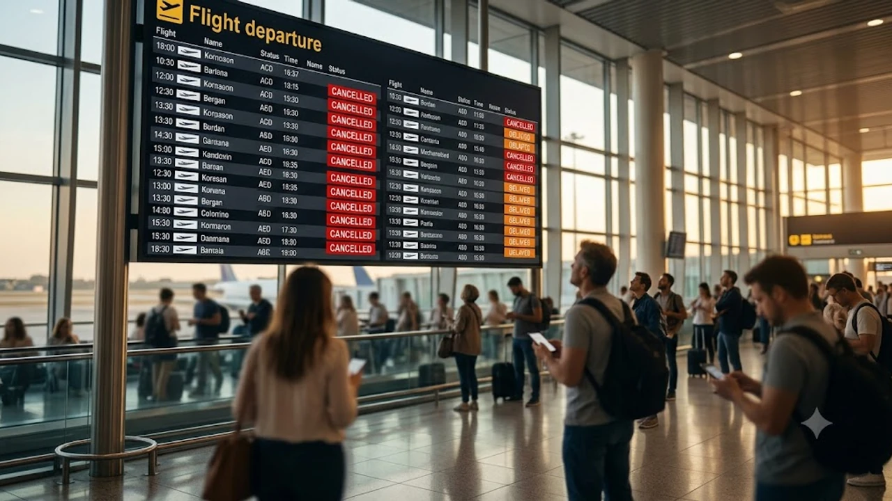

이탈리아 로마 피우미치노 공항(FCO)을 포함한 주요 공항에서 전면 파업이 예고되면서 현지를 오가는 항공편 운항 차질과 대규모 지연 사태가 벌어지고 있다. 이번 **로마 공항 파업**은 공항 지상 조업 인력뿐 아니라 터미널 보안 검색 요원들까지 동참해 사전 대처 없이는 현장에서 탑승 자체를 놓치기 십상이다. 직항 귀국편이나 유럽 내 환승 일정을 앞둔 여행자라면 피해를 줄이는 실전 행동 수칙을 즉시 확인해야 한다.

## 피우미치노 공항 파업 실시간 상황과 사전 확인법

### 이탈리아 인프라교통부 공식 캘린더 조회
이탈리아 교통 파업은 기습적으로 단행되지 않고 사전에 법적 공시 절차를 거친다. 현지 교통부(Ministero delle Infrastrutture e dei Trasporti) 파업 등록 포털에서 피우미치노(FCO) 및 참피노(CIA) 공항의 파업 시간대와 참여 노조를 실시간으로 직접 확인할 수 있다. [세계여행지 최신 트렌드](/posts/world-travel/world-travel-1783348391782/)를 미리 체크해 두는 것처럼 현지 공공 포털의 영문 공지를 확인하는 습관이 필수적이다.

### 항공사 모바일 앱 PUSH 알림 활성화
지상 조업 인력 파업 시 체크인 카운터 발권과 수하물 위탁 전산망이 일시에 지연된다. 항공사 공식 앱에서 푸시 알림을 켜두면 결항 결정이나 대체편 배정 정보를 공항 현장 전광판보다 평균 20~30분 빠르게 받아볼 수 있다.

---

## 파업 당일 살아남는 법적 보장 운항 시간대

### 이탈리아 항공법상 필수 보장 시간대 활용
이탈리아 항공청(ENAC) 규정에 따라 파업 기간 중에도 여객 수송권을 보장하기 위해 반드시 운항해야 하는 특정 시간대가 법으로 정해져 있다.

- **오전 보장 구간:** 07:00 ~ 10:00
- **저녁 보장 구간:** 18:00 ~ 21:00

> 이 시간대에 출도착하는 항공편은 파업 참여 대상에서 법적으로 제외되므로 결항 위험이 극히 낮다.

### 결항 통보 즉시 황금 시간대로 변경 요청
소지한 티켓이 파업 시간대와 겹쳐 지연·결항 통보를 받았다면 주저 없이 고객센터나 앱 변경 창에서 위 보장 시간대 항공편으로 변경을 요구해야 한다. 잔여 좌석이 빠르게 소진되므로 보장 시간대 편명을 미리 메모해 두고 상담원에게 직접 지정해 요청하는 편이 유리하다.

---

## 결항 지연 시 EU261 현장 보상 대처법

### 영수증 실시간 수집과 지연 확인서 발급
유럽연합 규정 EU261에 따라 항공편이 3시간 이상 지연되거나 결항될 경우 운항 거리에 따라 최대 600유로까지 금전적 보상을 청구할 수 있다. 항공사 책임 회피를 막기 위해 공항 지상 직원에게 지연 사유가 명시된 공식 확인서(Delay Confirmation)를 즉시 발급받아 두어야 한다.

### 식음료 바우처와 대체 숙소 청구 권리
대기 시간이 2시간을 넘어가면 항공사는 의무적으로 식음료 바우처를 제공해야 한다. 만약 카운터 혼잡으로 바우처를 받지 못했다면 공항 내 식당에서 결제한 카드 영수증을 항목별로 모두 챙겨두어야 추후 사후 실비 청구가 가능하다. 다음 날로 탑승이 밀릴 경우 인근 호텔 숙박권과 왕복 택시비 지원도 요청할 수 있다.

---

## 수하물 대란 피하는 기내 반입과 이동 동선

### 위탁 수하물 배제하고 기내용 캐리어 집중
지상 조업사 파업의 가장 치명적인 타격은 수하물 하역 중단이다. 캐리어가 터미널 지하 창고에 갇히면 현지 도착 후 수일간 짐을 찾지 못하는 참사가 벌어진다. 일주일 안팎의 일정이라면 최소한의 짐만 챙겨 기내 반입용 가방 1개로 압축하는 결단이 요구된다.

### 테르미니역 이동 시 공항철도 선점
공항 버스와 일반 택시 승차장은 파업 여파로 발이 묶인 인파가 몰려 수 시간 대기가 발생한다. 피우미치노 공항에서 로마 시내로 진입할 때는 도로 교통 정체 영향을 받지 않는 직통 열차 레오나르도 익스프레스(Leonardo Express) 모바일 티켓을 사전에 예매해 두는 편이 안전하다.

갑작스러운 수하물 분실과 지연 대기 상황에 대비해 위치 추적용 스마트태그와 압축 수하물 파우치를 미리 구비해 두는 것이 현명하다.

[관련상품 쿠팡에서 보기](https://www.coupang.com/np/search?q=%EC%97%AC%ED%96%89%EC%9A%A9%ED%92%88&sourceType=affiliate&trackingCode=AF8691300)

#로마공항파업 #피우미치노공항 #이탈리아여행 #EU261보상 #항공편결항대처 #레오나르도익스프레스 #유럽여행팁