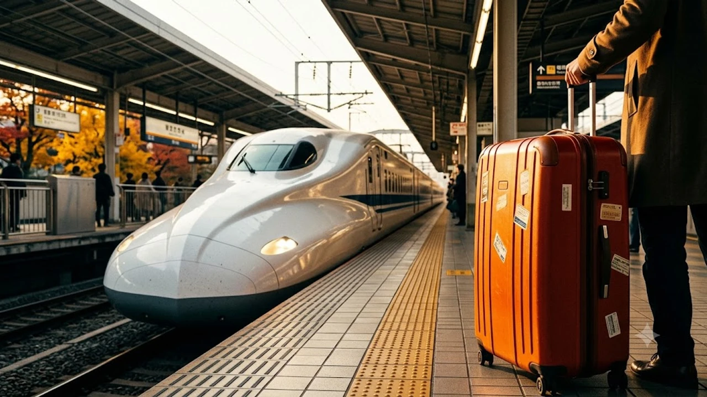

2026년 10월 단풍철을 맞아 일본 열도를 횡단하는 여행자라면 **신칸센 수하물 예약** 제도를 사전에 반드시 짚고 넘어가야 한다. 일반 지정석 승차권만 쥐고 플랫폼에 들어섰다가 열차 문앞에서 승무원에게 제지당해 현장 페널티를 물거나 탑승 자체가 거절되는 사례가 속출하고 있다. 특히 가을 성수기에는 차내 통로 혼잡도가 극에 달하므로 특대 수하물 규정의 엄격한 적용을 피하기 어렵다.

## 단풍철 신칸센 특대 수하물 단속 강화 배경

가을 단풍 시즌이 본격화되면서 주요 관광지로 향하는 주요 간선 철도의 혼잡도는 평소의 두 배 이상으로 치솟는다. 특히 교토, 오사카, 토호쿠 방면으로 향하는 열차는 매 편 만석을 기록하며 통로 안전 확보가 최우선 과제로 떠올랐다.

### 엄격해진 현장 검표 기준

현장 차장과 역무원들은 개찰구와 승강장 진입로부터 육안으로 28인치 이상으로 보이는 가방을 면밀히 감시한다. 이전에는 통로 구석에 짐을 세워두고 버티는 승객을 묵인하는 경우도 간혹 있었으나, 비상시 대피로 확보 지침이 강화되면서 허가받지 않은 대형 화물은 발각 즉시 이동 또는 하차 조치가 내려진다. 차내 순회 검표 역시 정차역마다 집요하게 이뤄지고 있다.

### 좌석 지정만으로 탑승이 거절되는 실제 사례

지정석 표를 정상 발권했음에도 '특대 수하물 전용 구역' 옵션이 빠져 있다는 이유로 차내 진입을 막아서는 일이 빈번하다. 짐을 좌석 발치에 욱여넣으려 해도 앞좌석 승객의 리클라이닝을 방해하거나 무릎이 끼어 안전상 탑승이 불가능하다고 판단되면 승무원은 현장에서 승차권 환불 없는 하차를 요구할 권한을 갖는다. 플랫폼에서 실랑이를 벌이다 열차 문이 닫혀 다음 편 자유석으로 밀려나는 낭패를 겪는 여행객이 적지 않다.

### 노선별 적용 구간 차이

도카이도·산요·규슈·니시큐슈 신칸센은 세 변의 합이 160cm를 넘는 짐에 대해 예약제를 전면 의무화하고 있다. 반면 도호쿠·홋카이도·조에쓰·호쿠리쿠 신칸센 등 동일본 관할 노선은 전용 예약 좌석 제도를 별도로 두지 않는 대신, 차내 수하물 거치대 선착순 이용 방식을 취한다. 본인이 탑승하는 열차가 도쿄를 기점으로 서쪽으로 가는지 북쪽으로 가는지에 따라 대처법이 180도 달라진다는 점을 명확히 인지해야 한다.

## 160cm 규격 계산법과 내 캐리어 측정 기준

열차 탑승 전 줄자로 본인의 짐을 직접 재어보지 않는다면 기준치를 넘겼는지 확신하기 어렵다. 항공사 수하물 규격과 철도 규격은 계산법과 제재 방식이 완전히 다르다.

### 세 변의 합 160cm 초과 250cm 이내 판별법

기준이 되는 수치는 가방의 가로, 세로, 높이 세 변의 길이를 모두 더한 값이다. 이때 바퀴의 높이와 상단 및 측면 손잡이 튀어나온 부분, 외부 포켓의 두께까지 전부 합산에 포함한다. 

- 세 변의 합 160cm 이하: 예약 불필요, 좌석 위 선반 또는 발밑 적재 가능
- 세 변의 합 161cm ~ 250cm: **특대 수하물 예약 필수** (미예약 시 차내 반입 제한)
- 세 변의 합 251cm 이상: 차내 반입 절대 불가 (화물 택배 이용 필수)

통상 24인치 캐리어까지는 160cm 이하에 머물지만, 확장 지퍼를 열거나 바퀴가 큰 28인치 이상 하드캐리어는 거의 예외 없이 160cm 기준선을 가뿐히 넘어선다.

### 대형 짐과 유모차·스포츠 용품 기준

접이식 자전거, 악기 케이스, 대형 유모차, 골프백 역시 세 변의 합이 160cm를 초과하면 동일한 규제 대상에 묶인다. 유모차의 경우 접었을 때 160cm 이하가 된다면 일반 좌석 발밑에 둘 수 있으나, 쌍둥이 유모차나 대형 디럭스 모델은 특대 수하물 좌석을 확보하지 않고는 열차 내 배치가 불가능하다. 스키나 스노보드 장비는 전용 가방에 넣어 세워둘 수 있는 공간이 지정석 뒤편에만 존재한다.

### 규격 미달이라도 통로 적재 시 제재받는 이유

160cm 이하의 중형 캐리어라 할지라도 통로나 출입문 부근 공간에 방치해 두는 행위는 엄격히 금지된다. 머리 위 선반에 가방이 다 올라가지 않는다는 핑계로 통로에 가방을 세워둘 경우, 객실 승무원의 경고 후 즉시 선반 적재를 지시받는다. 완력 부족으로 선반에 올리지 못해 쩔쩔매는 여행자 역시 규정 위반으로 과태료 부과 대상에 오를 수 있다. 복잡한 규정 변화는 최근 관광객 과밀화로 골치를 앓는 [세계여행지 최신 트렌드](/posts/world-travel/world-travel-1783348391782/) 전반에서도 공통적으로 나타나는 흐름이다.

## 수수료 1,000엔 피하는 사전 좌석 지정 단계별 매뉴얼

사전에 제도를 이해하고 표를 끊는다면 단 1엔의 추가 지출도 발생하지 않는다. 반대로 현장에서 적발되면 1,000엔(세금 포함)의 수수료를 즉시 지불해야 하며, 짐은 승무원이 지정한 엉뚱한 차량의 빈 공간으로 강제 이동 격리된다.

> **주의 사항**  
> 현장 수수료 1,000엔을 지불한다고 해서 내 자리 바로 뒤에 짐을 놓을 수 있는 권리가 생기는 것이 아니다. 차내 빈 보관함이 없으면 종착역까지 통로 간이 좌석에 서서 가야 하는 최악의 상황이 발생한다.

- **온라인 공식 예매처 활용**: 스마트EX(SmartEX) 모바일 앱이나 웹사이트를 이용할 때, 좌석 종류 선택 화면에서 반드시 **'특대 수하물 코너 이용 좌석'** 혹은 **'특대 수하물 스페이스 이용 좌석'** 옵션을 체크한다. 추가 요금 없이 일반 지정석 요금 그대로 결제된다.
- **차량 최후열 좌석 확보**: 특대 수하물 스페이스 좌석은 객차의 가장 마지막 열 좌석(벽면 바로 앞)이다. 등받이 뒤편 빈 공간이 바로 본인의 전용 짐칸이 된다.
- **코너 락커형 좌석 활용**: 일부 최신 신칸센 편성에 도입된 차내 전용 락커(도난 방지 와이어 및 번호키 구비)를 함께 사용하는 좌석을 선택하면 이동 중 분실 위험까지 완벽히 차단된다.
- **역 발권기 수동 지정**: 현지 미도리노마도구치(녹색 창구)나 다기능 자동발권기 화면에서도 '특대 수하물' 아이콘이 붙은 좌석 버튼을 직접 터치해 무료로 지정할 수 있다.

## 특대 수하물 지정석 매진 시 여행자 대처 옵션

단풍 절정기에는 수하물 전용 좌석이 며칠 전부터 빠르게 동난다. 일반 좌석만 남아 있거나 당일 급하게 이동해야 할 때 무작정 열차에 오르는 것은 위험한 도박이다.

### 역 구내 코인로커 및 짐 배송 서비스 활용

열차 탑승 직전 특대 수하물 좌석을 구하지 못했다면 도쿄역, 신오사카역, 교토역 등 주요 거점 역의 당일 수하물 택배 카운터(야마토 운수 등)를 찾는 편이 현명하다. 오전 10시 이전에 짐을 맡기면 당일 저녁 목적지 호텔 프런트로 가방을 직배송해 주는 호텔-투-호텔 서비스를 이용할 수 있다. 무거운 짐을 들고 계단을 오르내릴 필요 없이 빈손으로 단풍 명소를 둘러본 뒤 숙소에서 캐리어를 수령하는 방식이다.

### 일반 열차 및 쾌속·특급 대체 동선 구성

신칸센 전용 예약이 꽉 막혔다면 킨테츠 특급, JR 재래선 신쾌속, 사철 특급 열차로 우회하는 방안을 고려한다. 예를 들어 나고야-오사카 구간은 킨테츠 히노토리 특급을 타면 신칸센과 큰 시간 차이 없이 넉넉한 전용 대형 락커를 선착순으로 이용할 수 있다. 관서와 관동을 잇는 장거리 이동이 아니라면 사철 특급이 짐 보관 측면에서 훨씬 쾌적한 대안이 되어 준다.

### 성수기 이동을 위한 패킹 전략

가장 근본적인 해결책은 애초에 짐 부피를 160cm 이하로 통제하는 것이다. 현지 빨래방 인프라가 촘촘한 일본 여행 특성상 속옷과 기본 의류는 3일 치만 챙겨 세탁해 입고, 압축 파우치를 활용해 가방 내부 공간 효율을 극대화하면 24인치 캐리어 하나로도 열흘간의 일정을 무리 없이 소화할 수 있다.

[신칸센 규격에 딱 맞는 확장형 여행용 캐리어 쿠팡에서 확인하기](https://www.coupang.com/np/search?q=%EC%97%AC%ED%96%89%EC%9A%A9%ED%92%88&sourceType=affiliate&trackingCode=AF8691300)

#신칸센수하물예약 #일본기차여행 #신칸센특대수하물 #교토단풍여행 #스마트EX예매 #일본캐리어규정 #JR신칸센짐보관 #일본기차수수료