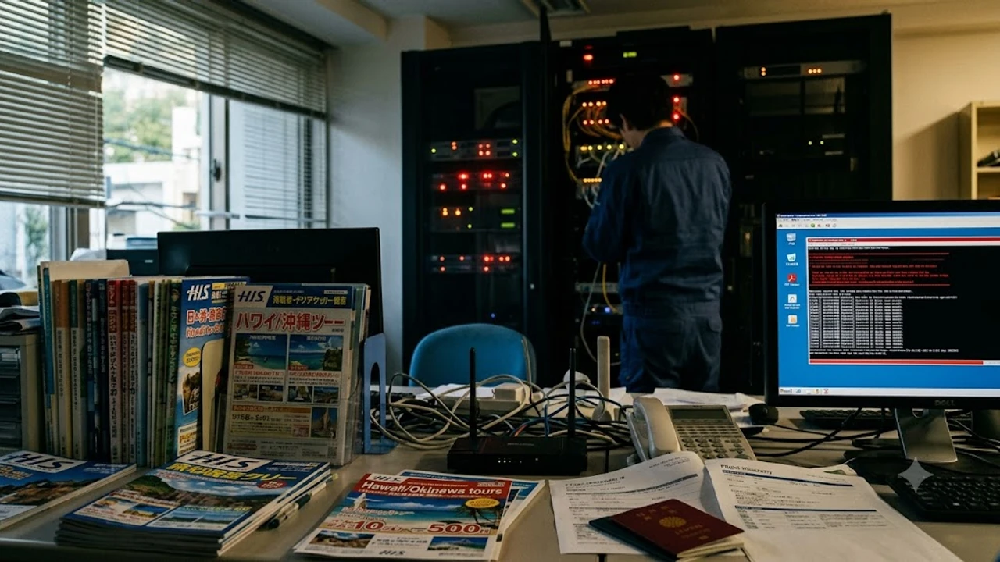

2026년 10월 일본 대형 여행 플랫폼을 강타한 **스카이티켓 정보유출** 사태로 가을 단풍철 일본행을 앞둔 여행자들의 발등에 불이 떨어졌습니다. 스카이티켓(Skyticket) 운영사 어드벤처와 일본 대형 여행사 HIS, 숙박 관리 시스템 테마이라즈(Temairazu)가 해킹 공격에 뚫리며 방대한 예약 데이터와 결제 정보가 외부에 노출된 정황이 공식 확인되었습니다. 결제 카드가 멋대로 긁히거나 피싱에 낚이는 참사를 막으려면 내 정보의 유출 여부를 실시간으로 짚어내고 즉각 방어선을 쳐야 합니다.

## 스카이티켓·HIS 유출 사태 전말과 위험성

### 침해 규모와 유출된 핵심 데이터 항목
일본 주요 언론 보도에 따르면 이번 사태는 숙박 채널 관리 시스템 테마이라즈의 보안 허점을 파고들어 스카이티켓과 HIS의 연동 데이터베이스까지 번졌습니다. 털려 나간 데이터는 영문 이름, 여권번호, 연락처, 이메일, 생년월일에 그치지 않고 **예약 호텔명, 투숙 일정, 항공권 예약 식별코드(PNR 6자리)**까지 몽땅 포함됐습니다. 일부 결제 데이터의 경우 카드 번호 일부와 유효기간이 암호화 없이 노출된 탓에 당장 실질적인 카드 도용 위협에 직면했습니다.

### 단풍철 일본 여행 예약자에게 미치는 영향
10월과 11월 교토, 오사카, 삿포로 등지의 숙소나 일본 국내선 특가를 건지려 스카이티켓을 두드렸던 개별 여행객들이 직격탄을 맞았습니다. 최근 [일본 JR패스 기습 인상 및 소도시 숙박세 연쇄 도입](/posts/world-travel/world-travel-issue-20261008/) 여파로 한 푼이라도 아끼려 해외 특가 OTA를 파고든 알뜰족의 정보가 고스란히 해커들의 손에 넘어간 셈입니다. 예약 내역 자체가 새어나간 만큼 현지 프런트 데스크에서 엉뚱한 예약 취소나 오버부킹 혼선에 휘말릴 위험도 배제할 수 없습니다.

### 피싱 및 2차 금융 피해가 발생하는 경로
공격자들은 단순히 카드 번호를 복제하는 데 그치지 않고, 털어낸 예약 명세를 앞세워 심리전을 겁니다. 실제 묵기로 한 호텔 이름과 체크인 날짜를 정확하게 들이밀며 가짜 안내 메일을 쏘는 식입니다.
> "고객님의 호텔 예약 결제 처리가 보류되었습니다. 24시간 내 카드 정보를 재인증하지 않으면 예약이 강제 취소됩니다."

이런 문구와 함께 전달된 링크를 무심코 누르면 피싱 페이지로 넘어가 카드 CVC 번호와 일회용 OTP 인증번호까지 해커 손에 넘어가 순식간에 수백만 원대 부정 결제가 떨어집니다.

## 내 예약 정보 유출 여부 3분 만에 확인하기

### 스카이티켓 계정 연동 상태 및 공지 조회법
스카이티켓 공식 사이트 상단의 긴급 보안 공지(Important Notice)를 열어 침해 대상 서버군에 내 예약 시점이 걸려 있는지 대조해야 합니다.
- 스카이티켓 로그인 뒤 **마이페이지(My Page)**로 직행
- 회원 정보 수정 메뉴에서 최근 접속한 기기와 로그인 IP 이력에 낯선 해외 위치가 찍혔는지 대조
- 비회원으로 예약했다면 예약 번호와 등록 이메일로 개별 바우처 조회 화면을 띄워 데이터 상태 확인

### 이메일 통지 확인 및 예약번호 유효성 점검
공식 공지 메일인 척 날아오는 스캠을 걸러내려면 메일 주소 도메인을 눈에 불을 켜고 봐야 합니다. 정식 발신지는 오직 `@skyticket.com` 하나뿐이며, 글자 하나를 슬쩍 바꾼 유사 도메인은 100% 낚시입니다. 본문에 달린 결제나 인증 링크는 쳐다보지도 말고, 항공사나 호텔 공식 사이트에 직접 접속해 **영문 성(Last Name)**과 **예약 식별번호(PNR 6자리)**를 직접 쳐넣어 예약이 멀쩡히 살아있는지 교차 검증해야 합니다.

### 카드 결제 내역과 의심스러운 청구 패턴 감지
스카이티켓 결제에 썼던 카드의 최근 승인 내역을 모바일 앱에서 1원 단위까지 훑어야 합니다. 카드 털이범들은 큰돈을 결제하기 전 카드가 살아있는지 떠보려고 1달러(USD) 미만의 소액 승인(Zero Auth 또는 Micro Charge)을 시험 삼아 찔러 넣습니다. 싱가포르, 런던, 델라웨어 등 듣도 보도 못한 가맹점에서 1달러나 0원 승인 문자가 날아왔다면 이미 카드 껍데기가 벗겨진 상태입니다.

## 피해 예방을 위한 즉각 대응 조치 매뉴얼

### 해외 결제 차단 및 일회성 가상카드 재발급
지금 당장 카드사 앱을 열어 결제 잠금장치부터 걸어 잠가야 합니다.
- **해외 온라인 결제 비활성화**: 출국 전까지 해외 결제 스위치를 꺼두는 것이 가장 든든한 방패입니다.
- **기존 카드 즉시 분실신고 및 재발급**: 유출이 의심되는 카드는 번호 자체를 갈아치우는 것만이 확실한 처방입니다.
- **가상 카드번호 발급 활용**: 앞으로 해외 사이트 결제 시에는 일회성 가상 카드번호를 띄워 1회 결제 직후 번호가 증발하도록 만들어야 합니다.

### 여행사 계정 비밀번호 변경 및 2단계 인증 설정
스카이티켓과 HIS에 묶어둔 비밀번호는 즉시 다른 사이트와 완전히 다른 무작위 조합으로 뜯어고쳐야 합니다. 포털이나 네이버, 구글과 같은 아이디·비밀번호를 돌려쓰고 있다면 해커들이 크리덴셜 스터핑(Credential Stuffing) 프로그램으로 연동 계정까지 연쇄적으로 털어버립니다. 사용하는 모든 포털 계정의 비밀번호를 분리하고, 모바일 2단계 인증(2FA)을 필수로 걸어둬야 안전합니다.

### 의심 거래 발견 시 카드사 긴급 차지백 신청법
원치 않는 해외 결제가 긁힌 즉시 카드사 고객센터에 **해외 부정사용(Fraud) 접수**와 **차지백(Chargeback) 이의제기**를 걸어야 합니다.
- 결제 시점 당시 국내 체류 사실(출입국 사실 증명원 등) 구비
- 해당 여행사의 해킹 공식 발표 공지 캡처본 제출
- 마스터카드, 비자 등 글로벌 카드사 규정에 맞춰 결제일로부터 60일 안에 이의제기를 접수해야 카드 청구를 묶어두고 전액 취소 처리를 받아낼 수 있습니다.

## 기존 예약 취소 및 대체 플랫폼 안전 예약 가이드

### 수수료 없는 예약 취소 및 환불 요청 기준
보안 참사로 인해 더는 사이트를 믿지 못해 일정을 취소하려 할 때는 시스템 귀책 사유를 전면에 내세워야 합니다. 항공권은 항공사 규정에 묶여 기본 취소 수수료가 찍힐 수 있지만, 여행사 플랫폼 측 보안 사고로 인한 예약 불안을 이유로 고객센터에 수수료 면제(Waiver)를 강하게 요구할 수 있습니다. 전화 통화에만 매달리지 말고 반드시 상담원 답변과 접수 번호를 이메일로 받아 증거를 박제해야 분쟁에서 밀리지 않습니다.

### 아고다·트립닷컴 등 대체 플랫폼 전환 시 주의점
대체 플랫폼을 찾아 숙소나 비행기 표를 다시 끊을 때는 결제 방식부터 뜯어고쳐야 합니다. 네이버페이, 애플페이, 페이팔 같은 간편결제 시스템을 거치면 여행사 서버에 내 실물 카드 16자리 번호가 전혀 남지 않고 일회성 암호화 토큰만 전달됩니다. 훗날 해당 여행사가 또 털리더라도 내 카드 번호는 안전지대에 남습니다.

### 향후 해외 여행 사이트 이용 시 보안 체크리스트
해외 OTA 사이트를 이용할 때 이것만 지켜도 개인정보 유출 피해를 90% 이상 쳐낼 수 있습니다.
- 카드 결제 창의 '카드 정보 저장(Save this card)' 체크 박스 무조건 해제
- 여권 사본 제출 뒤 바우처가 나오면 플랫폼 측에 사본 영구 파기 요구
- 해외 결제 전용 카드는 결제 한도를 30만~50만 원 선으로 타이트하게 묶어둘 것
- 바우처 발급 직후 항공사나 호텔 직영 앱에 예약 코드를 밀어 넣고 직접 관리할 것

해외 현지에서 실물 카드를 노리는 무선 RFID 불법 스키밍 복제까지 막아내려면 차폐 기능이 들어간 전용 트래블 파우치를 갖춰두는 편이 안심됩니다.

[RFID 차단 복제방지 여행용 여권지갑 쿠팡에서 보기](https://www.coupang.com/np/search?q=%EC%97%AC%ED%96%89%EC%9A%A9%ED%92%88&sourceType=affiliate&trackingCode=AF8691300)

#스카이티켓 #스카이티켓정보유출 #일본여행사해킹 #HIS개인정보유출 #해외결제차단 #항공권정보유출 #카드부정결제대처 #일본여행주의사항