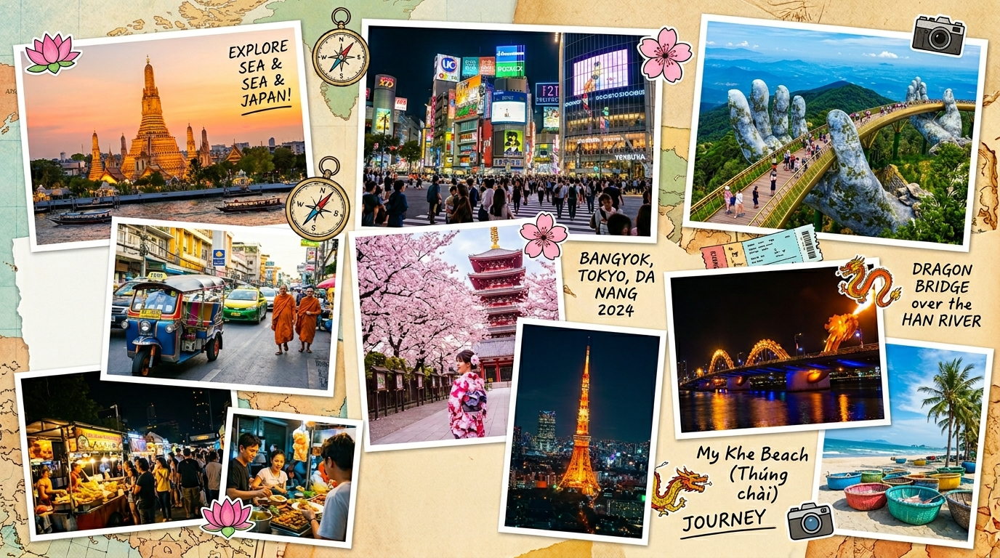
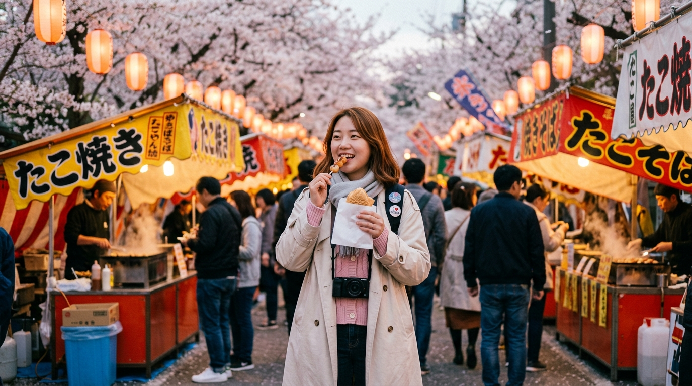

2026년 한국인 해외여행 시장은 코로나 이전 수준을 완전히 회복했습니다. 그런데 목적지 선택 패턴이 확연히 달라졌어요. **엔저 지속으로 일본은 여전히 가성비 1위**, 동남아는 '럭셔리 저예산' 여행지로 재발견되고 있습니다. 여행 목적도 단순 관광에서 미식·웰니스·로컬 경험으로 빠르게 이동하고 있어요. 2026년 해외여행을 계획 중이라면 이 트렌드를 먼저 파악하고 떠나세요.

## 일본 여행 — 엔저 효과는 언제까지 이어질까

### 엔화 환율과 실질 여행 비용

2026년 5월 기준 원/엔 환율은 여전히 100엔당 880\~900원대를 유지하고 있습니다. 2019년 대비 체감 여행 비용이 20\~25% 낮은 수준이에요. 도쿄 도심 호텔 1박이 10만 원대에 가능하고, 편의점 도시락과 라멘 한 그릇이 5,000원 내외입니다. 엔저가 완전히 해소되기 전까지는 일본 여행의 경제적 매력이 유지됩니다.

### 도쿄·오사카 포화, 지방 도시로 시선 이동

후쿠오카·삿포로·가나자와·히로시마 같은 지방 도시가 새로운 주목을 받고 있습니다. 혼잡도가 낮고, 현지 음식과 자연을 더 깊이 경험할 수 있어요. LCC 직항 노선이 확대되면서 교통비 부담도 줄었습니다.

### 일본 여행의 오버투어리즘 문제

교토와 후지산 주변은 관광객 규제를 강화하고 있어요. 일부 지역은 입장료 유료화, 사진 촬영 금지 구역 확대가 진행 중입니다. 인기 명소를 아침 일찍(오전 7시 이전) 방문하거나, 비수기(1\~2월, 6월)를 선택하는 전략이 필요해요.

## 동남아 여행 — 목적별로 달라지는 최적 목적지

### 태국 — 미식과 웰니스의 성지

방콕은 세계 최고 수준의 미식 도시로 자리를 굳혔습니다. 미슐랭 스트리트푸드부터 1인당 10만 원짜리 파인다이닝까지, 음식 하나만으로도 여행 값어치를 합니다. 치앙마이는 디지털 노마드 허브로 진화했고, 한 달 살기 수요가 꾸준해요. 태국 마사지와 스파 문화는 웰니스 여행자에게 여전히 세계 최고 가성비를 제공합니다.

### 베트남 — 물가 최강, 도시별 개성이 뚜렷

하노이·다낭·호치민 세 도시가 완전히 다른 여행 경험을 줍니다. 다낭은 해변과 음식, 리조트를 동시에 즐기는 3박 4일 패키지여행의 국민 목적지가 됐고, 하노이는 역사와 골목 탐험, 호치민은 음식과 도심 에너지가 매력입니다. 물가는 동남아에서 가장 낮은 편으로, 4박 5일 총 비용 50만 원 이하 여행이 가능해요.

### 일본 vs 동남아 예산 비교표

| 항목 | 일본 (도쿄 4박) | 태국 (방콕 4박) |
|------|----------------|----------------|
| 항공권 | 30\~50만 원 | 25\~40만 원 |
| 숙박 | 40\~60만 원 | 20\~40만 원 |
| 식비 | 15\~25만 원 | 10\~15만 원 |
| **총합** | **85\~135만 원** | **55\~95만 원** |

## 2026년 여행 트렌드 키워드

### 슬로우 트래블 — 덜 보고 더 느끼는 여행

1주일에 5\~6개 도시를 돌던 빡빡한 일정에서 벗어나 한 도시에 3\~4일씩 머무르는 슬로우 트래블이 빠르게 늘고 있습니다. 현지 마켓에서 장을 보고, 동네 카페에 하루 종일 앉아 있는 것이 SNS에서 오히려 선망의 대상이 됐어요.

### 솔로 트래블 — 혼자 가는 게 당연해진 시대

2026년 해외 솔로 여행자는 전체 여행자의 35%를 넘어섰습니다. 여성 솔로 여행자의 비율이 특히 빠르게 증가하고 있어요. 에어비앤비 익스피리언스, 소규모 그룹 투어, 코워킹 스페이스 등 솔로 여행자를 위한 인프라가 크게 확충됐습니다.

### AI 여행 플래닝 — 내 취향 맞춤 일정이 10분 만에

AI 여행 앱이 과거 검색 패턴, 예산, 관심사, 체력 수준까지 분석해 개인 맞춤 일정을 만들어줍니다. 구글 여행·카약·클룩 등 주요 플랫폼이 AI 추천 기능을 전면에 내세우고 있어요.

## 여행 전 반드시 체크할 것들

### 비자·입국 조건 최신화 확인 필수

동남아 국가들의 무비자 체류 기간과 조건이 2025\~2026년 사이 여러 차례 변경됐습니다. 태국은 무비자 60일 체류가 가능해졌지만, 베트남은 E-비자 사전 발급이 여전히 권고 사항이에요. 출발 2주 전에 반드시 재확인하세요.

### 여행자 보험과 의료 대비

동남아 여행에서 예상 외로 가장 많은 지출이 발생하는 항목이 의료비입니다. 오토바이 사고, 식중독, 뎅기열 등은 현지 병원비가 100만 원을 훌쩍 넘을 수 있어요. 여행자 보험은 반드시 가입하고, 응급 이송 보상이 포함된 플랜을 선택하세요.

[디지털 피로 탈출 트렌드](/posts/society/)에서 다룬 것처럼 여행은 지금 가장 강력한 디지털 디톡스 수단이기도 합니다. 2026년, 자신에게 가장 맞는 속도와 목적지를 고르는 것이 최고의 여행 전략이에요.

**함께 읽으면 좋은 글**
- [2026 남아공 필수 신고서 작성법](/posts/world-travel/south-africa-online-traveler-declaration-2026-guide/)
- [2026 진짜 뜨는 슬로우 여행지 Best 3](/posts/world-travel/2026-slow-travel-culinary-hidden-gems/)

#동남아여행2026 #일본여행 #해외여행추천 #태국여행 #베트남여행 #슬로우트래블 #솔로여행
