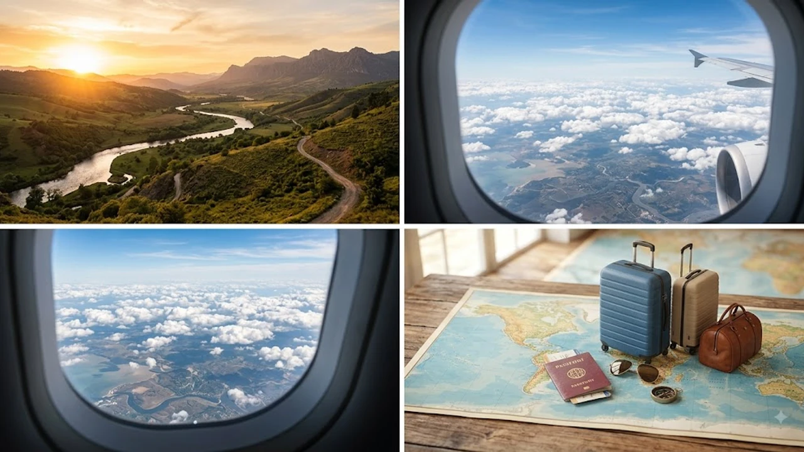

2026년 8월 유럽 전역을 뜨겁게 달군 세기의 천문 이벤트 이후, 대서양의 서늘한 바람과 원시림을 품은 **스페인 북부 여행지**가 전 세계 방랑자들의 새 거점으로 떠올랐습니다. 바르셀로나와 마드리드를 오가는 뻔한 코스를 벗어나, 짙푸른 녹음과 최정상급 미식이 어우러진 '그린 스페인(España Verde)'의 숨은 명소들을 찾는 발길이 이어지고 있습니다. 남부의 40도 폭염을 피해 늦여름과 가을 시즌 쾌적한 피서를 만끽할 수 있는 바스크 및 아스투리아스 일대의 정수를 집약했습니다.

## 8월 개기일식이 바꾼 유럽 여행 지도, 왜 스페인 북부인가?

### 8·12 일식 신드롬과 스페인 북부 직항·숙박 예약 급증 현황

지난 8월 12일 펼쳐진 개기일식의 핵심 관측지로 스페인 북부가 꼽히며 유럽 여행의 무게중심이 이동했습니다. 글로벌 여행 데이터 기업 아마데우스(Amadeus) 집계 기준, 8월 중순 빌바오 공항 항공 검색량은 전년 대비 366%, 아스투리아스는 292% 치솟으며 역대 최고치를 갈아치웠습니다. 

일식을 보러 온 여행자들이 대서양의 깎아지른 절벽과 깊은 풍미의 식문화에 매료되어 현지 일정을 늘렸고, 스페인 북부는 이제 단순한 경유지가 아닌 독립된 여행지로 자리매김했습니다.

### 바르셀로나·마드리드를 벗어난 '선선한 녹색 스페인'의 매력

한국인에게 익숙한 스페인이 이글거리는 태양과 안달루시아의 백색 마을이었다면, 칸타브리아해와 피레네산맥을 낀 북부는 전혀 다른 얼굴을 보여줍니다. 풍부한 강수량 덕분에 사계절 내내 울창한 숲과 목초지가 끝없이 펼쳐집니다.

> "녹색 스페인은 뜨거운 남부의 열기를 피해 유럽 로컬들이 숨어들던 피서지이자, 좁은 골목마다 미슐랭 스타의 손길이 닿아 있는 미식의 심장부다."

오버투어리즘으로 북새통을 이루는 대도시를 벗어나 현지의 숨결을 느끼고 싶다면 [2026년 여름 해외여행 추천 도시 5곳](/posts/world-travel/summer-travel-cities-2026/)을 참고해 색다른 여정을 구상하기 제격입니다.

### 늦여름·가을 시즌 방문 시 최적의 날씨와 준비물

8월 중순부터 10월까지 스페인 북부는 낮 기온이 23~26도 선을 유지해 걷기 딱 좋은 쾌적함을 자랑합니다. 세비야나 그라나다가 40도에 육박하는 찜통더위로 숨이 턱턱 막힐 때도, 이곳은 선선한 바닷바람이 땀을 식혀줍니다.

- **방풍 아우터**: 대서양 해풍과 밤낮의 큰 일교차를 막아줄 윈드브레이커
- **소형 우산**: '시리미리(Sirimiri)'로 불리는 바스크 특유의 안개비 대비
- **접지력 좋은 트레킹화**: 젖은 중세 돌바닥과 해안 절벽길을 안전하게 딛기 위한 신발

---

## 놓치면 후회하는 스페인 북부 대표 여행지 Best 5 추천

### 빌바오(Bilbao) — 구겐하임 미술관과 혁신적인 도시 재생의 정수

쇠락한 공업 도시에서 현대 예술의 중심지로 거듭난 도시 재생의 교과서입니다. 네르비온 강변에 닻을 내린 **구겐하임 미술관**은 티타늄 외벽이 햇빛을 받아 은빛으로 일렁이는 실물 자체가 거대한 조각품입니다.

구시가지 카스코 비에호(Casco Viejo)의 좁다란 골목을 누비며 선 채로 와인잔을 부딪치는 현지 바스크족의 일상에 자연스레 섞여 드는 맛이 일품입니다.

### 산세바스티안(San Sebastián) — 세계 최고의 미식 도시와 핀초스 투어

조개껍데기 형상의 라 콘차(La Concha) 해변을 품은 산세바스티안은 세계 미식가들이 아껴둔 종착점입니다.

바 카운터마다 수북이 쌓인 한입 요리 **핀초스(Pintxos)**를 골라 맛보며 차가운 전통 화이트 와인 차콜리(Txakoli)를 곁들이는 '치키테오(Chikiteo)'는 빼놓을 수 없는 통과의례입니다. 바게트 위에 올린 녹진한 성게알과 숯불에 구운 버섯 꼬치는 미각을 단숨에 사로잡습니다.

### 오비에도 & 아스투리아스 — 천혜의 자연 국립공원과 사이다(Sidra) 문화

아스투리아스의 심장 오비에도는 9세기 프리 로마네스크 건축물이 원형을 지키고 있는 야외 박물관입니다.

- **피코스 데 에우로파(Picos de Europa)**: 2,600m급 석회암 거봉과 에메랄드빛 호수가 빚어내는 장관
- **전통 사과주 시드라(Sidra)**: 높은 허공에서 낙하시켜 기포를 터뜨려 마시는 독특한 시음 방식

고풍스러운 옛 수도원을 개조한 파라도르(Parador)에 머무는 하룻밤은 [2026 이색 숙소 여행, 숨은 인생 역대급 호텔 5곳](/posts/world-travel/unconventional-accommodations-historical-stays-2026/) 이상의 묵직한 운치를 건넵니다.

### 산탄데르 & 코미야스 — 대서양 해변과 가우디의 숨겨진 걸작

과거 스페인 왕실의 공식 여름 별장이 자리했던 산탄데르는 탁 트인 백사장과 품격 있는 막달레나 궁전이 조화를 이룹니다.

차로 40분 거리의 소도시 코미야스(Comillas)에 닿으면 카탈루냐 밖에서 만나는 안토니 가우디의 초기작 **엘 카프리초(El Capricho)**가 모습을 드러냅니다. 해바라기 타일이 외벽을 촘촘히 메운 환상적인 건축미는 여행자의 시선을 단번에 빼앗습니다.

### 산티아고 데 콤포스텔라 — 순례길의 감동과 웅장한 대성당

수천 킬로미터를 걸어온 전 세계 도보 여행자들의 눈물과 땀이 모이는 카미노의 종점입니다. 오브라도이로 광장에 발을 딛는 순간, 배낭을 내려놓고 바닥에 누워 대성당을 올려다보는 순례자들의 벅찬 감정이 고스란히 전해집니다.

대성당 내부를 가로지르며 거대한 연기를 뿜어내는 향로 '보타푸메이로(Botafumeiro)' 의식은 압도적인 울림을 남깁니다.

---

## 남부 안달루시아 vs 북부 바스크·아스투리아스 완벽 비교

| 구분 | 남부 (안달루시아) | 북부 (바스크 & 아스투리아스) |
| :--- | :--- | :--- |
| **대표 도시** | 세비야, 그라나다, 코르도바 | 빌바오, 산세바스티안, 오비에도 |
| **기후 & 풍경** | 고온 건조, 지중해 햇살, 메마른 구릉 | 온난 습윤, 대서양 해풍, 울창한 숲 |
| **식문화** | 타파스, 하몽 이베리코, 가스파초 | 핀초스, 차콜리 와인, 시드라 사과주 |
| **건축 & 분위기**| 화려한 이슬람 양식, 열정적인 플라멩코 | 현대 예술(구겐하임), 켈트·로마네스크 |
| **여행 환경** | 단체 패키지 중심의 북적임 | 개별 자유 여행객 위주의 여유 |

### 기후와 풍경: 지중해성 폭염 vs 대서양 연안의 쾌적한 피서지

남부 스페인은 한여름 낮 기온이 40도를 훌쩍 넘어 오후에는 강제 실내 휴식을 취해야 합니다. 반면 북부 칸타브리아 해안선은 한낮에도 24도 안팎을 맴돌아 온종일 야외 테라스와 골목 투어를 여유롭게 즐길 수 있습니다.

### 미식 스타일: 타파스 & 하몽 vs 미슐랭 핀초스 & 해산물 요리

남부가 진하게 숙성된 육류와 튀김 요리 위주라면, 북부는 당일 새벽 대서양에서 건져 올린 제철 대구, 앤초비, 게살 등을 한입 크기로 빚어낸 예술적인 핀초스로 승부합니다.

산세바스티안 단 한 곳에만 미슐랭 최고 등급 레스토랑이 밀집해 있을 정도로, 식재료 본연의 신선함과 정교한 테크닉에서 독보적인 완성도를 보여줍니다.

---

## 스페인 북부 렌터카 & 대중교통 4박 5일 추천 코스 가이드

### 렌터카 수령 및 북부 고속도로(A-8) 해안 드라이브 핵심 동선

소도시와 국립공원 구석구석을 유연하게 누비기에는 렌터카가 가장 알맞은 수단입니다.

- **1일 차**: 빌바오 공항 렌터카 수령 → 구겐하임 미술관 & 구시가지 산책 (빌바오 1박)
- **2일 차**: A-8 고속도로 해안선 드라이브 → 게르니카 경유 → 산세바스티안 핀초스 탐방 (산세바스티안 1박)
- **3일 차**: 산탄데르 경유 → 코미야스 가우디 건축물 관람 → 아스투리아스 해안 마을 (아스투리아스 1박)
- **4일 차**: 피코스 데 에우로파 국립공원 트레킹 → 오비에도 구시가지 (오비에도 1박)
- **5일 차**: 산티아고 데 콤포스텔라 이동 → 대성당 관람 및 공항 차량 반납

### ALSA 버스와 렌페(Renfe) 철도로 떠나는 뚜벅이 여행 루트

운전대를 잡지 않는 여행자도 스페인의 고속버스망 **ALSA**를 타면 거점 도시를 막힘없이 오갈 수 있습니다.

> 빌바오 인터모달 터미널에서 산세바스티안까지 1시간 15분, 산탄데르까지는 1시간 30분이면 직통 버스로 닿습니다.

도시 사이 이동은 버스를 타고, 피코스 데 에우로파 같은 험준한 산악 지대만 당일 현지 투어를 엮는 방식이 시간과 체력을 아끼는 지름길입니다.

### 성수기 숙소 예약 주의사항과 현지 식당 브레이크타임 팁

북부 소도시는 대형 호텔보다 유서 깊은 부티크 호텔과 펜션(Pensión)이 주를 이룹니다. 일식 특수와 가을 성수기 수요가 겹쳐 중심가 객실이 빠르게 차므로 최소 3주 전 예약을 마치는 편이 안전합니다.

현지 식당의 점심은 오후 1시 30분부터 4시까지, 저녁은 밤 8시 30분이 넘어야 본격적으로 시작됩니다. 주방이 쉬어가는 오후 4시부터 8시 사이에는 언제든 열려 있는 핀초스 바를 찾아가 간단한 요기를 해결하면 일정에 빈틈이 생기지 않습니다.

#스페인북부여행 #빌바오구겐하임 #산세바스티안핀초스 #아스투리아스여행 #산티아고순례길 #스페인렌터카코스 #그린스페인 #유럽피서지추천