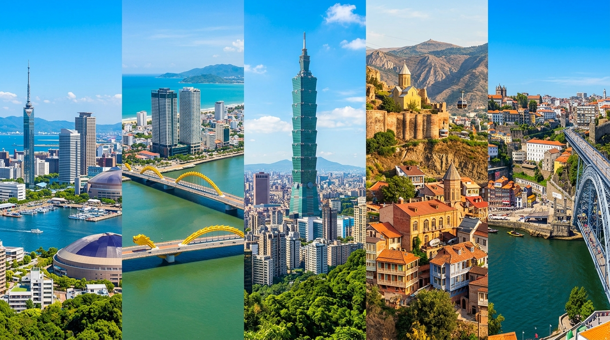

여름 휴가 시즌이 다가오면 해외여행 수요가 급증합니다. 2026년에는 각 도시의 물가 수준, 계절 날씨, 한국에서의 접근성을 고려해 한국인 여행자에게 유리한 도시를 골라봤습니다. 오래전부터 인기 있던 도시도 있지만, 최근 급부상한 숨은 여행지도 포함했습니다.

## 한국인 여행자에게 유리한 도시 선정 기준

이번 추천 리스트를 구성한 기준은 세 가지입니다. 첫째, 한국에서 직항 또는 단거리 경유 접근이 가능한 곳. 둘째, 2026년 기준 환율과 현지 물가 조합이 합리적인 곳. 셋째, 여름(6\~8월) 기간에 여행하기에 날씨가 나쁘지 않거나, 오히려 최적인 곳입니다. 중동의 일부 도시는 여름 폭염으로 야외 활동이 사실상 불가능하고, 유럽 인기 도시들은 성수기 요금이 워낙 높아 가성비 면에서 불리합니다.

### 단거리 아시아 vs 장거리 유럽

해외여행 목적지를 고를 때 비행 시간은 생각보다 큰 요소입니다. 3\~4시간 이내 단거리 아시아 여행은 짧은 휴가에도 부담 없이 다녀올 수 있고, 비용도 합리적입니다. 장거리 유럽은 비용과 시간이 더 들지만 색다른 경험을 원하는 여행자에게 맞습니다.

## 추천 도시 5곳 상세 소개

### 일본 후쿠오카 — 가깝고 실속 있는 서일본의 매력

부산에서 페리로도 닿고, 인천에서 비행기로 약 1시간 30분이면 도착하는 후쿠오카는 접근성에서 압도적입니다. 하카타 라멘, 모츠나베, 야키토리 등 먹거리가 풍성하고, 야나가와 운하 투어, 다자이후 천만궁 등 당일 근교 여행도 즐길 수 있습니다. 여름에는 덥지만 하카타기온야마카사 축제가 열리는 7월이 특히 활기찹니다.

### 베트남 다낭 — 한국인이 사랑하는 장기 체류지

다낭은 이미 한국인 여행자 사이에서 반복 방문하는 도시가 됐습니다. 물가가 합리적이고, 해변과 산악이 함께 있으며, 호이안·후에 같은 역사 도시도 당일 이동 거리입니다. 여름(6\~8월)이 베트남 중부의 건기와 겹쳐 날씨가 쾌청합니다. 골프 여행지로도 각광받고 있습니다.

### 대만 타이페이 — 음식과 야시장 문화의 도시

타이페이는 야시장 문화가 밤에도 활발해 낮에는 실내 관광·쇼핑, 밤에는 야시장 탐방으로 일정을 짤 수 있습니다. 딘타이펑 원조 본점, 화산 1914 문화창의원구, 지우펀 등 볼거리도 풍성합니다. 여름에는 덥고 습하지만 한국과 비슷한 날씨라 적응이 빠릅니다.

### 조지아 트빌리시 — 유럽 감성 코카서스의 가성비 여행지

최근 한국 여행자들 사이에서 급부상하고 있는 여행지입니다. 구소련 시절의 레트로 건축과 코카서스 산맥의 장엄한 자연이 공존하는 트빌리시는 가성비 측면에서 유럽 어느 도시보다 뛰어납니다. 음식, 와인, 온천이 모두 훌륭하며, 여름 기온도 한국보다 낮아 쾌적한 편입니다.

### 포르투갈 포르투 — 서유럽에서 가장 합리적인 도시

여름 유럽 여행을 꿈꾼다면 포르투갈이 가장 합리적입니다. 포르투는 리스본보다 여행자 수가 적어 덜 붐비고, 물가도 서유럽 기준으로 낮은 편입니다. 도루 강변의 와인 저장고, 아줄레주(파란 타일) 건물들 — 감성과 미식을 동시에 충족시켜 줍니다.

## 여름 해외여행 예약 타이밍

성수기인 여름 시즌은 항공권과 숙소 모두 일찍 예약할수록 유리합니다. 출발 3\~4개월 전 항공권을 확보하는 것이 일반적으로 가장 적절한 타이밍입니다. 숙소는 예약금 없는 무료 취소 정책이 있는 숙소를 먼저 잡아두고, 항공권이 확정된 후 조건이 좋은 숙소로 변경하는 방법도 있습니다.

여행의 최적지는 결국 본인의 관심사와 예산에 달려 있습니다. 위 다섯 도시 중 마음에 걸리는 곳이 있다면, 그곳이 올여름 여행지가 될 겁니다.

> [세계 여행지 더 많은 정보](/posts/world-travel/)를 확인해보세요.

#2026해외여행 #여름여행추천 #여행지추천 #해외여행2026 #후쿠오카여행 #다낭여행 #타이페이여행 #트빌리시여행