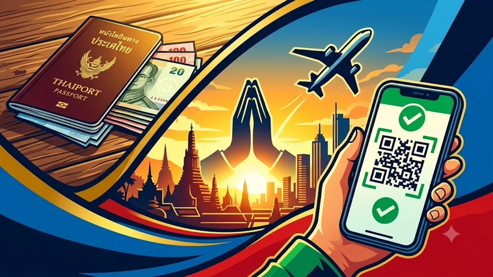

태국 여행을 앞둔 분들이라면 최근 발표된 입국 비용 규정에 주목해야 합니다. 2026년 10월 첫째 주 태국 관광체육부가 공식 확정한 **태국 관광세 300바트** 징수 지침과 전용 전자결제 시스템 세부 운영안이 본격화되면서 발권 방식에 따른 혼란이 커지고 있습니다. 현지 공항 입국 심사대의 정체를 피하고 불필요한 이중 지출을 막기 위해 핵심 변경점을 명확히 짚어둡니다.

## 태국 300바트 관광세 징수 확정 배경과 기본 요건

### 항공 입국과 육상·해상 입국의 차등 부과 기준
새롭게 적용되는 규정에 따르면 항공편으로 수완나품, 돈므앙, 푸껫 공항 등에 도착하는 외국인 여행객은 1인당 300바트(한화 약 1만 2천 원 안팎)를 부담합니다. 반면 말레이시아나 라오스 국경을 접한 육로 및 크루즈선 등 해상 경로를 통한 입국자는 150바트로 차등 책정되었습니다. 단기 관광 목적의 외국인 입국자 전체가 기본 부과 대상입니다.

### 징수 면제 대상자와 필수 확인 서류
모든 외국인이 무조건 돈을 내는 것은 아닙니다. 태국 내 정식 취업 비자를 소지한 노동 허가증(Work Permit) 소지자, 외교관 여권 소지자, 그리고 2세 미만의 영유아는 면제 대상에 포함됩니다. 환승 구역을 벗어나지 않고 24시간 이내에 제3국으로 떠나는 환승객 역시 제외되지만, 수하물 연결이 되지 않아 입국 심사대를 통과해야 한다면 징수 대상이 되므로 비행 일정 확인이 필수적입니다.

### 관광세 기금의 사용 목적과 여행자 보험 보장 범위
태국 당국은 징수한 기금을 국가 관광 인프라 개선과 함께 외국인 관광객 전용 의료·안전 기금으로 전환한다고 밝혔습니다. 현지 체류 중 발생하는 불의의 사고나 긴급 응급 상황에 대해 일정 수준의 치료비 보장이 연동되는 구조입니다. 그러나 보장 한도가 제한적이고 현지 병원 청구 절차가 복잡할 수 있어 개인 여행자 보험을 대체하기는 어렵습니다.

## 기발권 항공권 소지자의 추가 결제 여부와 방식

### 10월 3일 발표 기준 항공권 포함 여부 구분
가장 큰 의문은 이미 예매를 끝낸 티켓의 처리 방식입니다. 10월 시스템 연동 이후 새로 발권되는 항공권은 유류할증료 및 공항세 항목에 300바트가 자동 합산됩니다. 하지만 제도 시행 발표 이전에 결제를 마친 항공권은 해당 금액이 운임에 반영되지 않은 상태입니다. 각 항공사별로 웹 체크인 단계에서 부과하거나 사전 등록 포털 링크를 문자로 안내하는 방식을 순차 도입하고 있습니다.

### 사전 온라인 납부 웹 포털 이용 단계
항공 운임에 포함되지 않은 승객은 태국 관광체육부가 개설한 전용 사전 등록 웹 포털을 거쳐야 합니다. 여권 정보, 항공편명, 입국 예정일을 입력한 뒤 해외 결제가 가능한 신용카드나 간편결제로 300바트를 납부하면 승인 QR코드가 생성됩니다. 이 QR코드를 모바일 기기에 저장하거나 지류로 인쇄해 입국 심사 시 제시해야 불필요한 대기 시간을 줄일 수 있습니다.

### 유럽 관광세 모델과의 운영상 차이점
이러한 국가 단위 입국세 징수는 전 세계적인 관광 관리 트렌드와 궤를 같이합니다. 실제로 [베네치아 당일치기 300유로 벌금 피하는 법](/posts/world-travel/venice-day-trip-entry-fee-qr-fine-guide/)에서 다룬 도시 진입 예약제처럼, 사전 승인 QR코드 시스템을 도입해 오버투어리즘 관리와 재원 확보를 동시에 노리는 구조입니다. 현장 적발 시 과태료를 물리는 유럽 도심 규제와 달리, 태국은 공항 통과 자체를 제한하므로 출국 전 준비가 필수입니다.

## 현장 납부 시 발생 가능한 혼잡과 공항 리스크

### 수완나품 및 돈므앙 공항 키오스크 처리 지연 가능성
사전 납부를 미처 완료하지 못한 채 입국장에 도착한 승객을 위해 현장 무인 수납기(키오스크)와 유인 창구가 마련됩니다. 그러나 방콕 노선 특성상 심야 및 새벽 시간대에 대형 여객기가 집중 착륙하기 때문에 극심한 병목 현상이 빚어질 확률이 큽니다. QR코드를 미리 발급받지 않은 승객들이 한꺼번에 키오스크로 몰릴 경우 입국 수속에만 1시간 이상 추가 소요될 수 있습니다.

### 현지 화폐 환전 수수료 손실과 카드 결제 오류
공항 현장 키오스크는 기본적으로 태국 바트화 현금과 국제 신용카드를 지원합니다. 하지만 현장 결제를 위해 공항 내 환율이 불리한 환전소를 이용해야 하거나, 해외 원화 결제(DCC) 차단 설정 등으로 인해 카드 승인이 거절되는 돌발 상황이 생길 수 있습니다. 결제 오류로 승인 처리가 지연되면 다음 입국 대기 줄 뒤로 밀려나는 낭패를 겪기 쉽습니다.

### 패키지 단체 여행객과 개별 자유 여행객의 대응 차이
패키지 여행 상품을 이용하는 단체 관광객은 대다수 여행사 차원에서 단체 일괄 등록이나 비용 사전 징수를 대행합니다. 반면 자유 여행객은 본인이 직접 항공권 상세 영수증의 세금(Taxes & Fees) 내역을 대조해 300바트 상당의 항목이 포함되었는지 확인하고 수속 절차를 밟아야 합니다.

## 방콕·푸껫 여행 전 반드시 점검해야 할 체크리스트

### E-티켓 영수증 내 세금 상세 항목 대조
출국 전 가장 먼저 할 일은 E-티켓의 세금 상세 명세를 확인하는 것입니다. 항목 중 태국 정부 세금(코드 또는 'Tourism Fee')이 책정되어 있는지 살펴보고, 표기가 모호하다면 이용 항공사 고객센터나 모바일 앱 체크인 화면에서 납부 여부를 점검해야 이중 지불을 피할 수 있습니다.

### 모바일 QR코드 오프라인 캡처 및 지류 출력물 준비
방콕 공항 입국장 내부는 수많은 이용자로 인해 무료 공공 와이파이 연결이 불안정하거나 데이터 로밍 접속이 지연되는 경우가 빈번합니다. 사전 납부 후 발급받은 영수증과 QR코드는 스마트폰 사진 앨범에 오프라인 상태로 저장해두고, 만약의 배터리 방전에 대비해 종이 출력본을 여권과 함께 챙겨두는 방식이 가장 안전합니다.

### 여권 만료 잔여 기간과 입국 서류 동시 점검
관광세 납부 외에도 태국 입국 시 요구되는 기본 조건은 여전히 유효합니다. 여권 잔여 유효기간이 입국일 기준 최소 6개월 이상 남아있어야 하며, 귀국용 리턴 티켓 정보도 확실히 보관해야 합니다. 국가별 최신 이동 규제는 [미국 여행 입국 바뀐 규정 진짜 3가지](/posts/world-travel/us-travel-reentry-advance-parole-rule-change-2026/)와 마찬가지로 사전 안내 없이 수시로 엄격해질 수 있으므로 출발 직전 재확인이 필요합니다.

출국 전 공항에서 겪을 수 있는 스마트폰 방전과 데이터 오류에 대비해 신뢰할 수 있는 보조배터리와 여행용 멀티 파우치를 구비하는 것도 좋은 방법입니다.
[태국 여행 필수 수납 파우치 쿠팡에서 보기](https://www.coupang.com/np/search?q=%EC%97%AC%ED%96%89%EC%9A%A9%ED%92%88&sourceType=affiliate&trackingCode=AF8691300)

#태국관광세 #방콕여행준비 #태국입국세300바트 #수완나품공항 #태국자유여행 #푸껫여행 #동남아여행규정