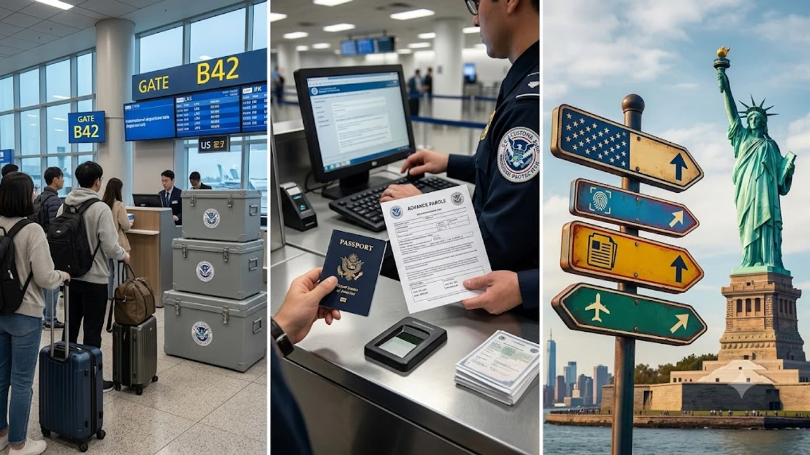

2026년 8월 들어 **미국 여행 입국 규정**에 중대한 법적 지각변동이 발생하면서 현지 체류자와 출국을 앞둔 여행자들 사이에 큰 혼선이 번지고 있습니다. 특히 미국 이민항소위원회(BIA)의 최신 판결로 **출입국 심사 기준**이 대폭 까다로워졌기 때문에, 비행기 표를 끊기 전 바뀐 세부 조항을 점검하지 않으면 자칫 공항에서 발이 묶이는 낭패를 겪을 수 있습니다.

## 2026년 8월 미국 출입국 규정의 기습 변경 배경

### 14년 만에 뒤집힌 사전여행허가서(Advance Parole) 판례
미국 이민법원은 지난 2012년 확립되었던 'Matter of Arrabally and Yerrabelly' 판례를 전격 재검토했습니다. 과거에는 영주권 신청(I-485) 대기자가 사전여행허가서(Advance Parole, I-512L)를 받아 출국하면, 이를 공식적인 '불법체류 후 자진 출국(Departure)'으로 보지 않아 재입국 시 3년 또는 10년 입국 금지 페널티를 피해 갈 수 있었습니다. 그러나 2026년 8월 중순 내려진 신규 판결로 이 방패막이가 사실상 사라졌습니다.

### 8월 13일 BIA 판결이 일반 여행자 및 체류자에게 미치는 영향
미국 이민항소위원회(BIA)가 8월 13일 채택한 새 지침에 따르면, 합법 체류 신분이 끊긴 채 체류 기간이 누적된 상태에서 국경을 넘는 행위 자체를 법률상 명백한 'Departure'로 못 박았습니다. 여행 허가증을 손에 쥐고 공항 게이트를 통과하는 순간 불법체류 누적 일수가 확정되면서, 미국으로 돌아올 때 입국 심사대에서 자동 입국 거부 대상자로 분류될 위험이 생겼습니다.

### '단순 출국'이 '불법체류 출발'로 간주되는 법적 쟁점
이번 사태의 핵심은 '당국의 허가를 받은 일시적 여행'을 법적으로 출국으로 간주하느냐입니다. 새로 정립된 행정 법리는 서류상 허가증이 있더라도 미국 영토를 벗어나는 물리적 이동 자체를 이민법(INA § 212(a)(9)(B))상 출국 행위로 판정합니다. 이에 따라 단순 휴가나 출장 목적으로 출국했다가 현지 공항에서 비행기 탑승을 거부당하는 사례가 실시간으로 이어지고 있습니다.

## 최대 10년 입국 금지 처분 대상과 핵심 주의사항

### 180일~1년 미만 및 1년 이상 체류 상태별 입국 금지 기간
미국 이민법상 입국 금지 페널티 기준은 날짜 단위로 엄격히 갈립니다.

- **180일 초과 1년 미만 불법 체류:** 미국 출국일로부터 **3년간 입국 금지**
- **1년(365일) 이상 불법 체류:** 미국 출국일로부터 **10년간 입국 금지**

> **핵심 경고:** 영주권 수속 중 발급받은 여행허가서가 있더라도 합법 신분 만료일로부터 180일 넘게 공백이 발생했다면, 비행기에 오르는 순간 3년 또는 10년 입국 금지 덫에 걸리게 됩니다.

### 영주권 진행자·유학생·DACA 대상자의 실제 리스크 분석
이번 판례 변경으로 직격탄을 맞은 대상은 크게 세 부류입니다.

* **비이민 비자 만료 후 I-485 접수자:** 학생(F-1), 취업(H-1B), 방문(B1/B2) 비자 만료일과 I-485 접수증(I-797C) 우선일자 사이에 180일 이상의 신분 공백이 있는 신청자
* **DACA(청소년 추방유예) 수혜자:** 합법 체류 신분이 단절된 상태에서 인도적 사전여행허가로 한국 방문을 계획하던 대상자
* **비자 신분 변경(COS) 기각 후 출국자:** 신분 변경 신청이 거절되어 체류 기간이 소급 계산되면서 180일을 넘긴 인원

### 기존 승인자와 8월 이후 출국자 간의 적용 기준선
기존에 I-512L(사전여행허가서)을 발급받아 보관 중이라도, **실제 비행기를 타는 시점**이 판결 이후라면 예외 없이 새 기준이 적용됩니다. 세관국경보호국(CBP) 심사관들이 현장에서 엄격한 재량권을 발휘하고 있으므로 극도의 주의를 기울여야 합니다. 현재 글로벌 입출국 동향과 규정 변화는 [세계여행지 최신 트렌드](/posts/world-travel/world-travel-1783348391782/) 분석에서도 지속해서 다루고 있습니다.

## 변경된 규정 속 안전한 해외 입출국 대비 절차

### 출국 전 체류 기간 및 누적 불법체류일 계산법
공항으로 출발하기 전 본인의 합법 체류 공백을 하루 단위로 쪼개어 계산해야 합니다.

- **I-94 만료일 대조:** 여권 도장이 아닌 공식 I-94 온라인 전산망의 'Admit Until Date' 확인
- **신분 단절 일수 산출:** 기존 체류 자격 만료 다음 날부터 영주권 접수증의 'Received Date' 전날까지의 정확한 일수 파악
- **179일 안전선 준수:** 누적 공백이 179일 이내여야만 3년 입국 금지 규정을 피할 수 있음

### I-512L 소지자의 항공권 발권 전 필수 확인 목록
사전여행허가증을 들고 나갈 때는 다음 사항을 점검해야 합니다.

1. **기존 합법 체류 신분 유지 여부:** H-1B, L-1 등 이중의도(Dual Intent)가 인정되는 유효 비자를 여전히 보유하고 있는지 점검
2. **영주권 최종 인터뷰 일정 확인:** 해외 체류 중 인터뷰 통지서(I-485 Notice)가 나와 불참하게 되면 신청서 전체가 기각될 위험 존재
3. **콤보 카드 유효기간 잔여일:** 미국 재입국 예정일 기준으로 최소 60일 이상 여유가 남아 있는지 확인

### 긴급 해외 출국 시 이민 전문 변호사 상담 가이드
직계가족 상병 등 불가피한 사정으로 나가야 한다면, 출국 전 반드시 담당 이민 변호사와 상의해 I-601 입국 금지 면제(Waiver) 승인 가능성을 짚어봐야 합니다. 미국 땅을 벗어난 뒤에는 서류 보완이나 긴급 청원이 통하지 않으므로 사전에 법적 대책을 끝내놓는 것이 상책입니다.

## 미국 입국 심사 강화 트렌드와 여행자 실전 대응

### 공항 2차 심사대(Secondary Inspection) 대비 서류 준비
최근 로스앤젤레스(LAX), 뉴욕(JFK), 샌프란시스코(SFO) 등 주요 관문 공항의 CBP 입국 심사 문턱이 크게 높아졌습니다. 단순 단기 여행자라도 2차 심사대로 넘겨지는 일이 흔해진 만큼 종이 서류 원본을 철저히 챙겨야 합니다.

* **확정된 귀국 항공권:** 한국행 출국 날짜가 찍힌 e-티켓 출력본
* **숙소 예약 바우처:** 호텔 예약 내역 또는 현지 지인 연락처와 체류지 주소
* **영문 재직 및 잔고 증명서:** 한국에 확실한 생활 기반이 있음을 입증해 불법 취업 의심을 걷어낼 서류

### ESTA 및 비이민 비자 여행자가 오해하기 쉬운 혼선 방지
무비자 전자여행허가제(ESTA)를 쓰는 순수 관광객은 이번 사전여행허가서 판례 변경의 직접 대상은 아닙니다. 하지만 미국 내 90일 체류 한도를 꽉 채워 머문 뒤 멕시코나 캐나다를 찍고 바로 돌아오는 '비자런' 패턴은 CBP 심사관의 표적이 되어 즉각 입국 거부로 이어질 수 있습니다.

### 2026년 하반기 미국 방문 시 유의할 현장 체크포인트
공항 심사대에서는 휴대전화 메신저나 SNS 대화방 조사가 무작위로 이뤄집니다. 미국 내 단기 알바, 베이비시팅, 구직 관련 메시지가 발견되면 즉각 추방으로 이어지므로 디지털 기기 내 불필요한 오해 요소를 정리해 두어야 합니다.

공항 이동 중 여권과 서류를 분실 없이 안전하게 챙기려면 [여행용 전자여권 도난방지 케이스 쿠팡에서 보기](https://www.coupang.com/np/search?q=%EC%97%AC%ED%96%89%EC%9A%A9%ED%92%88&sourceType=affiliate&trackingCode=AF8691300) 같은 전용 오거나이저를 활용해 철저히 대비하는 것이 좋습니다.

#미국여행입국규정 #미국입국심사 #사전여행허가서 #AdvanceParole #미국이민법2026 #미국비자입국거부 #ESTA주의사항 #I485체류규정